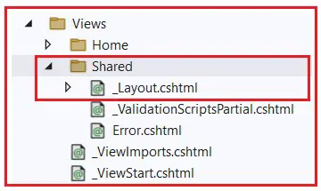

### Layout View in ASP.NET Core MVC

In this article, I am going to discuss the Layout View in ASP.NET Core MVC Web Application with Examples. Please read our previous article, where we discussed Attribute Routing in ASP.NET Core MVC Applications with examples. As part of this article, we are going to discuss the following pointers.

1. What is Layout View in ASP.NET Core MVC?
2. Why Do We Need Layout View in ASP.NET Core MVC?
3. How Do We Create a Layout View in ASP.NET Core MVC?
4. Understanding the _Layout.cshtml file.
5. How to Use Layout View in ASP.NET Core MVC Application?

### What is Layout View in ASP.NET Core MVC?

In ASP.NET Core MVC, the Layout View is a shared template or master page that can be used across different views within your application to maintain consistent looks and feels. It is useful for defining elements that are common across multiple pages, such as headers, footers, navigation bars, and sidebars. This helps maintain a consistent look and feel across your web application and also minimizes code duplication.

So, a Layout View in ASP.NET Core MVC contains HTML markup and Razor code that will be rendered in other views that use this layout. For example, you can define a layout with a common header, footer, and navigation menu and then specify this layout in your individual views. The Layout Views include the following sections:

**@RenderBody()**: This is a placeholder where the content of the views that use this layout will be rendered.
**@RenderSection(“SectionName”, required: false)**: This method is used to render optional sections that views might provide. If required is set to true, the section must be defined in the views.

### Why Do We Need Layout View in ASP.NET Core MVC?

The layouts in ASP.NET Core MVC Applications help us maintain a consistent look across all the pages of our application. Nowadays, most web applications have a common layout that provides a consistent user experience when the user navigates from one page to another. The layout typically includes common user interface elements such as:

1. Website Header
2. Website Footer
3. Navigation Menus
4. Main Content Area

Please look at the following diagram,which shows the above-mentioned four areas on a website.


If you don’t have a layout view for your website, then you need to repeat the required HTML for the above-mentioned sections in each and every view of your application. This violates the DRY (Don’t Repeat Yourself) principle as we are repeating the same code in multiple views.

As a result, it isn’t easy to maintain the application code. For example, suppose we have to remove or add a menu item from the list of navigation menus or even if we want to change the header or footer of our website. In that case, we need to do this in every view, which is tedious, time-consuming, and error-prone.

Instead of putting all the sections (i.e., the HTML) in every view page, it is always better and advisable to put them in a layout view and then inherit that layout view in every view where we want that look and feel. With the help of layout views, it is now easier to maintain our application’s consistent look and feel. This is because if we need to make any changes, we need to do it only in one place, i.e., in the layout view, and the changes will be reflected immediately across all the views inherited from the layout view.

### How Do We Create a Layout View in ASP.NET Core MVC Application?

First, create a new ASP.NET Core Application named FirstCoreMVCApplication using the Model-View-Controller Template. Next, follow the steps below to create a layout view in ASP.NET Core MVC.

1. The layout view is usually placed in the Views/Shared folder and named _Layout.cshtml by convention. Right-click on the “**Views**” folder and then add a new folder named “**Shared**” if not already added. If you are creating the ASP.NET Core Web Application using Model-View-Controller, the Shared folder will be there with the _Layout.cshtml file by default.

2. Next, Right-click on the “Shared” folder and select the “Add” – “New Item” option from the context menu. This will open the Add New Item window.

3. From the “**Add New Item**” window, search for Layout and then select “**Razor Layout**“, give your layout view a meaningful name (**_Layout.cshtml**), and finally, click on the “**Add**” button, as shown below. This should add the **_Layout.cshtml**file to the Shared folder.


So, once you add the _Layout.cshtml file, your Views folder should look as shown below.



### Understanding the _Layout.cshtml file:

Let us first modify the _Layout.cshtml file as follows.

```cshtml
<!DOCTYPE html>
<html>
    <head>
        <meta name="viewport" content="width=device-width" />
        <title>@ViewBag.Title</title>
    </head>
    <body>
        <div>@RenderBody()</div>
    </body>
</html>
```

The above layout file contains the standard HTML, head, title, and body elements. Since these elements are present in the layout file, we don’t have to repeat them in every view of our application that uses this layout.

The View or Page-Specific title is retrieved by using the @ViewBag.Title expression. For example, when the “index.cshtml” view is rendered using this layout view, then the index.cshtml view will set the ViewBag.Title property. This is then retrieved by the Layout view using the expression @ViewBag.Title and set as the value for the <title> tag.

The @RenderBody() method specifies the location where the View or Page-Specific content will be injected. For example, if the “index.cshtml” view is rendered using this layout view, then the index.cshtml view content will be injected at the @RenderBody() location.

### Structure of Layout View in ASP.NET Core MVC:


Now, let us modify the _Layout.cshtml page again, as shown below, to include the header, footer, left navigation menus, and main content area section.

```razor
<!DOCTYPE html>
<html>
<head>
    <meta name="viewport" content="width=device-width" />
    <title>@ViewBag.Title</title>
</head>
<body>
    <table border="1" style="width:800px; font-family:Arial">
        <tr>
            <td colspan="2" style="text-align:center">
                <h3>Website Header</h3>
            </td>
        </tr>
        <tr>
            <td style="width:200px">
                <h3>Left Navigation Menus</h3>
            </td>
            <td style="width:600px">
                @RenderBody()
            </td>
        </tr>
        <tr>
            <td colspan="2" style="text-align:center; font-size:x-small">
                <h3>Website Footer</h3>
            </td>
        </tr>
    </table>
</body>
</html>
```