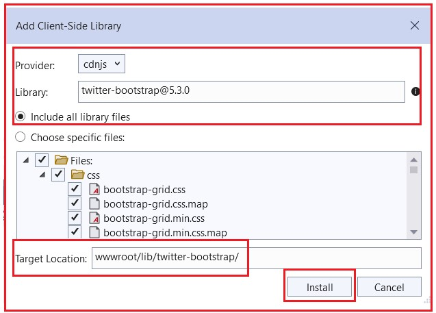
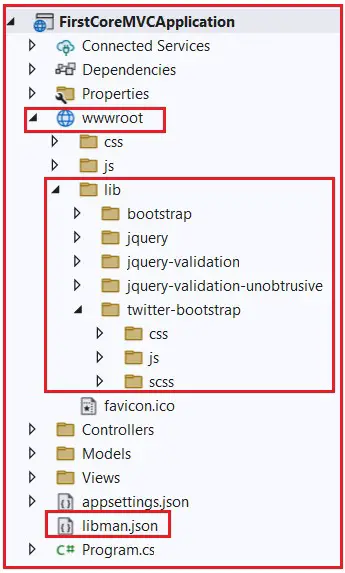
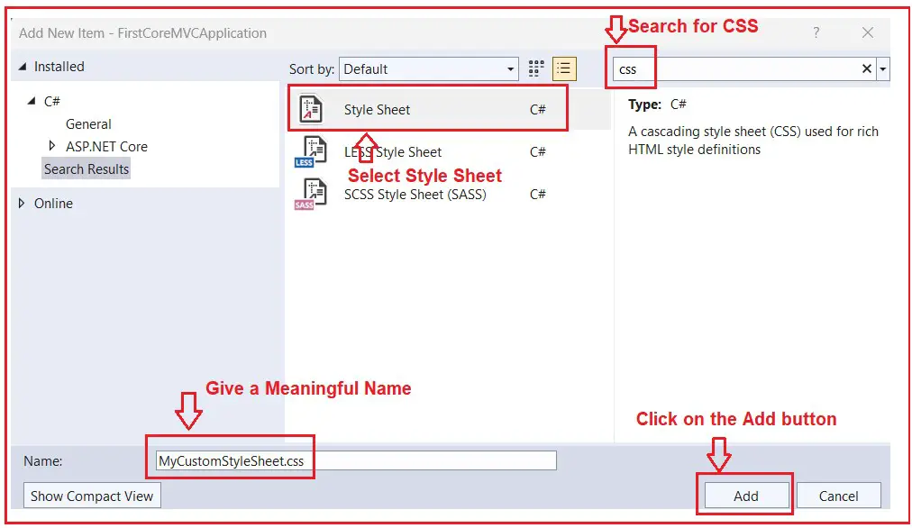
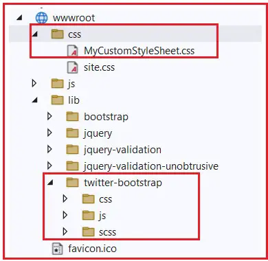
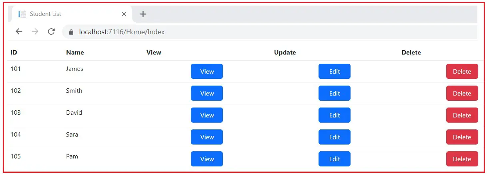
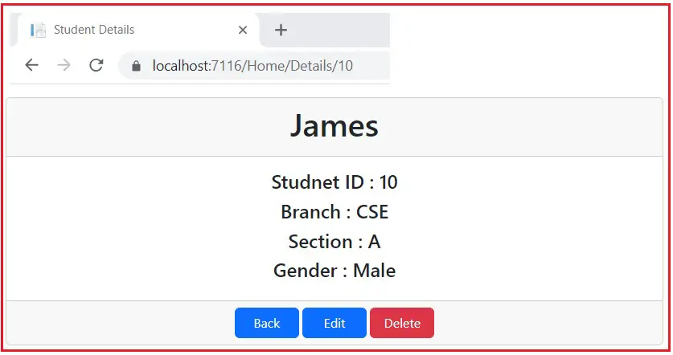

### How to Use Bootstrap in ASP.NET Core MVC Application

In this article, I will discuss How to Use Bootstrap in ASP.NET Core MVC Web Applications. Please read our previous article before proceeding to this article discussing How to Install Bootstrap in ASP.NET Core MVC Application using Library Manager (LibMan). Here, I will discuss how to use Bootstrap as well as how to create and use custom CSS in a view.

### Creating a New ASP.NET Core MVC Application:

First, create a new ASP.NET Core MVC Application with the name FirstCoreMVCApplication using the Model-View-Controller Project Template. Once you create the Project, add Bootstrap to your application using the Library Manager (Libman). Our previous article discussed how to install BootStrap into the ASP.NET Core MVC Application. So, you must follow the steps below to install Bootstrap on your application.

1. Right-click on the “Project Name” in the Solution Explorer and then select Add > Client-Side Library, which will open the “Add Client-Side Library” Window.

2. Leave the default provider as it is, which “cdnjs” is in this case. The other providers are filesystem, jsdelivr, and unpkg.

3. In the “Library” text box, type “twitter-bootstrap“. You can also get intelligence support once you start typing. Once you select the matching entry, it will try to install the latest version of Bootstrap. However, if you want, you can manually type the version number. Here, we are installing the latest version of Bootstrap, i.e. (twitter-bootstrap@5.3.0).

4. There are two radio buttons to select whether you to include “All library files” or “Choose Specific files“. If you select the “All library files” radio button, all the files will be downloaded. On the other hand, if you select the Choose Specific Files radio button, you need to check the selected checkboxes as per your requirements. Here, I am selecting the “All library files” radio button.

5. In the “Target Location” text box, specify the folder location where you want the library files to be installed. By default, the static files are only served from the wwwroot folder. I am going with the default location, i.e., “wwwroot/lib/twitter-bootstrap/”.

6. Finally, click on the “Install” button, as shown in the image below.



Once it is successfully installed, you will find two things: the libman.json file and the required bootstrap files. Please have a look at the following image.



### Creating a Custom Style Sheet in ASP.NET Core MVC Application:

First, create a folder with the name CSS within the wwwroot folder. As we are creating the ASP.NET Core Application using the Model-View-Controller template, by default, the CSS folder should be inside the wwwroot folder. All the custom CSS files are going to be created within this folder. Once you have the CSS folder, let’s add a CSS file with the name MyCustomStyleSheet.css.

To create a style sheet, right-click on the CSS folder and then select “Add – New Item” from the context menu. Then, search for CSS and select Style Sheet, provide a meaningful name, i.e., MyCustomStyleSheet.css, and finally click the Add button as shown in the image below.



Once you add the MyCustomStyleSheet.css file, then your wwwroot folder should look as shown below.



**Note**: All the custom style sheets for our application need to be placed within the MyCustomStyleSheet.css file. So, open the MyCustomStyleSheet.css file and copy and paste the following code into it. We are going to use the custom .btn style sheet in our application.

```css
.btn {
    width: 80px;
}
```

### How to Use Bootstrap in ASP.NET Core MVC Application?

To use Bootstrap, you first need to include a reference to the bootstrap.css file. You can add the reference on each individual view. But as we are going to use the Layout file, we will add a reference to the bootstrap.css file in the _Layout.css file. Along with bootstrap.css, we are also including a reference to our custom style sheet, i.e., MyCustomStyleSheet.css.

### Modifying _Layout.cshtm file:

Please modify the Layout.cshtml file, which is present in the shared folder, as shown below.

```html
<!DOCTYPE html>
<html>
<head>
    <meta name="viewport" content="width=device-width" />
    <title>@ViewBag.Title</title>
    <link href="~/lib/twitter-bootstrap/css/bootstrap.css" rel="stylesheet" />
    <link href="~/css/MyCustomStyleSheet.css" rel="stylesheet" />
</head>
<body>
    <div class="container">
        @RenderBody()
    </div>
</body>
</html>

```

As you can see in the HTML code, we have included references for both bootstrap.css and MyCustomStyleSheet.css files. We also use the bootstrap container class to position the elements on the page.

### Creating Models:

Within the Models folder, add a class file with the name Student.cs and then copy and paste the following code into it. As you can see, this is a very simple Student Model having only five properties holding the Student ID, Name, Branch, Section, and Gender.

```C#
namespace FirstCoreMVCApplication.Models
{
    public class Student
    {
        public int StudentId { get; set; }
        public string? Name { get; set; }
        public string? Branch { get; set; }
        public string? Section { get; set; }
        public string? Gender { get; set; }
    }
}
```

### Modifying the Home Controller:

Next, modify the Home Controller as shown below. As you can see in the code below, we have created two action methods. The Index action method returns a list of students to the view, whereas the Details action method takes the student ID as a parameter and then returns that student information to the view. Here, we have hard-coded the data, but in real time, you will get the data from a database.

```c#
using FirstCoreMVCApplication.Models;
using Microsoft.AspNetCore.Mvc;
using System.Collections.Generic;

namespace FirstCoreMVCApplication.Controllers
{
    public class HomeController : Controller
    {
        public ViewResult Index()
        {
            //Create a List of Students
            //In Real-Time, you will get the data from the database
            List<Student> listStudents = new List<Student>()
            {
               new Student() { StudentId = 101, Name = "James", Branch = "CSE", Section = "A", Gender = "Male" },
               new Student() { StudentId = 102, Name = "Smith", Branch = "ETC", Section = "B", Gender = "Male" },
               new Student() { StudentId = 103, Name = "David", Branch = "CSE", Section = "A", Gender = "Male" },
               new Student() { StudentId = 104, Name = "Sara", Branch = "CSE", Section = "A", Gender = "Female" },
               new Student() { StudentId = 105, Name = "Pam", Branch = "ETC", Section = "B", Gender = "Female" }
            };

            //Pass the Student List to the View to make the view as a Strongly Typed View
            return View(listStudents);
        }

        public ViewResult Details(int Id)
        {
            //Here, we have hard coded the student details
            //In Real-Time, you will get the student information from the database
            Student studentDetails = new Student() { StudentId = Id, Name = "James", Branch = "CSE", Section = "A", Gender = "Male" };

            //Pass the Student model to the View to make the view as a Strongly Typed View
            return View(studentDetails);
        }
    }
}
```

### Modifying the Index View of the Home Controller:

Please modify the Index view, which is present inside the Home Controller, as shown below. As you can see in the HTML below, we are using Bootstrap in-built classes like class=”table-responsive”, class=”table”, class=”text-center” and class=”btn btn-primary.” Here, we are not going to explain the Bootstrap class. Instead, I am only going to show you how to use Bootstrap in an ASP.NET Core MVC Application.

```html
@model List<FirstCoreMVCApplication.Models.Student>
@{
    ViewBag.Title = "Student List";
    Layout = "~/Views/Shared/_Layout.cshtml";
}

<div class="table-responsive">
    <table class="table">
        <thead>
            <tr>
                <th>ID</th>
                <th>Name</th>
                <th>View</th>
                <th>Update</th>
                <th>Delete</th>
            </tr>
        </thead>
        <tbody>
            @foreach (var student in Model)
            {
                <tr>
                    <td>@student.StudentId</td>
                    <td>@student.Name</td>
                    <td class="text-center"><a href="#" class="btn btn-primary">View</a></td>
                    <td class="text-center"><a href="#" class="btn btn-primary">Edit</a></td>
                    <td class="text-center"><a href="#" class="btn btn-danger">Delete</a></td>
                </tr>
            }
        </tbody>
    </table>
</div>

```

### Creating Details View inside the Home Folder:

Next, create a view with the name Details.cshtml and copy and paste the following code. As you can see in the below HTML, we are using Bootstrap in-built classes such as class=”row justify-content-center m-3″, class=”col-sm-8″, lass=”card”, class=”card-header text-center”, class=”card-body text-center”, lass=”card-footer text-center”, class=”btn btn-primary”, etc.

```html

@model FirstCoreMVCApplication.Models.Student
@{
    ViewBag.Title = "Student Details";
    Layout = "~/Views/Shared/_Layout.cshtml";
}

<div class="row justify-content-center m-3">
    <div class="col-sm-8">
        <div class="card">
            <div class="card-header text-center">
                <h1>@Model?.Name</h1>
            </div>

            <div class="card-body text-center">
                <h4>Studnet ID : @Model?.StudentId</h4>
                <h4>Branch : @Model?.Branch</h4>
                <h4>Section : @Model?.Section</h4>
                <h4>Gender : @Model?.Gender</h4>
            </div>
            <div class="card-footer text-center">
                <a href="#" class="btn btn-primary">Back</a>
                <a href="#" class="btn btn-primary">Edit</a>
                <a href="#" class="btn btn-danger">Delete</a>
            </div>
        </div>
    </div>
</div>

```

That’s it. Save the changes, run the application, and then visit the Home/Index or the root URL, and you should get the following output.



Next, visit Home/Details/10 to get the following output.



We have just created the View, Update, Delete, and Back buttons but have not implemented them. In our upcoming articles, I will show you how to implement the CRUD operation in ASP.NET Core MVC Application.

In the next article, I will discuss the Action Results in ASP.NET Core MVC Web Applications. In this article, I explain How to Use Bootstrap in ASP.NET Core MVC Applications. I hope you enjoy this How to Use Bootstrap in ASP.NET Core MVC Web Applications article.


