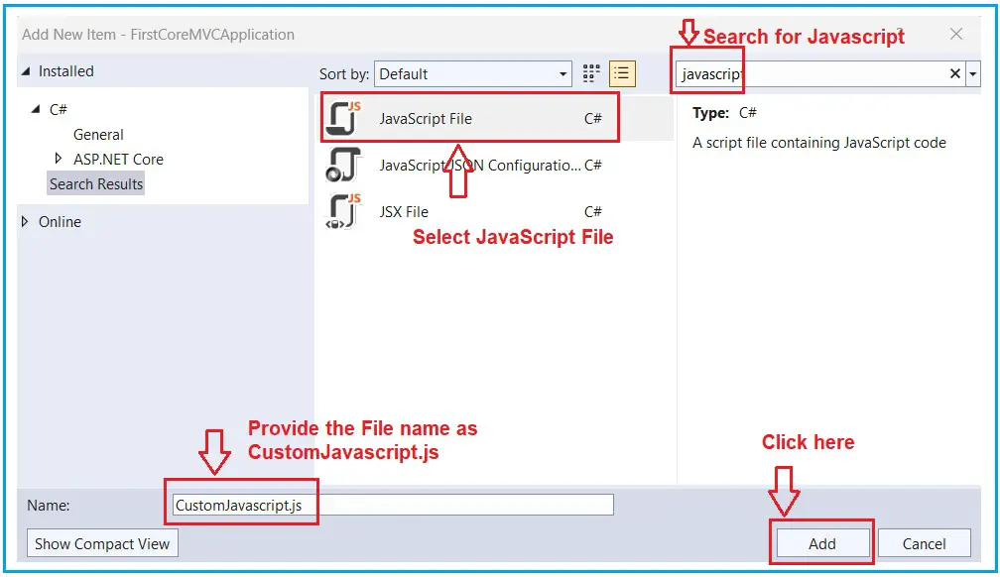

### Sections in Layout View in ASP.NET Core MVC

In this article, I will discuss the Sections in Layout View in ASP.NET Core MVC Application. Please read our previous article discussing the Layout View in ASP.NET Core MVC Application. We will also work with the example we created in our previous article. As part of this article, we will discuss the following pointers.

1. What are Section in Layout View?
2. Why Do we Need sections in a layout view?
3. Understanding RenderSection and RenderSectionAsync Methods.
4. How Do We Use the RenderSection method in  ASP.NET Core MVC?
5. How do we provide section content in a child view?
6. Optional and Required sections in asp.net core mvc.
7. How Do We Make the Layout section optional in ASP.NET Core Mvc?
8. RenderSectionAsync Method Real-Time Example in asp.net core mvc.

### What are sections in layout view?

The layout view is a shared template used to maintain a consistent look and feel across all the views in our application. In ASP.NET Core MVC, sections within a Layout View provide a way to inject content from a child view into specific places in the layout. This feature is useful when we want to include page-specific scripts, styles, or other elements in the layout without affecting our main content area.

Sections are defined in the Layout View using the RenderSection or RenderSectionAsync method and can be marked as optional or required. In the child views, we need to specify the content for these sections using the @section directive.

### Why Do We Need Sections in a Layout View?

To understand the Need for Sections in a Layout View, let us first create a custom JavaScript file. If it isn’t already there, create a folder at the root level of the application with the name wwwroot. As we create the project using Model-View-Controller, the wwwroot folder should be there.

In general, all the static files of our ASP.NET Core MVC Application need to be placed within this wwwroot folder. Once you have created the “wwwroot” folder, create a subfolder within it with the name “js” if it is not already there, and then add a Javascript file with the name “CustomJavascript.js” within the js folder.

To do so, right-click on the js folder and select Add => New Item from the context menu, which will open the Add New Item window. Here, search javascript, select Javascript File, give the file name CustomJavascript.js, and finally click the Add button, as shown in the image below.



Once you add the CustomJavascript.js file, your wwwroot folder should look as shown in the image below.


### Situation 1:

If we have a custom Javascript file (e.g., CustomJavascript.js) and all the views of our application require that file, we need to place that file in the Layout View of our application. Let us add that CustomJavascript.js file within our _Layout.cshtml file. So, modify the _Layout.cshtml file as follows.

```html
<!DOCTYPE html>
<html>
    <head>
        <meta name="viewport" content="width=device-width" />
        <title>@ViewBag.Title</title>
    </head>
    <body>
        <table border="1" style="width:800px;font-family:Arial">
            <tr>
                <td colspan="2" style="text-align:center">
                    <h3>Website Header</h3>
                </td>
            </tr>
            
            <tr>
                <td style="width:200px">
                    <h3>Left Navigation Menus</h3>
                </td>
                <td style="width:600px">
                    @RenderBody()
                </td>
            </tr>

            <tr>
                <td colspan="2" style="text-align:center;font-size:x-small">
                    <h3>Website Footer</h3>
                </td>
            </tr>
        </table>
        <script src="~/js/CustomJavascript.js"></script>
    </body>
</html>
```

**Note**: Putting all the script files before the closing body tag is always a good programming practice.

### Situation 2:

Suppose we have a custom Javascript file (e.g., CustomJavascript.js), and we want this file to be used in some specific views. Let’s assume we want this file in the Index view but not in the Details view of the Home Controller. In such scenarios, we can use the Layout Section in ASP.NET Core MVC Applications.


As you can see, two overloaded versions of the RenderSection Method exist. The same is the case for the RenderSectionAsync method. The first version of the RenderSection method takes a single parameter (i.e., name) that specifies the section’s name. The second overloaded version takes two parameters. The first parameter (name) specifies the section’s name, while the second parameter (required) specifies whether the section is required or optional.

- **name**: The name of the section.
- **required**: A boolean value indicating whether the section is mandatory. If set to true, an exception is thrown if the section is not defined on the content page. If set to false, the layout will render without the section if it’s not present on the content page.

**Note**: The first overloaded version takes only the name parameter; in that case, by default, it sets the required parameter value to true. So, if you use the first overloaded version, then it will be a required section.


### Differences Between RenderSection and RenderSectionAsync:

In ASP.NET Core MVC, both RenderSection and RenderSectionAsync methods are used to include sections of content in a layout view. However, there are some differences between them related to how they handle asynchronous operations. RenderSection is a synchronous method. RenderSectionAsync is an asynchronous method. RenderSectionAsync is useful when the section’s content involves asynchronous operations, such as fetching data or performing I/O-bound tasks.

#### Synchronous vs. Asynchronous:

- RenderSection is synchronous and blocks the execution until the section content is rendered.
- RenderSectionAsync is asynchronous and does not block the execution, allowing other asynchronous 
operations to run concurrently.

#### Use Case:

- Use RenderSection when the content for the section does not involve any asynchronous operations.
- Use RenderSectionAsync when the section content involves asynchronous operations, such as network calls, database queries, or any other asynchronous tasks.


### How Do We Use the RenderSection Method in ASP.NET Core MVC?

From your layout view, we need to call the RenderSection() method at the location where we want the section content to be rendered. For example, we want the script file to be included before the closing </body> tag. So, here, we are calling the @RenderSection() method just before the closing </body> tag, as shown below.

```html
<!DOCTYPE html>
<html>
<head>
    <meta name="viewport" content="width=device-width" />
    <title>@ViewBag.Title</title>
</head>
<body>
    <table border="1" style="width:800px; font-family:Arial">

        <tr>
            <td colspan="2" style="text-align:center">
                <h3>Website Header</h3>
            </td>
        </tr>
        <tr>
            <td style="width:200px">
                <h3>Left Navigation Menus</h3>
            </td>
            <td style="width:600px">
                @RenderBody()
            </td>
        </tr>
        <tr>
            <td colspan="2" style="text-align:center; font-size:x-small">
                <h3>Website Footer</h3>
            </td>
        </tr>

    </table>
    @RenderSection("Scripts")
</body>
</html>
```

In the above code, we use the first overloaded version of the RenderSection method, which only takes the name parameter. In this case, the second parameter value will be true by default. That means it is a mandatory section. Also, remember that we have provided the section name as Scripts.

### How Do We Provide Section Content in a Child View?

We have created a section in our layout view. Now, let us understand how to provide section content from the Child Views. Each view that wants to provide section content must include a section within the view. We need to use the @section directive to include the section and provide the content.

In our example, we want to provide the section content from the Index view. So, modify the Index view as shown below. Here, you can see we are using @section Scripts {<script src=”~/js/CustomJavascript.js”></script>} as we are trying to include a javascript file. Here, we need to provide the section name as Scripts, and this is because, in the _Layout view, we have specified the section name as Scripts, i.e., @RenderSection(“Scripts”)

```html
@{
    ViewBag.Title = "Home Page";
    Layout = "~/Views/Shared/_Layout.cshtml";
}

<h1>Home Page</h1>
@section Scripts {
    <script src="~/js/CustomJavascript.js"></script>
}
```

Now run the application and navigate to the Home/Index URL, and you will see the out as expected, as shown in the below image.


But, when you navigate the Home/Details URL, you will get the following error page.


The reason for getting the above exception is the section is mandatory, and we have not specified the section content in the Details view. To verify this, go to the definition of the RenderSection(“Scripts”) method, which takes the string file name as a parameter, and you will see the following. As you can see, this method takes only the name parameter, and internally, it sets the required parameter value to true, making it mandatory to include the section in the child view. And in the Details view, we have not included any section.


### Optional and Required Sections in ASP.NET Core MVC

As mentioned, sections can be marked as required or optional in the layout:

- **Required Sections**: If a section is marked as required in the layout and if the child view does not include that section, an exception will be thrown. 
- **Optional Sections**: If a section is marked as optional (required: false), the layout will render without the section content if the child view does not define it. 

### How Do We Make the Layout Section Optional in ASP.NET Core MVC?

We can make the layout section optional in ASP.NET Core MVC in two ways. They are as follows:

**Option 1**: Use the RenderSection method, which takes two parameters. Set the second parameter (i.e., the required) to false.
**@RenderSection(“Scripts”, required: false)**

So, modify the _Layout.cshtml file as shown below to make the section optional.

```html
<!DOCTYPE html>
<html>
<head>
    <meta name="viewport" content="width=device-width" />
    <title>@ViewBag.Title</title>
</head>
<body>
    <table border="1" style="width:800px; font-family:Arial">

        <tr>
            <td colspan="2" style="text-align:center">
                <h3>Website Header</h3>
            </td>
        </tr>
        <tr>
            <td style="width:200px">
                <h3>Left Navigation Menus</h3>
            </td>
            <td style="width:600px">
                @RenderBody()
            </td>
        </tr>
        <tr>
            <td colspan="2" style="text-align:center; font-size:x-small">
                <h3>Website Footer</h3>
            </td>
        </tr>

    </table>
    @RenderSection("Scripts", false)
</body>
</html>
```

With the above changes in place,run the application and navigate to both URLs.You should get the expected output.

### Option 2: Using the IsSectionDefined() method.

This method returns a value indicating whether the specified section is defined on the child view. If the section is defined in the child view, then the IsSectionDefined() method returns true, and in that case, the RenderSection method loads the content from the child view. If the method returns false, then the RenderSection method is not going to be executed and be ignored. So, modify the _Layout.cshtml file as shown below.

```html
<!DOCTYPE html>
<html>
<head>
    <meta name="viewport" content="width=device-width" />
    <title>@ViewBag.Title</title>
</head>
<body>
    <table border="1" style="width:800px; font-family:Arial">

        <tr>
            <td colspan="2" style="text-align:center">
                <h3>Website Header</h3>
            </td>
        </tr>
        <tr>
            <td style="width:200px">
                <h3>Left Navigation Menus</h3>
            </td>
            <td style="width:600px">
                @RenderBody()
            </td>
        </tr>
        <tr>
            <td colspan="2" style="text-align:center; font-size:x-small">
                <h3>Website Footer</h3>
            </td>
        </tr>

    </table>
    @if (IsSectionDefined("Scripts"))
    {
        @RenderSection("Scripts")
    }
</body>
</html>
```

With the above changes in place, run the application and navigate to both URLs. You should get the expected output.

### RenderSectionAsync method in ASP.NET Core MVC Layout View:

Let’s understand the RenderSectionAsync method in ASP.NET Core MVC Layout View with one real-time example: a blogging platform. In this example, we will use the RenderSectionAsync method in the layout view to handle a section where we load some user-specific data asynchronously, such as recent comments, which could take time due to database querying or processing.

### Blogging Platform Layout with Asynchronous Sections

In the blogging platform, each page has a section that displays the recent comments or all comments. The comments are fetched from the database and can vary in loading time depending on the number of comments and server load. We want this section to load independently without blocking the rendering of the rest of the page.

### Define the Comment Model

First, let’s define a Comment model class that will represent a comment. Create a class file named Comment.cs within the Models folder and then copy and paste the following code. This is a simple model with two properties: Text and User.

```csharp
namespace FirstCoreMVCApplication.Models
{
    public class Comment
    {
        public string Text {get;set;}
        public string User {get;set;}
    }
}
```

### Create the CommentService Class

Next, we will create a CommentService class that includes the GetRecentCommentsAsync() method. This method will asynchronously return a list of Comment objects. So, create a class file named CommentService.cs within the Models folder and then copy and paste the following code.

```csharp
namespace FirstCoreMVCApplication.Models
{
    public class CommentService
    {
        public static async Task<List<Comment>> GetRecentCommentsAsync()
        {
            //Simulate asynchronous data fetching by waiting for a short time
            await Task.Delay(500); //Wait for half a second

            //Return some hardcoded comments
            return new List<Comment>{
                new Comment(){Text="This is a great post!",User="Alice"},
                new Comment(){Text="Very informative,thanks for sharing.",User="Bob"},
                new Comment(){Text = "I had a similar experience.", User= "Charlie"}
            };
        }
    }
}

```

### Modifying the _Layout.cshhtml

First, define the @RenderSectionAsync in your Layout view. This section will be used to render notifications. So, modify the _Layout.cshhtml view as follows:

```html
<!DOCTYPE html>
<html>
<head>
    <meta name="viewport" content="width=device-width" />
    <title>@ViewBag.Title</title>
</head>
<body>
    <table border="1" style="width:800px; font-family:Arial">

        <tr>
            <td colspan="2" style="text-align:center">
                <h3>Website Header</h3>
            </td>
        </tr>
        <tr>
            <td style="width:200px">
                <h3>Left Navigation Menus</h3>
            </td>
            <td style="width:600px">
                @RenderBody()
            </td>
        </tr>
        <tr>
            <td colspan="2" style="text-align:left;">
                @await RenderSectionAsync("RecentComments", required: false)
            </td>
        </tr>
    </table>
</body>
</html>
```

The layout view defines a section @await RenderSectionAsync(“RecentComments”, required: false). This means it will render the “RecentComments” section if it is defined in the child view, but it is not mandatory for every page.

### Modifying the Index.cshhtml

In one of the views, let’s define the “RecentComments” section that we referenced in the layout. We will make a call to a service that fetches recent comments and renders them. So, modify the Index.cshhtml view as follows:

```html

@{
    ViewBag.Title = "Home Page";
    Layout = "~/Views/Shared/_Layout.cshtml";
}

<h1>What is Section in Layout View</h1>
<p>The layout view is a shared template used to maintain a consistent look and feel across all the views in our application. 
    In ASP.NET Core MVC, sections within a Layout View provide a way to inject content from a child view into specific places in the layout. 
    This feature is useful when we want to include page-specific scripts, styles, or other elements in the layout without affecting our main content area.
</p>
@section RecentComments {
    <h3>Recent Comments</h3>
    @{
        var comments = await CommentService.GetRecentCommentsAsync();
        if (comments.Any())
        {
            <ul>
                @foreach (var comment in comments)
                {
                    <li>@comment.Text - <strong>@comment.User</strong></li>
                }
            </ul>
        }
        else
        {
            <p>No recent comments.</p>
        }
    }
}

```

This view defines the content for the “RecentComments” section. It uses asynchronous operations (await CommentService.GetRecentCommentsAsync()) to fetch recent comments. By using RenderSectionAsync, the rest of the layout (main content, header, footer) can be rendered independently and won’t have to wait for this potentially slow operation.

With the above changes in place, run the application and access the Index view. You should see the output as expected, as shown in the image below.


By rendering the comments section asynchronously, the main content of the page can load without having to wait for the comments to be fetched and processed. Users see the main parts of the page (like the header and main content) quickly, which can be crucial for user retention and satisfaction, especially during peak server load times.

In the next article, I will discuss the _ViewStart.cshtml in an ASP.NET Core MVC Application. In this article, I will try to explain the sections on the layout page of an ASP.NET Core MVC Application.

