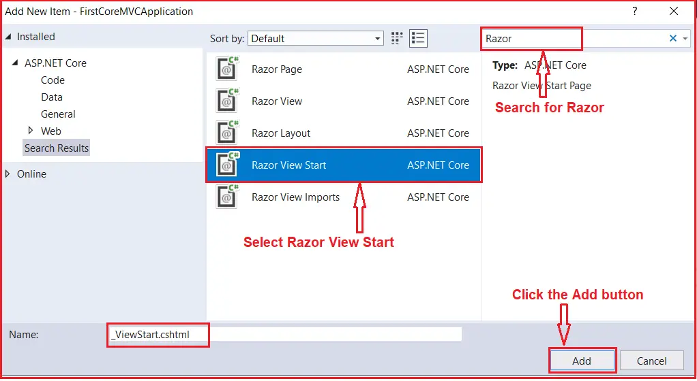
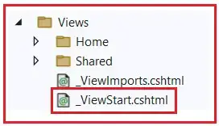
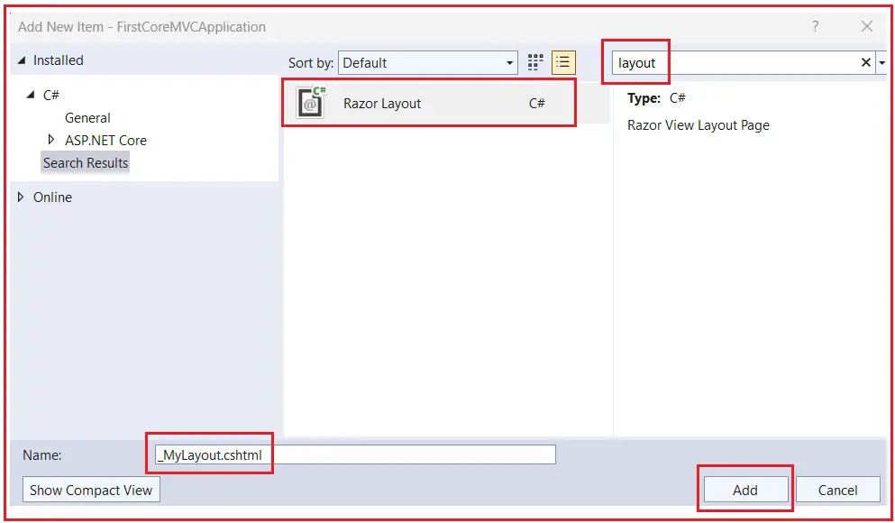
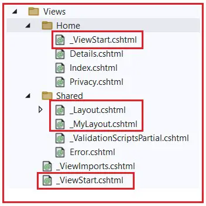
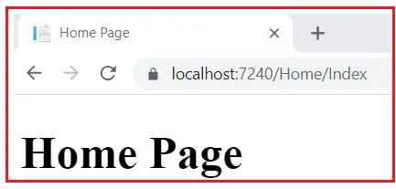
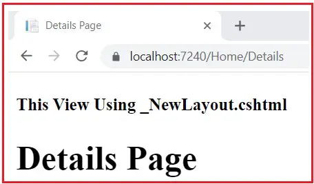
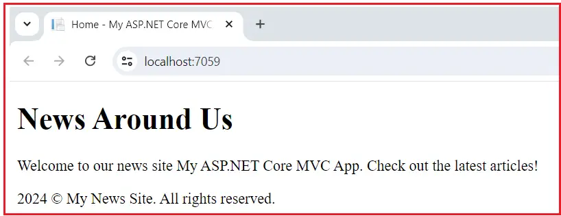

### ViewStart in ASP.NET Core MVC Application

In this article, I will discuss the ViewStart in ASP.NET Core MVC Web Application with Examples. Please read our previous article before proceeding to this article, as it is a continuation part of our previous article. Please read our previous article discussing the Sections in Layout View in ASP.NET Core MVC Application. As part of this article, we will discuss the following pointers.

1. Why Do We Need _ViewStart.cshtml File in ASP.NET Core MVC Application?
2. How to Create _ViewStart.cshtml file in ASP.NET Core MVC Application?
3. How to Set the Layout Property in ViewStart.cshtml file?
4. Understanding the Hierarchy of _ViewStart.cshtml File in ASP.NET Core MVC.
5. How to Use a Different Layout Other the Layout Specified in the _ViewStart.cshtml File?
6. How Do We Select a Layout Conditionally in the ViewStart file?
7. Real-time Example of ViewStart file in ASP.NET Core MVC Application.\

### What is _ViewStart.cshtml File in ASP.NET Core MVC Application?

In ASP.NET Core MVC, the _ViewStart.cshtml file is a special view that allows us to set common configuration settings for views in our application. This file is typically used to define settings that should apply to all views, such as specifying a layout, setting view-specific data, or configuring view behavior.

The primary purpose of _ViewStart.cshtml is to contain code that we want to execute before rendering each view in the directory where the _ViewStart.cshtml file exists and its subdirectories. The _ViewStart.cshtml is executed before each view is rendered. 

### Why Do We Need _ViewStart.cshtml File?

The primary use of _ViewStart.cshtml is to specify a default layout for all views, so we don’t need to set it individually in every view. For example, we have used the Layout Property to associate a view with a layout view, as shown below. So, basically, within the Child view, we have added the following statement to use the layout view.

`Layout = “~/Views/Shared/_Layout.cshtml”;`

Suppose we have 100 views in our application, and all the views want to use the same layout file. Then, we need to set the Layout Property, i.e., Layout = “~/Views/Shared/_Layout.cshtml”; in all 100 views. This violates the **DRY (Don’t Repeat Yourself)** Principle.

Suppose, later, you want to use a different Layout for all 100 views tomorrow. Then, you need to update the Layout Property in each individual view of your application. This process is tedious, time-consuming, and error-prone because you may miss updating the Layout Property in some views. To solve the above problems, we need to use the _ViewStart.cshtml file.

### How to Create _ViewStart.cshtml file in ASP.NET Core MVC Application?

The _ViewStart.cshtml files are created within the Views or the Views folder’s subfolder. To create the _ViewStart.cshtml file, right-click on the Views folder and then select the Add – New Item option from the context menu; this will open the New Item window. From the New Item window, search for Razor and then select the Razor View Start template, provide the name as _ViewStart.cshtml, and click on the Add button as shown in the below image, which should create the _ViewStart.cshtml file within the Views folder of your project.



If you are creating the ASP.NET Core Application using the Model-View-Controller Project template, then by default, the _ViewStart.cshtml file is added within the Views folder, as shown in the image below.




### How to Set the Layout Property in _ViewStart.cshtml file in ASP.NET Core MVC Application?

Once the _ViewStart.cshtml file is created, modify it as shown below to set the Layout property. Here, you can see that we are specifying the layout file path using the Layout property. Layout files are typically in the Views/Shared folder and have the .cshtml file extension.

```html

@{
    Layout="~/Views/Shared/_Layout.cshtml";
}
```

Then, we need to remove the Layout property on individual views. So, modify the Index view of the Home Controller, i.e., the Index.cshtml View is inside the Views=>Home Folder, as shown below.

```html
@{
    ViewBag.Title = "Home Page";
}

<h1>Home Page</h1>

@section Scrtips {
    <script src="~/js/CustomJavascript.js"></script>
}
```

Next,modify the Details.cshtml view of Home Controller as follows.

```html

@{
    ViewBag.Title = "Details Page";
}

<h1>Details Page</h1>

```

With the above changes in place,run the application and navigate to Home/Index and  Home/Details.it should display the output as expected.


### Understanding the Hierarchy of _ViewStart.cshtml File in ASP.NET Core MVC:


As we already discussed, we can place the _ViewStart.cshtml file within the Views folder as well as its subfolder. So, we need to understand the hierarchical order of the ViewStart file. 

The _ViewStart.cshtml file can be placed in the Views root directory or any subdirectory under Views. ASP.NET Core MVC applications search for the _ViewStart.cshtml file using a top-down approach, starting from the specific view’s directory to the root of the Views directory. 

Let us understand this with an example. First, create another layout file named _MyLayout.cshtml within the Shared folder. To do so, right-click on the Shared folder and then select Add => New Item from the context menu, which will open the following Add New Item window. Here, search for Layout and then select Razor Layout template, give the view name as _MyLayout.cshtml, and finally click on the Add button as shown below image, which should add _MyLayout.cshtml file within the Shared folder.




Once you create the _MyLayout.cshtml file,copy and paste the following code.

```html
<html>
    <head>
        <meta name="viewport" content="width=divice-width" />
        <title>@ViewBag.Title</title>
    </head>

    <body>
        <div>
            @RenderBody()
        </div>

        @if(IsSectionDefined("Scripts"))
        {
            @RenderSection("Scripts")
        }
    </body>
</html>

```

With this Layout,we now have two layouts (_Layout.cshtml and _MyLayout.cshtml) for our application

### Create another ViewStart.cshtml file within the Home Folder

Let's add another ViewStart file within the Home Folder,which is present within the Views folder.Once you create the _ViewStart.cshtml file,modify it as shown below.Here,we are setting the newly create _MyLayout.cshtml layout using the Layout property.

```html
@{
    Layout="~/Views/Shared/_MyLayout.cshtml";
}
```

With the above changes in place,our application's Views folder should look like the image below.



As you can see in the above image,we have placed one ViewStart file inside the Views folder and another inside the Home sub-folder.Now run the application and navigate to the Home/Index,as show in the image below.



The above Index view of the Home Controller uses MyLayout.cshtml view,which we specified within the _ViewStart.cshtml File,which is present inside the Home Folder.So,here,the Layout Page,specified in the _ViewStart.cshtml file in the Home sub-folder,overwrites the Layout Page,which is specified in the _ViewStart.cshtml File in the Views folder.

This means all the views in the Views folder will use the layout page specified in the _ViewStart.cshtml file in the Views folder, but the views in the Home folder will use the layout page specified in the _ViewStart.cshtml File in the Home folder.

### How to Use a Different Layout Other the Layout Specified in the _ViewStart.cshtml File?

To use a different layout than the one specified in the _ViewStart.cshtml file, we need to set the layout explicitly in individual view files. If you don’t want to use the layout file specified in the _ViewStart file either from the Home folder or the Views folder, rather you want to use a different layout file, then you need to use the Layout property in the individual view to set the layout.

Let us understand this with an example. Create another Layout with the name _NewLayout.cshtml within the Shared Folder. Once you create the _NewLayout.cshtml file, copy and paste the following code.

```html
<!DOCTYPE html>

<html>
<head>
    <meta name="viewport" content="width=device-width" />
    <title>@ViewBag.Title</title>
</head>
<body>
    <div>
        <h4>This View Using _NewLayout.cshtml</h4>
        @RenderBody()
    </div>
</body>
</html>
```

I want to use the above _NewLayout.cshtml in the Details View of our Home Controller. To do so explicitly, we need to use the Layout property and provide the path of the _NewLayout.cshtml file. So, modify the Details.cshtml file as follows. 

```html
@{
    ViewBag.Title = "Details Page";
    Layout = "~/Views/Shared/_NewLayout.cshtml";
}

<h1>Details Page</h1>
```

Now, run the application and navigate to Home/Details. You should get the following output, which means the Details view now uses the Layout, which is specified in the Details view only.



Now,if you don't want to use any layout or want to render a view without a layout,then you need to set the Layout property to null.For example,if you don't want to use a Layout in Details View,you need to modify the Details.cshtml view as follows.

```html
@{
    ViewBag.Title = "Details Page";
    Layout = null;
}

<h1>Details Page</h1>
```

Now,run the application and navigate to the Home/Details URL.You should see the output without using any layout page.

### How Do We Select a Layout Conditionally in the ViewStart file?

To conditionally select a layout in the _ViewStart.cshtml file in an ASP.NET Core MVC application, you can use C# code to set the layout based on certain conditions. Here is a step-by-step guide on how to do this:

**Identify the Condition**: First, you need to determine the condition for changing the layout. This could be based on the current controller, action, user roles, or any custom logic.
**Implement the Conditional Logic**: Inside the _ViewStart.cshtml file, you can write C# code within @{ … } blocks. Using this C# code block, you can write your conditional logic to select the layout.

When you work with a Real-Time ASP.NET Core MVC application, you may have multiple layout views. Let’s say we have two Layouts, such as _NonAdminLayout and _AdminLayout. If you want to select the layout based on the user role, i.e., if the user role is Admin, then use _AdminLayout; otherwise, use the _NonAdminLayout. Then, you need to write the following conditional logic within the _ViewStart.cshtml file, which will select the layout based on the logged-in user’s role.

```c#
@{
    if(User.IsInRole("Admin"))
    {
        Layout = "_AdminLayout";
    }
    else
    {
        Layout="_NonAdminLayout";
    }
}
```

### Real-Time Example: Setting Up a Default Layout and Initializing ViewData

Let’s assume we are developing a content management system (CMS) for a small news website. We want to ensure that all views use a consistent layout called _Layout.cshtml. Additionally, we want to initialize some ViewData properties that should be available across all views, such as the title suffix and a generic message.

### Create the Default Layout

First, let’s define our default layout, _Layout.cshtml, which should be located in the Views/Shared folder. This layout includes placeholders for the title, application name, header, and content. We already have this layout in our application. So, please modify the _Layout.cshtml file as follows:

```html
<!DOCTYPE html>
<html lang="en">
<head>
    <meta charset="UTF-8">
    <meta name="viewport" content="width=device-width, initial-scale=1.0">
    <title>@ViewData["Title"] - @ViewData["ApplicationName"]</title>
</head>
<body>
    <header>
        <h1>@ViewData["Header"]</h1>
    </header>
    <main>
        @RenderBody()
    </main>
    <footer>
        <p>@DateTime.Now.Year © My News Site. All rights reserved.</p>
    </footer>
</body>
</html>

```

### Configure _ViewStart.cshtml

Now, we need to set up the _ViewStart.cshtml file to specify that _Layout.cshtml should be the default layout for all views. We also initialize ViewData with a default title, header, and application name that will be consistent across the website. We have already created the _ViewStart.cshtml file within the Views folder, so modify the file as follows:

```html
@{
    Layout="~/Views/Shared/_Layout.cshtml";
    ViewData["Title"] = "Welcome";
    ViewData["Application"] = "My ASP.NET Core MVC App";
    ViewData["Header"] = "News Around Us";
}
```

Note:Please remove the _ViewStart.cshtml file from the Views/Home folder.

### Create a View

Let's create a view for a specific page,such as the homepage,which resides under Views/Home/Index.cshtml.This view will use the layout and ViewData.which are initialized in _ViewStart.cshtml.We already have this view,so let us modify the Index.cshtml as follows:

```html
@{
    //This will override the default title set in _ViewStart
    ViewData["Title"] = "Home";

    <p>Welcome to our news site @ViewData["ApplicationName"]. Check out the latest articles!</p>
}
```

Now,run the application and access the Index Page,and you should see the following output:



### How It Works

When a request is made to the Home controller’s Index action, the Razor view engine starts processing Index.cshtml. Before rendering Index.cshtml, it executes _ViewStart.cshtml, which sets the layout and initializes some ViewData.

- The layout for the view is set to _Layout.cshtml.
- ViewData[“Title”] is initially set to “Welcome”, but it is overridden in Index.cshtml to “Home”.
- ViewData[“ApplicationName”] is set to “My ASP.NET Core MVC App”; and will also appear in the page title
- ViewData[“Header”] is set to “News Around Us” and will appear as the header in all views unless specifically overridden.

The layout _Layout.cshtml uses the ViewData values to render the HTML title and the header. This results in a consistent look and feel across the site with minimal code duplication and centralized configuration for common elements like the layout, title, and header.

 In the next article, I will discuss the _ViewImports.cshtml in ASP.NET Core MVC Application. In this article, I try to explain ViewStart in the ASP.NET Core MVC Application.

 