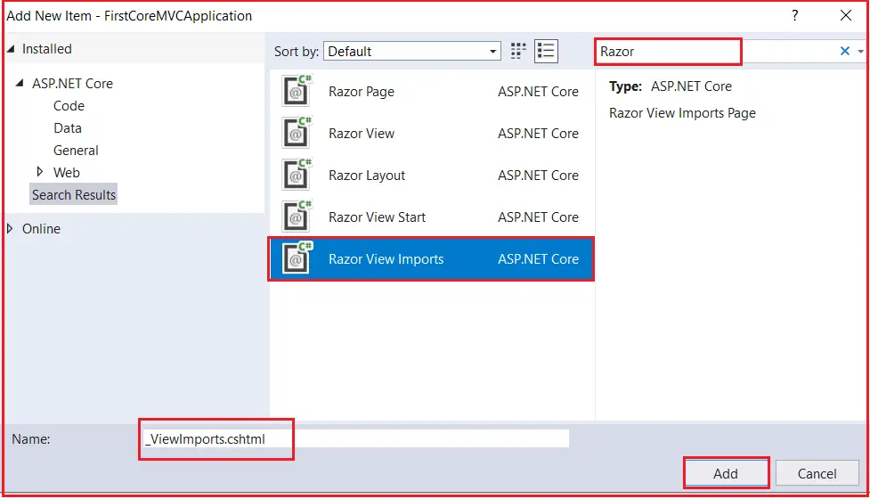
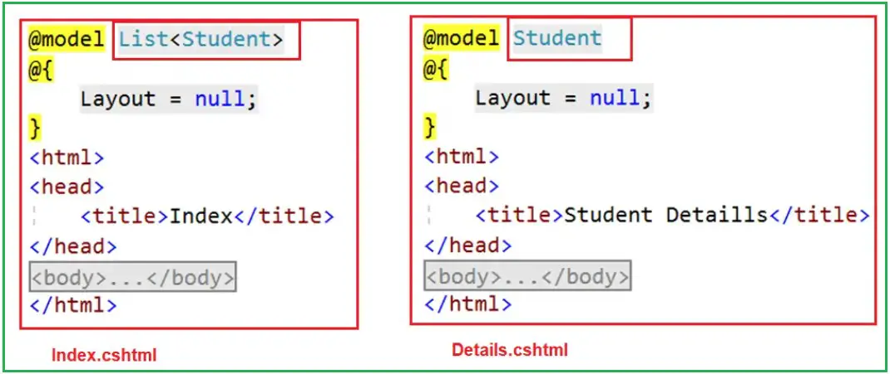
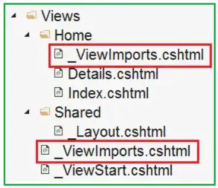

### ViewImports in ASP.NET Core MVC

In this article, I will discuss ViewImports in an ASP.NET Core MVC Application. Please read our previous article before proceeding to this one, as it is a continuation of our previous article, where we discussed the ViewStart in Layout Page in ASP.NET Core MVC Application. 


### What is _ViewImports.cshtml in ASP.NET Core MVC Application?

In ASP.NET Core MVC, the _ViewImports.cshtml file is a special view file that provides a way to include common C# directives and namespaces used across multiple views within an application. It helps to keep view files cleaner and more maintainable by allowing to define common settings such as namespaces, services, view components, and tag helpers in a single location. These settings are then automatically applied to all Razor views in the same directory or in any subdirectory.

统一导入命名空间的地方，可以供同文件夹内及子文件夹内的view文件使用，避免重复导入。

### Common Uses of _ViewImports.cshtml:

The following are the Common Uses of _ViewImports.cshtml file in ASP.NET Core MVC Application.

**Importing Namespaces:**

We can use _ViewImports.cshtml to import namespaces that are used across our Razor views. This can simplify our view code by allowing us to use types from those namespaces without having to specify @using directives in every view.

**@using MyApp.Models**
**@using MyApp.ViewModels**

**Tag Helpers:**

We can register tag helpers that we want to use in our Razor views. Tag helpers enhance the HTML markup in our views with server-side processing, eliminating the need to declare tag helpers in every view where they are used.

`@addTagHelper *, Microsoft.AspNetCore.Mvc.TagHelpers`


**View components**

If we have custom view components that we want to use in your Razor views,we can also include them here.

`@using MyApp.ViewComponents`

**Injecting Services:**

We can also use the @inject directive in the _ViewImports.cshtml file to set up dependency injection for commonly used services across all Razor views. This feature allows us to inject services directly into the view, which can be very useful for accessing application data and functionality directly from within your views.

`@inject IHttpContextAccessor HttpContextAccessor`

**Note**: In this article, I will show you how to use the @using directive in the ViewImports.cshtml file. We will discuss the rest of the directives in our upcoming articles.

### Example to Understand ViewImports in ASP.NET Core MVC:

Create a class file named Student.cs within the Models folder and then copy and paste the following code. As you can see, we have created the Student model with five properties. 

```csharp
namespace FirstCoreMVCApplication.Models
{
    public class Student
    {
        public int StudentId {get;set;}
        public string? Name {get;set;}
        public string? Branch {get;set;}
        public string? Section {get;set;}
        public string? Gender {get;set;}
    }
}
```

### Modifying Home Controller:


Next, modify the Home Controller as shown below. As you can see, we have created two action methods here. The Index Action Method displays all the student data, while the Details Action Method takes the student ID as a parameter and displays that student information.

```csharp
using FirstCoreMVCApplication.Models;
using Microsoft.AspNetCore.Mvc;
using System.Collections.Generic;

namespace FirstCoreMVCApplication.Controllers
{
    public class HomeController : Controller
    {
        public ViewResult Index()
        {
            List<Student> listStudents = new List<Student>()
            {
               new Student() { StudentId = 101, Name = "James", Branch = "CSE", Section = "A", Gender = "Male" },
               new Student() { StudentId = 102, Name = "Smith", Branch = "ETC", Section = "B", Gender = "Male" },
               new Student() { StudentId = 103, Name = "David", Branch = "CSE", Section = "A", Gender = "Male" },
               new Student() { StudentId = 104, Name = "Sara", Branch = "CSE", Section = "A", Gender = "Female" },
               new Student() { StudentId = 105, Name = "Pam", Branch = "ETC", Section = "B", Gender = "Female" }
            };

            return View(listStudents);
        }

        public ViewResult Details(int Id)
        {
            var studentDetails = new Student() { StudentId = Id, Name = "James", Branch = "CSE", Section = "A", Gender = "Male" };

            return View(studentDetails);
        }
    }
}
```

**Modifying the Index and Details view:**

**Index.cshtml:**

```html
@model List<FirstCoreMVCApplication.Models.Student>
@{
    Layout = null;
}
<html>
<head>
    <title>Index</title>
</head>
<body>
    <table>
        <thead>
            <tr>
                <th>ID</th>
                <th>Name</th>
                <th>Branch</th>
                <th>Section</th>
                <th>Gender</th>
            </tr>
        </thead>
        <tbody>
            @foreach (var student in Model)
            {
                <tr>
                    <td>
                        @student.StudentId
                    </td>
                    <td>
                        @student.Name
                    </td>
                    <td>
                        @student.Branch
                    </td>
                    <td>
                        @student.Section
                    </td>
                    <td>
                        @student.Gender
                    </td>
                </tr>
            }
        </tbody>
    </table>
   </body>
</html>
```

**Details.cshtml:**

```html

@model FirstCoreMVCApplication.Models.Student
@{
    Layout = null;
}
<html>
<head>
    <title>Student Detaills</title>
</head>
<body>
    <div>
        StudentId : @Model?.StudentId
    </div>
    <div>
        Name : @Model?.Name
    </div>
    <div>
        Branch : @Model?.Branch
    </div>
    <div>
        Section : @Model?.Section
    </div>
    <div>
        Gender : @Model?.Gender
    </div>
</body>
</html>

```

In the above Index and Details view, we are using the @model directive to specify the model for the view. If you notice, you can see that in both views, we have specified the fully qualified name for the model, such as FirstCoreMVCApplication.Models.Student. Now, let us see how to move the namespace to the ViewImports file so we can only specify the model name.

### Creating ViewImports.cshtml file in ASP.NET Core MVC Application:

In general, _ViewImports.cshtml files are created within the Views or within the subfolder of the Views folder. To create the _ViewImports.cshtml file, right-click on the Views folder and then select the Add – New Item option from the context menu, which will open the “Add New Item” window. From the New Item window, search for Razor, select the Razor View Import, and click on the Add button as shown in the image below, which should create the _ViewImport.cshtml within the Views folder.



**Note**: When creating the project using the ASP.NET Core Web Application using the Model-View-Controller Project template, Visual Studio adds the _ViewImports.cshtml file with the Views Folder by default. Once the _ViewImports.cshtml file is created, copy and paste the following code.

```html
@using FirstCoreMVCApplication
@using FirstCoreMVCApplication.Models
@addTagHelper *, Microsoft.AspNetCore.Mvc.TagHelpers

```

As we placed the above namespace in the ViewImports file, all the types present in the above namespace are available to every view of our application. So now we don’t need to type the Type’s fully qualified name. So, modify the Index and Details view as shown below.



As you can see in the above image, we are removing the namespace and only specifying the model name. Run the application, and it should work as expected.

### _ViewImports file Hierarchical Order in ASP.NET Core MVC:

Like the _ViewStart file, the _ViewImports file is hierarchical. It is also possible to pace the _ViewImports in the subfolder of the Views folder. The following are the places where you can place the _ViewImports file in ASP.NET Core MVC:

- **Application Level**: The root level of the application is the most general level where a **_ViewImports.cshtml** file can be placed. Located in the Views folder, directives placed here are globally available to all views throughout the application. This is the highest level in the hierarchy.
**Controller Level**: Within the Views directory, the controller-specific _ViewImports.cshtml can be placed inside the Views/[ControllerName] directory. This targets all views associated with the specified controller, allowing for controller-specific namespaces or tag helpers.

**View Level**: The most specific level is directly within a specific view file. This allows for more control over directives that apply only to a particular view.

Please have a look at the image below to better understand. Here, we have one ViewImports file in the Views folder and another within the Home folder.



The settings specified in the _ViewImports file in the Home subfolder will overwrite the settings specified in the _ViewImports file in the Views folder. 

### How Does It Work?

When rendering a view, ASP.NET Core MVC processes _ViewImports.cshtml files from the most general to the most specific. This means that directives defined at the application level are applied first, followed by the controller level, and finally at the view level. If the same directive is defined at multiple levels, the most specific definition takes precedence. This hierarchical processing ensures that common settings can be defined globally while allowing for specific overrides where needed.

In the next article, I will discuss Partial Views in ASP.NET Core MVC Applications. Here, in this article, I explain ViewImports in ASP.NET Core MVC Application.