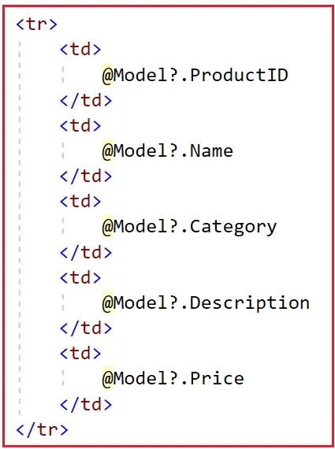
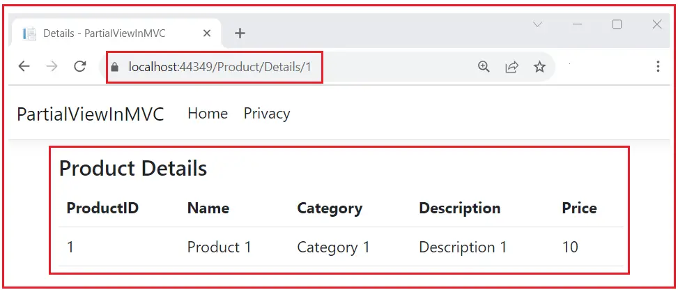
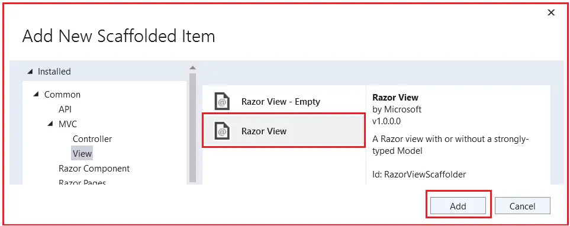
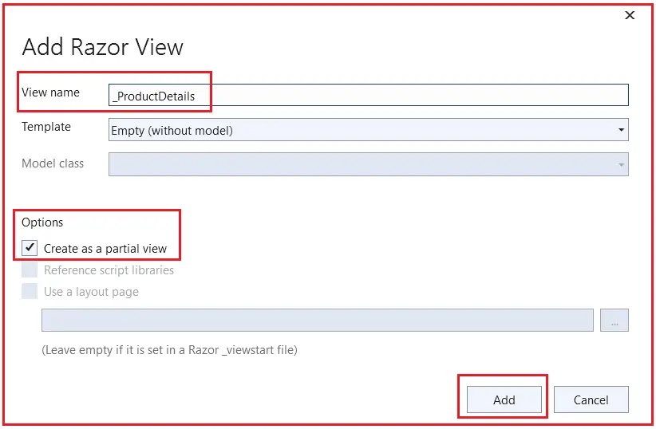
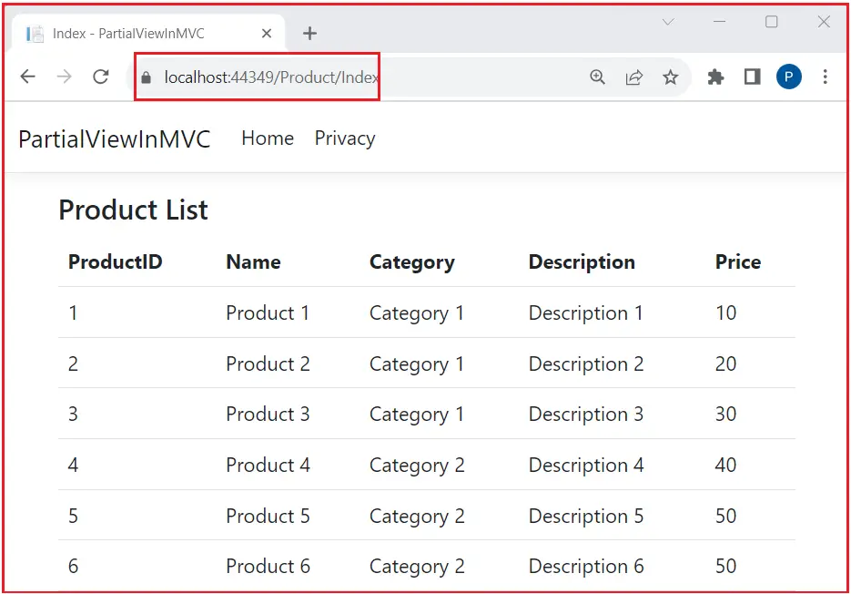
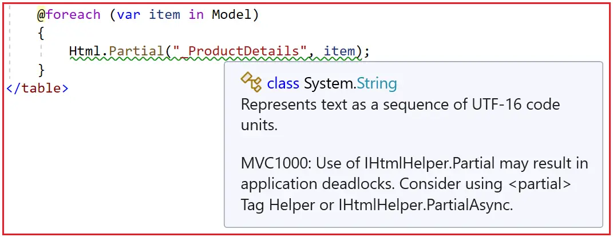

### Partial Views in ASP.NET Core MVC

In this article, I will discuss the Partial Views in ASP.NET Core MVC Applications with Examples. Please read our previous article discussing ViewImports in ASP.NET Core MVC Application. At the end of this article, you will understand What Partial Views in ASP.NET Core MVC are, Why We Need Partial Views, and how to implement Partial Views in the ASP.NET Core MVC Application with Examples.

### What are Partial Views in ASP.NET Core MVC?

Partial Views are special views in the ASP.NET Core MVC Application that render a portion of the view content. They are used to encapsulate and reuse view logic and markup. They help break down large views into smaller, more manageable pieces, promoting reusability and maintainability by avoiding duplication of code. For example, you might have a partial view for a login form, a navigation menu, or a product summary that can be included in various views.

Partial Views are similar to regular views, but they do not run on their own; they must be embedded within other views. This makes them ideal for rendering portions of HTML that are reusable across different parts of an application, such as headers, footers, or complex form elements. For example, if you have a section that displays user information that is required on multiple pages, you can create a Partial View for that section and include it wherever needed.

### Example to Understand Partial Views in ASP.NET MVC:

It is a common task in Web Applications to use the same code repeatedly to display/render information. For example, an e-commerce web application would probably render each product similarly on multiple web pages, like the Product details page, cart page, and checkout page. Let’s understand how we can implement this using Partial Views in an ASP.NET Core MVC Application. First, let’s create a new ASP.NET Core MVC Web Application named “PartialViewInMVC” using the Model View Controller Project Template.

### Creating Product Model:

Create a class file named Product.cs within the Models folder, then copy and paste the following code. This simple class holds the product information in a few properties.

```csharp
namespace PartialViewInMVC.Models
{
    public class Product
    {
        public long ProductID {get;set;}
        public string? Name {get;set;}
        public string? Category {get;set;}
        public string? Description {get;set;}
        public decimal Price {get;set;}
    }
}
```

The View for rendering Product Details in ASP.NET Core MVC View is like the one below.



This is just a simple Product class for demonstration purposes. What if we wanted to display objects with twenty or even more properties? And what if we needed to display this information on multiple pages in our application? Writing the same code repeatedly would be time-consuming and error-prone, and maintenance becomes a headache. If we need to modify anything, we need to do it in all places. This is where Partial Views Come into the picture in the ASP.NET Core MVC Application.

### Creating Product Controller:

Add a new Controller named ProductController within the Controllers folder, and choose the “MVC Controller – Empty” template. Once you create the ProductController, copy and paste the following code into it. Here, you can see we have the Details action method, which will take the Product ID as input and then return a view that will render the Product information. Here, we are using an in-memory data store to store all the product information. In real time, you will get this data from a database.

```csharp
using Microsoft.AspNetCore.Mvc;
using PartialViewInMVC.Models;

namespace PartialViewInMVC.Controllers
{
    public class ProductController : Controller
    {
        private List<Product> products = new List<Product>();
        public ProductController()
        {
            products = new List<Product>()
            {
                new Product { ProductID =1, Name ="Product 1", Category = "Category 1", Description ="Description 1", Price = 10m},
                new Product { ProductID =2, Name ="Product 2", Category = "Category 1", Description ="Description 2", Price = 20m},
                new Product { ProductID =3, Name ="Product 3", Category = "Category 1", Description ="Description 3", Price = 30m},
                new Product { ProductID =4, Name ="Product 4", Category = "Category 2", Description ="Description 4", Price = 40m},
                new Product { ProductID =5, Name ="Product 5", Category = "Category 2", Description ="Description 5", Price = 50m},
                new Product { ProductID =6, Name ="Product 6", Category = "Category 2", Description ="Description 6", Price = 50m}
            };
        }
        
        //Product/Details/1
        public ActionResult Details(int Id)
        {
            var ProductDetails = products.FirstOrDefault(prd => prd.ProductID == Id);
            return View(ProductDetails);
        }
    }
}
```

Next, add the Details.cshtml view within the Views => Product folder. Once you add the view, copy and paste the following code. The following is a strongly typed view where the Model is a Product object. It then renders the product details from the Model using both Razor Syntax and HTML Markup.

```html
@model PartialViewInMVC.Models.Product

@{
    ViewData["Title"] = "Details";
}
<div>
    <h4>Product Details</h4>

    <table class="table">
        <tr>
            <th>
                ProductID
            </th>
            <th>
                Name
            </th>
            <th>
                Category
            </th>
            <th>
                Description
            </th>
            <th>
                Price
            </th>
        </tr>

        <tr>
            <td>
                @Model?.ProductID
            </td>
            <td>
                @Model?.Name
            </td>
            <td>
                @Model?.Category
            </td>
            <td>
                @Model?.Description
            </td>
            <td>
                @Model?.Price
            </td>
        </tr>
    </table>
</div>
```

Now, run the application and navigate to URL: Product/Details/1, and you should get the following output.



When we need a section of a web page (both the Razor Syntax and HTML Markup) on several different pages, we need to create and use them as Partial Views in ASP.NET Core MVC Applications.

### How Do We Create a Partial View in ASP.NET Core MVC Application?

Creating a partial view in an ASP.NET Core MVC application is a straightforward process. Partial views are similar to regular views, but they start with an **underscore** (_) in their file name to indicate that they are meant to be partial. For example, _ProductDetails.cshtml. Here, the underscore (_) prefix is a convention to denote partial views but is not mandatory. They need to be created inside the **Views/Shared** directory of our ASP.NET Core MVC project.

So, right-click on the /Views/Shared folder, then select the Add -> View option from the context menu. It will open the following window. Here, we need to select Razor View and click the Add button, as shown in the image below.



Once you click on the Add button, it will open the following window: Here, please provide the View name as _ProductDetails without .cshtml extension, **check the Create as a partial view check box**, and then click on the Add button as shown in the image below.



This will create a Partial view. Once you create the _ProductDetails.cshtml Partial View, open the view file, and copy and paste the following code. Here, you can see we are using Product as the model and then displaying Product information. This is similar to our Main views, which can have a Model, and they can have both Razor Syntax and HTML Markup to generate dynamic views.

```html
@model PartialViewInMVC.Models.Product
<tr>
    <td>
        @Model?.ProductID
    </td>
    <td>
        @Model?.Name
    </td>
    <td>
        @Model?.Category
    </td>
    <td>
        @Model?.Description
    </td>
    <td>
        @Model?.Price
    </td>
</tr>
```

### How to Use the Partial Views in ASP.NET Core MVC Application?

There are many methods available to render a partial view from the main view in our ASP.NET Core MVC Application. They are as follows:

#### Method 1: Using Html.Partial

This is one of the simplest ways to render a partial view. It returns an HTML-encoded string and can be included directly within a Razor view. This method is executed synchronously. It is not recommended for use in modern applications because it blocks the calling thread until the view is rendered.

**Syntax**:

`@Html.Partial(“_PartialViewName”)`
`@Html.Partial(“_PartialViewName”, model)`

**Arguments**:

- The first argument is the name of the partial view.
- The second argument (optional) is the model passed to the partial view.

#### Method 2: Using Html.RenderPartial

This method is similar to Html.Partial, but it renders the partial view directly to the response stream. This can improve performance because it doesn’t require converting the partial view to a string before rendering. This method is also executed synchronously but does not return anything; it writes output directly. This method is useful when the partial view is large, and you want to avoid the overhead of string manipulation.

**Syntax**:

- @{ Html.RenderPartial(“_PartialViewName”); }
- @{ Html.RenderPartial(“_PartialViewName”, model); }

#### Method 3: Using Html.PartialAsync

This method is the asynchronous counterpart of Html.Partial. This method is used to asynchronously render partial views. It is the recommended way due to its non-blocking nature.
Syntax:

- @await Html.PartialAsync(“_PartialViewName”)
- @await Html.PartialAsync(“_PartialViewName”, model)

#### Method 4: Using Html.RenderPartialAsync

This method is the asynchronous counterpart of Html.RenderPartial. This method is similar to Html.PartialAsync, but it directly writes the output to the response stream and does not return a result that can be captured.

**Syntax**:

- @{ await Html.RenderPartialAsync(“_PartialViewName”); }
- @{ await Html.RenderPartialAsync(“_PartialViewName”, model); }

#### Method 5: Using Tag Helpers

ASP.NET Core MVC provides a Partial Tag Helper that can render partial views. This is also executed synchronously.

**Syntax: <partial name=”_MyPartialView” model=”Model.PartialData” />**

### Rendering the Partial View using the PartialAsync Helper Method


Let us render the partial view using the PartialAsync helper method. To use this Partial HTML Helper method, we need to pass the name of the partial view as a parameter. As our partial view, expecting the Product model, we need to pass the Product object as the second parameter, such as @await Html.PartialAsync(“_ProductDetails”, Model). As it is an asynchronous method, we need to use the await keyword when calling the method. So, modify the Details.cshtml View as follows.

```html
@model PartialViewInMVC.Models.Product

@{
    ViewData["Title"] = "Details";
}
<div>
    <h4>Product Details</h4>

    <table class="table">
        <tr>
            <th>
                ProductID
            </th>
            <th>
                Name
            </th>
            <th>
                Category
            </th>
            <th>
                Description
            </th>
            <th>
                Price
            </th>
        </tr>

        @await Html.PartialAsync("_ProductDetails", Model)
    </table>
</div>
```

Now, run your application and see that everything is working as expected. But this time, you can re-use this partial view wherever you want, and moreover, if you decide to change how product details should be rendered, the only View you need to change is the _ProductDetails.cshtml Partial View. The above @Html.PartialAsync helper method passed a Product object to the “_ProductDetails” partial view. The partial view was dynamically rendered.


Now, let us see how we can use the same Partial View from another View. Let us first modify the Product Controller as follows. Here, you can see we have added the Index action method, which is going to render all the product details.

```csharp
using Microsoft.AspNetCore.Mvc;
using PartialViewInMVC.Models;

namespace PartialViewInMVC.Controllers
{
    public class ProductController : Controller
    {
        private List<Product> products = new List<Product>();
        public ProductController()
        {
            products = new List<Product>()
            {
                new Product { ProductID =1, Name ="Product 1", Category = "Category 1", Description ="Description 1", Price = 10m},
                new Product { ProductID =2, Name ="Product 2", Category = "Category 1", Description ="Description 2", Price = 20m},
                new Product { ProductID =3, Name ="Product 3", Category = "Category 1", Description ="Description 3", Price = 30m},
                new Product { ProductID =4, Name ="Product 4", Category = "Category 2", Description ="Description 4", Price = 40m},
                new Product { ProductID =5, Name ="Product 5", Category = "Category 2", Description ="Description 5", Price = 50m},
                new Product { ProductID =6, Name ="Product 6", Category = "Category 2", Description ="Description 6", Price = 50m}
            };
        }

        //Product/Index
        public ActionResult Index()
        {
            return View(products);
        }
        
        //Product/Details/1
        public ActionResult Details(int Id)
        {
            var ProductDetails = products.FirstOrDefault(prd => prd.ProductID == Id);
            return View(ProductDetails);
        }
    }
}
```

Next, add the Index.cshhtml view within the Views => Product folder. Once you add the view, copy and paste the following code. 

```html
@model IEnumerable<PartialViewInMVC.Models.Product>

@{
    ViewData["Title"] = "Index";
}

<h4>Product List</h4>

<table class="table">
    <tr>
        <th>
            ProductID
        </th>
        <th>
            Name
        </th>
        <th>
            Category
        </th>
        <th>
            Description
        </th>
        <th>
            Price
        </th>
    </tr>

    @foreach (var item in Model)
    {
        @await Html.PartialAsync("_ProductDetails", item)
    }
</table>
```

As you can see in the above code, each loop item calls the same partial view by passing the product object, which will act as the model in the partial view. With the above changes in place, run the application and navigate to the Product/Index action method, and you will see the data as expected, as shown in the image below.



### Using Partial HTML Helper Method in ASP.NET Core MVC:

Now, let us use the Partial HTML Helper method to render the Partial View. So, modify the Index.cshtml view of the Product Controller as follows. Here, you can see, we are using the Html.Partial HTML Helper method.

```html
@model IEnumerable<PartialViewInMVC.Models.Product>

@{
    ViewData["Title"] = "Index";
}

<h4>Product List</h4>

<table class="table">
    <tr>
        <th>
            ProductID
        </th>
        <th>
            Name
        </th>
        <th>
            Category
        </th>
        <th>
            Description
        </th>
        <th>
            Price
        </th>
    </tr>

    @foreach (var item in Model)
    {
        @Html.Partial("_ProductDetails", item)
    }
</table>

```

With the above changes in place, run the application and access the Product/Index URL, and you should get the output as expected. However, Microsoft does not recommend the use of HTML.Partial HTML helper method to render partial view. If you move the mouse pointer over the Partial Method, you will see the following warning. The first part of the warning message says that you may get Application Deadlocks.




An application deadlock is a situation in computer programming where two or more processes or threads become permanently blocked because each process is waiting for resources or conditions that are being held by the other processes.

The second part of the warning message says that instead of using the Partial Method, please use the Partial Tag Helper or PartialAsync method. We have already discussed rendering the Partial View using the PartialAsync HTML helper method; now, let us proceed with how to use the Partial Tag Helper.

### Using Partial Tag helper to Render Partial View in ASP.NET Core MVC:

So, what is Tag Helper? We will discuss this in our upcoming article. Now, let us use the Partial Tag helper to render the Partial View in ASP.NET Core MVC Application.

The Partial Tag Helper renders partial views synchronously. So, modify the Index View of the Product Controller as follows. The model attribute is assigned a Product instance to be binding to the partial view.

```html
@model IEnumerable<PartialViewInMVC.Models.Product>

@{
    ViewData["Title"] = "Index";
}

<h4>Product List</h4>

<table class="table">
    <tr>
        <th>
            ProductID
        </th>
        <th>
            Name
        </th>
        <th>
            Category
        </th>
        <th>
            Description
        </th>
        <th>
            Price
        </th>
    </tr>

    @foreach (var product in Model)
    {
        <partial name="_ProductDetails" model="product" />
    }
</table>
```

With the above changes in place, run the application, and you should get the output as expected.

### Benefits of Using Partial Views in ASP.NET Core MVC

The following are some of the benefits of using Partial Views in ASP.NET Core MVC:

- **Modularity**: Breaking down views into partial views makes our application modular and easier to manage.
- **DRY Principle**: Partial views help adhere to the DRY (Don’t Repeat Yourself) principle by reusing common view logic. When we have a component (like a banner, a navigation menu, or a footer) reused across multiple pages.
- **Performance**: Rendering only parts of a view can improve performance, especially when combined with AJAX requests to load partial content dynamically. Partial views can be returned from controller actions for AJAX calls to update a portion of a page without reloading the entire page.

In the next article, I will discuss Different ways to Render Partial Views in ASP.NET Core MVC Applications with Examples. In this article, I will try to explain Partial Views in ASP.NET Core MVC Applications with Examples. I hope you enjoy this Partial Views in ASP.NET Core MVC article.

