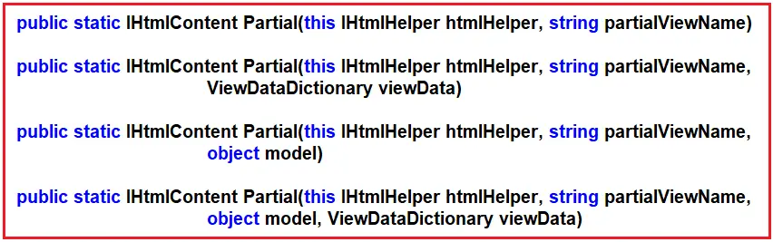
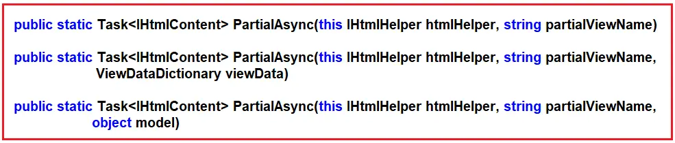
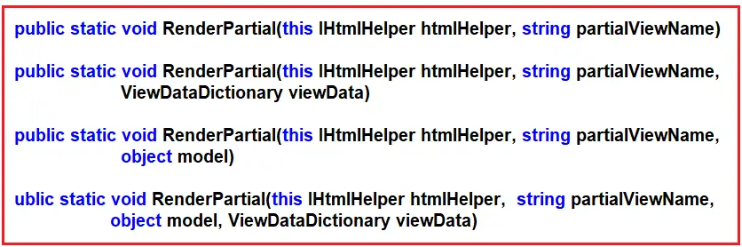
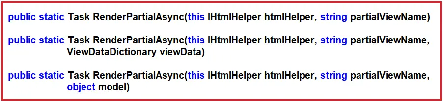

### Different Ways to Render Partial View in ASP.NET Core MVC

In this article, I will discuss Different Ways to Render a Partial View in an ASP.NET Core MVC Application with Examples. Please read our previous article on Partial Views in ASP.NET Core MVC Applications. We will work with the same example we created in that article.

### Different Ways to Render Partial View in ASP.NET Core MVC

In the ASP.NET Core MVC Application,we can  render a partial view using the following ways:

1. **Html.Partial**: The Html.Partial method is used to render a partial view synchronously.It inserts the HTML output of the partial view directory into the parent view.You can also store the return HTML in a variable.This method is typically used when the data needed by the partial view is already available in the parent view. **Syntax: @Html.Partial("_PartialViewName",model)**

2. **Html.RenderPartial**: Similar to Html.Partial,the Html.RenderPartial renders a partial view synchronously.The key difference is that RenderPartial writes the output directly to the response stream.This method does not return an HTML string but instead sends the output directly to the HTTP response,which can improve performance in certain scenarios. **Syntax: @{ Html.RenderPartial("_PartialViewName",model);}**

3. **Html.PartialAsync**: Html.PartialAsync is the asynchronous counterpart of Html.Partial. It is used to render a partial view asynchronously, which can be beneficial when the partial view needs to perform asynchronous operations, such as database calls or file I/O operations, before rendering. **syntax: @await Html.PartialAsync("_PartialViewName",model)**

4. **Html.RenderPartialAsync:** Html.RenderPartialAsync is the asynchronous version of Html.RenderPartial view asynchronously and writes the output directly to the response stream. This method is useful for improving the performance of rendering partial views that perform asynchronous operations. **Syntax: @{ await Html.RenderPartialAsync("_PartialViewName",model);}**

5. **Partial Tag Helper:** ASP.NET Core introduced Tag Helpers to render partial views in a more HTML-like syntax. The partial Tag Helper allows you to include a partial view within another view. **Syntax: <partial name="_PartialViewName" model="model" />**

### Example to Understand How to Render Partial View:

We will use the same example we created in our previous article. The following is the Product Controller class.

```csharp
using Microsoft.AspNetCore.Mvc;
using PartialViewInMVC.Models;

namespace PartialViewMVC.Controllers
{
    public class ProductController : Controller
    {
        private List<Product> products = new List<Product>();
        
        public ProductController()
        {
            products = new List<Product>()
            {
                new Product{ProductID =1, Name ="Product 1", Category = "Category 1", Description ="Description 1", Price = 10m},
                new Product { ProductID =2, Name ="Product 2", Category = "Category 1", Description ="Description 2", Price = 20m},
                new Product { ProductID =3, Name ="Product 3", Category = "Category 1", Description ="Description 3", Price = 30m},
                new Product { ProductID =4, Name ="Product 4", Category = "Category 2", Description ="Description 4", Price = 40m},
                new Product { ProductID =5, Name ="Product 5", Category = "Category 2", Description ="Description 5", Price = 50m},
                new Product { ProductID =6, Name ="Product 6", Category = "Category 2", Description ="Description 6", Price = 50m}
            };
        }

        public ActionResult Index()
        {
            return View(products);
        }

        public ActionResult Details(int Id)
        {
            var ProductDetails = products.FirstOrDefault(prd=>prd.ProductID == Id);
            return View(ProductDetails);
        }
    }
}

```

Next, modify the _ProductDetails.cshtml Partial View file as follows:

```html

@model PartialViewInMVC.Models.Product;

<table class="table">
    <tr>
        <th>ProductID</th>
        <th>Name</th>
        <th>Category</th>
        <th>Description</th>
        <th>Price</th>
    </tr>

    <tr>
       <td> @Model?.ProductID</td>
       <td>@Model?.Name</td>
       <td>@Model?.Category</td>
       <td>@Model?.Description</td>
       <td>@Model?.Price</td>
    </tr>
    
</table>

```

### Render a Partial view using @Html.Partial() Method in ASP.NET Core MVC:

The Html.Partial() method synchronously returns an IHtmlContent that represents the HTML content generated by the specified partial view.  Since it’s synchronous, it can potentially block the thread if the operation takes a long time.

The Html.Partial() is an HTML helper method available in the Microsoft.AspNetCore.Mvc.Rendering namespace. Four overloaded versions of the Partial method are available, as shown in the image below. 



**Parameters:**

- **htmlHelper**: The HTML helper instance that this method extends
- **partialViewName**: The name of the partial view to render
- **viewData**: The view data dictionary for the partial view.
- **model**: The model for the partial view.

**Returns**: The partial view that is rendered as an HTML-encoded string.

To render a partial view using @Html.Partial() html helper, please modify the Details.cshtml view of the Product controller as shown below. Here, _ProductDetails is the name of the partial view file, and Model is the model object.

```html
@model PartialViewInMVC。Models.Product

@{
    ViewData["Title"] = "Details";
}

<div>
     <h4>Product Details</h4>
     <p>Rendering the Result of Partial View</p>
     @Html.Partial("_ProductDetails",Model)
     <br />
     <p>Storing the Result of Partial View into a variable</p>
     @{
        var result = Html.Partial("_ProductDetails",Model);
     }
     <span>@result</span>
</div>


```

### Render a Partial view using the @Html.PartialAsync() Method in ASP.NET Core MVC:

The Html.PartialAsync() HTML Helper Method is the async version of Html.Partial() Method. This method asynchronously returns an IHtmlContent that represents the HTML content generated by the specified partial view. This method is preferred over Html.Partial when the partial view involves I/O operations, such as database calls or file reads, as it doesn’t block the thread while these operations are complete.

The Html.PartialAsync is also an HTML helper available in **Microsoft.AspNetCore.Mvc.Rendering** namespace. There are 3 overloaded versions of this HTML.PartialAsync method, which is available as follows. 



To render a partial view using @Html.PartialAsync() html helper, please modify the Details.cshtml file of the Product controller as shown below. Here, _ProductDetails is the name of the partial view file, and Model is the model object. Here, we must use the await keyword as this method works asynchronously.

```html
@model PartialViewInMVC.Models.Product

@{
    ViewData["Title"] = "Details";
}
<div>
    <h4>Product Details</h4>
    <p>Rendering the Result of Partial View</p>
    @await Html.PartialAsync("_ProductDetails", Model)
    <br/>
    <p>Storing the Result of Partial View into a variable</p>
    @{
        var result = await Html.PartialAsync("_ProductDetails", Model);
    }
    <span>@result</span>
</div>
```

### Render a Partial view using @Html.RenderPartial() Method in ASP.NET Core MVC:

The Html.RenderPartial synchronously renders the specified partial view to the response stream. This method does not return a value; instead, it writes the rendered HTML directly to the response’s output stream. This can be more efficient than HTML.Partial in terms of memory usage since it doesn’t need to store the rendered HTML in an intermediary IHtmlContent object before it’s written to the response.

The @Html.RenderPartial is also an HTML helper method for rendering a partial view. It is available in the **Microsoft.AspNetCore.Mvc.Rendering** namespace. There are **4 overloaded** versions of the RenderPartial method available, as shown in the image below. You can use any one of them as per your requirements.



**Parameters:**

- **htmlHelper**: The HTML helper instance that this method extends
- **partialViewName**: The name of the partial view.
- **viewData**: The view data for the partial view.
- **model**: The model for the partial view.

To render a partial view using @Html.RenderPartial() HTML helper, please modify the Details.cshtml view of the Product controller as shown below. Here, _ProductDetails is the name of the partial view file, and Model is the model object. This method works synchronously.


```html
@model PartialViewInMVC.Models.Product

@{
    ViewData["Title"] = "Details";
}
<div>
    <h4>Product Details</h4>
    <p>Rendering the Result of Partial View</p>
    @{
        Html.RenderPartial("_ProductDetails", Model);
    }
</div>
```

### Render a Partial view using @Html.RenderPartialAsync() Method in ASP.NET Core MVC:

The Html.RenderPartialAsync asynchronously renders the specified partial view to the response stream. It is similar to Html.RenderPartial, but it performs the rendering operation asynchronously, making it suitable for I/O-bound operations within the partial view.

The Html.RenderPartialAsync() Method is the async version of @Html.RenderPartal(), which is also used to render a partial view. It is available in the Microsoft.AspNetCore.Mvc.Rendering namespace. Three overloaded versions of the RenderPartialAsync method are available, as shown in the image below. 



To render a partial view using @Html.RenderPartialAsync() HTML helper, please modify the Details.cshtml file of the Product controller as shown below. Here, **_ProductDetails** is the name of the partial view file, and Model is the **model** object. Here, we must use the await keyword as this method works asynchronously.


```html
@model PartialViewInMVC.Models.Product

@{
    ViewData["Title"] = "Details";
}
<div>
    <h4>Product Details</h4>
    <p>Rendering the Result of Partial View</p>
    @{
        await Html.RenderPartialAsync("_ProductDetails", Model);
    }
</div>
```

### Rending Partial View using Partial Tag Helper in ASP.NET Core MVC

The Partial Tag Helper, introduced in ASP.NET Core, is used within a view to render a partial view. It uses a more concise syntax compared to the Html.* methods and supports asynchronous rendering by default. The syntax looks like <partial name=”_PartialViewName” />, making it more readable and consistent with other tag helpers in ASP.NET Core. This approach is often recommended for its simplicity and modern syntax. Important features of Partial tag helper –

- Easy to use
- HTML like syntax
- The partial tag works in async mode
- Newly introduced tag helper in ASP.NET Core

To render a partial view using the partial tag helper, please modify the Details.cshtml file of the Product controller as shown below.

```html
@model PartialViewInMVC.Models.Product

@{
    ViewData["Title"] = "Details";
}
<div>
    <h4>Product Details</h4>
    <p>Rendering the Result of Partial View</p>

    <partial name="_ProductDetails" model="Model" />

</div>

```

Let’s discuss the details of this partial tag helper –

- **Tag name**: The name of the tag is partial. <partial /> is a self-closing tag helper.
- **Partial view name**: We can write the name of the partial view using the name attribute of the partial tag.
- **Pass data (Model) to the partial view**: We can pass the model to the partial view using the model attribute of the partial tag.

### Partial View with ViewData in ASP.NET Core MVC:

Now, let us understand how to create a partial view that will accept a model object as well as a ViewData. So, modify the _ProductDetails.cshtml partial view as follows. As you can see, we are using the Product model as well as a ViewData for displaying the header.

```html
@model PartialViewInMVC.Models.Product
@{
    var heading = ViewData["Header"];
}
<h2>@heading</h2>
<table class="table">
    <tr>
        <th>
            ProductID
        </th>
        <th>
            Name
        </th>
        <th>
            Category
        </th>
        <th>
            Description
        </th>
        <th>
            Price
        </th>
    </tr>

    <tr>
        <td>
            @Model?.ProductID
        </td>
        <td>
            @Model?.Name
        </td>
        <td>
            @Model?.Category
        </td>
        <td>
            @Model?.Description
        </td>
        <td>
            @Model?.Price
        </td>
    </tr>
</table>

```

Next, modify the Details.cshtml view of the product controller is as follows. Here, I show how to call the partial view using ViewData with all five approaches.

```html
@model PartialViewInMVC.Models.Product

@{
    ViewData["Title"] = "Details";
    ViewData["Header"] = "Product Details";
}
<div>
    
    <p>Using Tag Helper</p>
    <partial name="_ProductDetails" model="Model" view-data="ViewData" />

    <p>Using Html.Partial</p>
    @Html.Partial("_ProductDetails", Model, ViewData)
    
    <p>Using Html.PartialAsync</p>
    @await Html.PartialAsync("_ProductDetails", Model, ViewData)
    
    <p>Using Html.RenderPartial</p>
    @{
        Html.RenderPartial("_ProductDetails", Model, ViewData);
    }
    
    <p>Using Html.RenderPartialAsync</p>
    @{
        await Html.RenderPartialAsync("_ProductDetails", Model, ViewData);
    }

</div>
```

### Difference Between @Html.Partial and @Html.RenderPartial in ASP.NET Core MVC:

In ASP.NET Core MVC, both @Html.Partial and @Html.RenderPartial are used to render a partial view within a parent view. However, they differ in the way they render the partial view and their return types, which influences how they are used within your Razor views. Understanding the difference between these two can help in deciding which one to use based on your specific needs.

@Html.Partial

- Return Type: @Html.Partial returns an IHtmlString, which means it returns the rendered HTML content of the partial view as an HTML-encoded string. This allows the result to be stored in a variable or returned directly in a Razor file.
- Usage: Because it returns an IHtmlString, you can use it like this in your Razor view: @Html.Partial(“_PartialViewName”, model). The rendered HTML from the partial view is inserted into the parent view’s output.
- Performance: It might be slightly slower in scenarios where direct writing to the output stream is more efficient because it involves creating a string of the rendered HTML before it’s written to the output stream.

@Html.RenderPartial

- Return Type: @Html.RenderPartial writes the rendered HTML content of the partial view directly to the Response stream. It does not return anything (void return type); instead, it outputs the rendered HTML directly to the page’s output.

- Usage: Since it does not return a value, you have to call it within a code block in your Razor view like this: @{ Html.RenderPartial(“_PartialViewName”, model); }. This means the HTML is directly streamed to the output, which can be more efficient in terms of performance.

- Performance: Generally, @Html.RenderPartial is more efficient, especially for larger partial views, because it avoids the overhead of generating and then writing an IHtmlString to the output.

**Note**: The same differences are there between @Html.PartialAsync and @Html.RenderPartialAsync. The only difference is that @Html.PartialAsync and @Html.RenderPartialAsync work asynchronously, whereas @Html.Partial and @Html.RenderPartial work synchronously.

### Choosing the Right Method

- For Synchronous Operations: If the partial view rendering is CPU-bound and expected to complete quickly, Html.Partial or Html.RenderPartial might be suitable. However, in most cases, it’s better to default to asynchronous methods to avoid blocking the thread.

- For Asynchronous Operations: When the partial view involves I/O-bound operations, prefer Html.PartialAsync, Html.RenderPartialAsync, or the Partial Tag Helper. These methods allow the thread to be released back to the thread pool to handle other requests while waiting for the I/O operations to complete.

- For Cleaner Syntax and Consistency: The Partial Tag Helper is often preferred for its cleaner syntax and consistency with other tag helpers in ASP.NET Core, making your views more readable and maintainable.

In the next article, I am going to discuss View Components in ASP.NET Core MVC Applications with Examples. In this article, I explain Different ways to Render a Partial View in ASP.NET Core MVC Applications with Examples. I hope you enjoy this article.