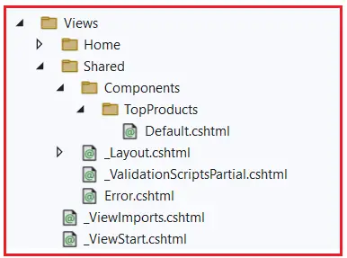

### View Components in ASP.NET Core MVC

In this article, I am going to discuss View Components in ASP.NET Core MVC Application with Examples. Please read our previous article discussing Different Ways to Render Partial Views in ASP.NET Core MVC Applications. At the end of this article, you will understand the following pointers.

1. What are the View Components in ASP.NET Core MVC?
2. What Are All Files Available in a View Component in ASP.NET Core MVC?
3. What Should be the Location for the Files of View Components in ASP.NET Core?
4. Example to Understand View Component in ASP.NET Core MVC.
5. How Do We Invoke a View Component from a View File in ASP.NET Core MVC?
6. View Component vs. Partial View in ASP.NET Core MVC

### What are the View Components in ASP.NET Core MVC?

View Components in ASP.NET Core MVC are used to **create reusable components that can encapsulate rendering logic and data fetching logic independently from views**, and they can be called from different places like from Controller action methods, from views, and from Razor Pages. They are similar to partial views, but they can have their own logic, making them suitable for creating dynamic content that requires processing.

View Components consist of two main parts: the class that handles processing and logic and the result it returns, which is typically a view (rendered HTML). They are ideal for scenarios where you need to display information that requires some business logic to fetch or generate the displayed data, such as dynamic navigation menus, a shopping cart, or user profile summaries.

### What Are All Files Available in a View Component in ASP.NET Core MVC?

A View Component typically consists of 2 files in ASP.NET Core MVC. They are as follows:

- **Server-Side File (.cs file)**: Contains the logic to retrieve or prepare data.
- **Client Side File (.cshtml file)**: Renders the output, similar to how a partial view works.

### What Should be the Location for the Files of View Components in ASP.NET Core?

**Server-Side file (.cs):**

This file can be **created anywhere in the project**. But we generally create a new folder (with the name Components, ViewComponents, or any other name as per your choice) at the root level of the project and put all the view components in this folder.

     ( create ViewComponents folder at root level of project)


**Client-Side File (.cshtml):**

The client-side file of a view component **must be placed at a specific location**.

- **Location 1**: If you want to call the View Component **from the controller’s action method**, then you need to add the view component client-side file at the location- **/Views/{Controller Name}/Components/{View Component Name}/{View Name}**

- **Location 2**: If you want to call the view component **from the other cshtml file**, then you need to add the view component client-side file at the location- **/Views/Shared/Components/{View Component Name}/{View Name}**

- **Location 3**: If you are using a view component **in Razor pages**, then you need to add the view component client-side file at the location- **/Pages/Shared/Components/{View Component Name}/{View Name}**

**Note**: The name for each View Component file is Default.cshtml. But you can also have other names for your vView Component client-side file. **But the recommended one is Default.cshtml**

### Example to Understand View Component in ASP.NET Core MVC Web Application

We want to display the top-selling products on the web page using the View Component. Let us see the step-by-step process to implement this using the View Component. First, create a new ASP.NET Core Web Application using the Model-View-Controller Project template with the name ViewComponentInMVC.

**Product Model:**

Create a class file named **Product.cs** within the Models folder, and then copy and paste the following code. This is going to be our model, which will hold the product information.

```csharp
namespace ViewComponentInMVC.Models
{
    public class Product
    {
        public long ProductID { get; set; }
        public string? Name { get; set; } = null!;
        public string Category { get; set; } = null!;
        public string Description { get; set; } = null!;
        public decimal Price { get; set; }
    }
}
```

**ProductRepository File:**

Create a Class file named ProductRepository.cs within the Models folder, and then copy and paste the following code. The code for getting the top-selling products from the database is written in the ProductRepository.cs file. You will get the data from the database in real time, but here, we have hard-coded it.

```csharp
namespace ViewComponentInMVC.Models
{
    public class ProductRepository
    {
        public async Task<List<Product>> GetTopProductsAsync(int count)
        {
            IEnumerable<Product> products = new List<Product>()
            {
                new Product { ProductID =1, Name ="Product 1", Category = "Category 1", Description ="Description 1", Price = 10m},
                new Product { ProductID =2, Name ="Product 2", Category = "Category 1", Description ="Description 2", Price = 20m},
                new Product { ProductID =3, Name ="Product 3", Category = "Category 1", Description ="Description 3", Price = 30m},
                new Product { ProductID =4, Name ="Product 4", Category = "Category 2", Description ="Description 4", Price = 40m},
                new Product { ProductID =5, Name ="Product 5", Category = "Category 2", Description ="Description 5", Price = 50m},
                new Product { ProductID =6, Name ="Product 6", Category = "Category 2", Description ="Description 6", Price = 50m}
            };
            //We are Delaying the Execution for 1 Seconds to get the Data from the database
            await Task.Delay(TimeSpan.FromSeconds(1));
            return products.Take(count).ToList();
        }
    }
}
```

### View Component Server-Side File in ASP.NET Core MVC:

Now, we need to create the View Component server-side file. In the project, we can add the server-side file at any location (let’s say within the ViewComponents folder). So, in the project root directory, create a folder named **ViewComponents**. Suppose the name of the View Component server-side file is TopProducts; then, we must add a suffix ViewComponent to its name. Hence, the final name of the View Component server-side file will be **TopProductsViewComponent**.

### Creating TopProductsViewComponent

A View Component is a class that derives from a ViewComponent class and implements the Invoke or InvokeAsync method. The Invoke method is synchronous, while InvokeAsync is asynchronous. It contains the logic to generate the content. The Invoke or InvokeAsync method can return a view (HTML) using the View method, similar to how actions in controllers work. The Invoke or InvokeAsync method is the entry point for the View Component. This method contains the logic to generate the data and select a view to render it.

So, **create a class file named TopProductsViewComponent.cs within the ViewComponents folder** and copy and paste the following code. The code is self-explained, so please read the comment line for a better understanding. Here, we are using the InvokeAsync method for better performance and scalability.

```csharp
using Microsoft.AspNetCore.Mvc;
using ViewComponentInMVC.Models;
namespace ViewComponentInMVC.ViewComponents
{
    //Create a Class, and it should inherit from ViewComponent class
    public class TopProductsViewComponent : ViewComponent
    {
        //The Invoke method for the View component
        public async Task<IViewComponentResult> InvokeAsync(int count)
        {
            // Your logic for preparing data
            ProductRepository productRepository = new ProductRepository();
            var products = await productRepository.GetTopProductsAsync(count);
            return View(products);
        }

        //public IViewComponentResult Invoke(int count)
        //{
        // // Your logic for preparing data
        // ProductRepository productRepository = new ProductRepository();
        // var products = productRepository.GetTopProductsAsync(count).Result;
        // return View(products);
        //}
    }
}

```

**Here**:

- **TopProductsViewComponent**:  The TopProductsViewComponent class inherits from the ViewComponent class, making it a View Component. This inheritance enables the class to execute logic and return a view for rendering.

- **InvokeAsync Method**:  The InvokeAsync method is the entry point for the View Component. It is called when the component is invoked from a Razor view. The method is asynchronous, allowing for non-blocking I/O operations, such as database calls. It accepts an integer parameter count, which specifies the number of top-selling products to retrieve.
- **return View(products);**:  The InvokeAsync method returns a view for rendering by calling the View method. The View method looks for a Razor view that matches the View Component’s name in the **Views/Shared/Components/TopProducts** folder by default. The products model, which is a collection of top-selling products, will be passed to the view. This model can then be used within the view to render HTML content.

### View Component Client-Side File in ASP.NET Core MVC:
We are using the ASP.NET Core MVC Application and want to invoke the View Component from a view file. Hence, we need to place the client-side file at the location **/Views/Shared/Components/{ViewComponentName}/{ViewName}.cshtml**. In our example, the View Component Name is TopProducts, and the view name is going to be Default.cshtml. So, we need to create the View in the location: **/Views/Shared/Components/TopProducts/Default.cshtml**

Once you create the Default.cshtml view file, your Views folder should look as shown below.



Now, open Default.cshtml view file and then copy and paste the following code into it. Here, you can see that IEnumerable<Product> is going to be the model, and using a loop, we are rendering the top-selling products.

```csharp
@model IEnumerable<Product>
<div class="row">

    <div>
        <h4>Product Details</h4>

        <table class="table">
            <tr>
                <th>
                    ProductID
                </th>
                <th>
                    Name
                </th>
                <th>
                    Category
                </th>
                <th>
                    Description
                </th>
                <th>
                    Price
                </th>
            </tr>

            @foreach (var product in Model)
            {
                <tr>
                    <td>
                        @product?.ProductID
                    </td>
                    <td>
                        @product?.Name
                    </td>
                    <td>
                        @product?.Category
                    </td>
                    <td>
                        @product?.Description
                    </td>
                    <td>
                        @product?.Price
                    </td>
                </tr>
            }
        </table>
    </div>
</div>
```

With this, our view component is completed and ready to use.

### How Do We Invoke a View Component from a View File in ASP.NET Core MVC?

We can invoke a View Component from a view using the Component.InvokeAsync HTML Helper method, passing the name of the component and any necessary parameters. View components do not use model binding, so you need to pass any required data explicitly using an anonymous object. So, we can invoke the View Component from a view file by using the following syntax:

`@await Component.InvokeAsync(“Name of View Component”, {Anonymous Type Containing Parameters});`

### How Do We Invoke a View Component from a View File Using Tag Helper ASP.NET Core MVC?

View components can also be invoked using HTML Tag Helper on any view (cshtml) file using the following syntax.

```c#
<vc:[view-component-name]
      parameter1=”parameter1 value”
      parameter2=”parameter2 value”>
</vc:[view-component-name]>
```

### Invoking the TopProducts View Component in ASP.NET Core MVC View:

Now, we need to invoke the TopProducts View Component from another view file. So, modify the Index.cshtml file of Home Controller as follows. Here, TopProducts is the name of the View Component, and we are creating an anonymous object with a count property with a value of 3. You can assign any value to the count parameter. If you check the View Component CS class file, you will see the InvokeAsync or Invoke method taking one integer parameter named count, and here, we pass a value 3 to that count parameter.

```html

@{
    ViewData["Title"] = "Home Page";
}
<div class="text-center">
    @await Component.InvokeAsync("TopProducts", new { count = 3})
</div>
```

With the above changes in place, run the application, access the Home/Index URL and you should get the following output.


### Invoke a View Component From a View File Using HTML Tag Helper in ASP.NET Core MVC:

Please update the ViewImport file as follows to include the required tag helpers. Here, ViewComponentInMVC is the project name.

```csharp
@using ViewComponentInMVC
@using ViewComponentInMVC.Models
@addTagHelper *, Microsoft.AspNetCore.Mvc.TagHelpers
@addTagHelper *, ViewComponentInMVC
@addTagHelper *, ViewComponentInMVC.TagHelpers
```

Now, if you want to invoke the View Component using Tag Helper, then modify the Index.cshtml file of the Home controller as follows:

```html
@{
    ViewData["Title"] = "Home Page";
}

<div class="text-center">
    <vc:top-products count="3"></vc:top-products>
</div>
```

### View Components Real-Time Examples in ASP.NET Core MVC:

To avoid code duplication in ASP.NET Core MVC Web Applications, the View Components can be used in various areas such as the Navigation Menus, Login Panel, Billing and Shipping Address, Shopping Cart, etc. View components can be used to create the following features:

- Login Panel.
- Dynamic Navigation Menu (Based on role etc.).
- Get some related data for a page. (Like Related posts, Related books).
- Shopping Cart.
- Shipping and Billing Address.
- Any content visible on the side of the Web Page, etc.

### View Component vs. Partial View in ASP.NET Core MVC

In ASP.NET Core MVC, View Components and Partial Views create reusable components, allowing developers to avoid duplicating markup across different views. However, they serve different purposes and come with their own features, making them suitable for different scenarios.

### View Component in ASP.NET Core MVC

View Components are intended for more complex scenarios where you need to execute some logic before rendering the HTML. They are a combination of a C# class that handles the logic and a Razor view that generates the HTML markup. View Components are not part of the MVC request life cycle, which means they cannot directly respond to HTTP requests. Instead, they are invoked from within a view and can be used to render a portion of a page with its own logic. So, View Components are for dynamic content such as dynamic navigation menus, a shopping cart, or user profile summaries.

### Partial View in ASP.NET Core MVC

Partial Views, on the other hand, are more straightforward. Unlike View Components, Partial Views do not have their own logic. They depend on the data provided to them by the view that renders them, typically through model binding or ViewData/ViewBag. Partial views are best for HTML generation without additional processing or data fetching. So, they are best for static content that is going to be reused on multiple pages, such as headers, footers, or reusable forms.

In the next article, I will discuss Razor View Syntax in ASP.NET Core MVC Applications with Examples. In this article, I will explain View Components in ASP.NET Core MVC Applications with Examples. I hope you enjoy this article.