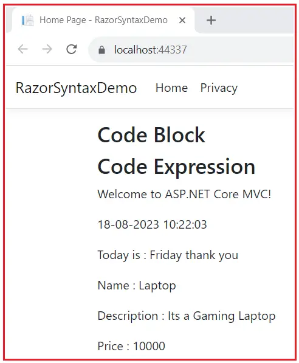
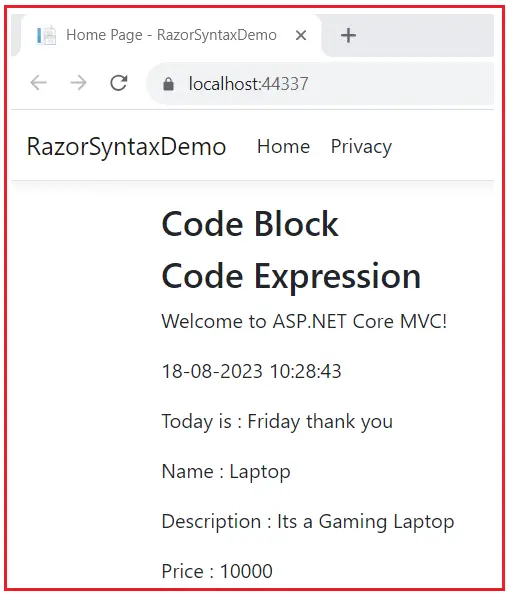
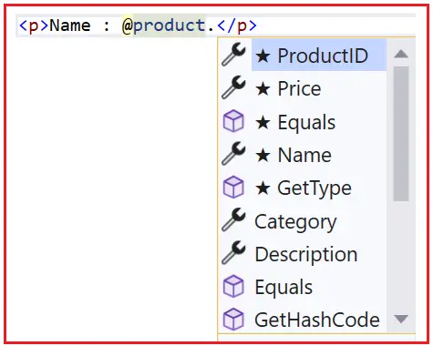
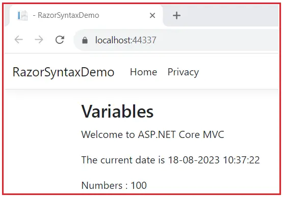
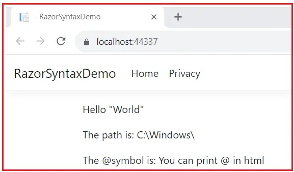

### Razor Syntax in ASP.NET Core

In this article, I will discuss Razor Syntax in ASP.NET Core MVC Web Application with Examples. Please read our previous article discussing View Components in ASP.NET Core MVC.

### What is Razor Markup?

Razor Markup refers to the syntax used in Razor view templates in ASP.NET web applications to combine server-side code with HTML markup. Razor Markup allows developers to embed C# code directly within HTML, making generating dynamic and data-driven content for web pages easier. The Razor Markup syntax is designed to be concise, readable, and intuitive, enabling seamless integration of code and markup.

The Controller in ASP.NET Core MVC invokes the View by passing the data to render. The Views must be able to process the data and generate a response. This is done using the Razor markup, which allows us to use C# code in an HTML file. The Razor View Engine processes these markups to generate the HTML.

### Example to Understand Razor Syntax in ASP.NET Core MVC:

First, create a new ASP.NET Core Web Application using the Model-View-Controller Project template with the name RazorSyntaxDemo. Then, create a class file with the name Product.cs within the Models folder and copy and paste the following code.

```C#
namespace RazorSyntaxDemo.Models
{
    public class Product
    {
        public long ProductID { get; set; }
        public string? Name { get; set; } = null!;
        public string Category { get; set; } = null!;
        public string Description { get; set; } = null!;
        public decimal Price { get; set; }
    }
}
```

### Razor Syntax in ASP.NET Core MVC:

The Razor uses the @ symbol to switch from HTML markup to the C# code. The following are the two ways by which you can achieve the transitions.

1. Using Razor code expressions
2. Using Razor code blocks.

These expressions are evaluated by the Razor View Engine and written to the response.

### Razor Code Block Syntax in ASP.NET Core MVC:

The Razor code blocks start with the @ symbol, followed by curly braces. You can use code blocks anywhere in the markup. A Razor code block can be used to manipulate a model, declare variables, set local properties on a view, etc. However, it would be best if you did not use it for business logic. Now, open the index.cshtml file of Home Controller and copy and paste the following code into it.

```razor
<h3>Code Block</h3>

@{
    var greeting = "Welcome to ASP.NET Core MVC!";
    var weekDay = DateTime.Now.DayOfWeek;
    ViewData["Title"] = "Home Page";
}

@{
    var product = new RazorSyntaxDemo.Models.Product()
            {
                ProductID = 1000,
                Name = "Laptop",
                Description= "Its a Gaming Laptop",
                Category = "Electronics",
                Price = 10000
            };
}

```

First, we have created a Razor code block beginning with a @ symbol and { } curly brackets. Inside the Curly brackets, we have regular C# code, which declares greeting and weekDay Variables as well as a ViewData to hold the Title property. The Second Razor Code block creates a product variable, which is a new instance of the Product model class.

### Razor Code Expression Syntax in ASP.NET Core MVC

The Razor Code expressions start with @ and are followed by C# code. The Code expression can be either Implicit or Explicit.

**Implicit Razor Expressions**

Implicit Razor expressions start with @ followed by C# code. In the below example, the codes @greeting, @DateTime.Now, and @WeekDay are treated as Implicit Razor expressions. Space is not allowed in the Code expression, as it is used to identify the end of the expression. The Razor View engine evaluates the expressions, and the result is inserted in their place.

```razor
<h3>Code Block</h3>

@{
    var greeting = "Welcome to ASP.NET Core MVC!";
    var weekDay = DateTime.Now.DayOfWeek;
    ViewData["Title"] = "Home Page";
}

@{
    var product = new RazorSyntaxDemo.Models.Product()
            {
                ProductID = 1000,
                Name = "Laptop",
                Description= "Its a Gaming Laptop",
                Category = "Electronics",
                Price = 10000
            };
}

<h3>Code Expression</h3>

<p>@greeting</p>
<p>@DateTime.Now</p>
<p>Today is : @weekDay thank you </p>
<p>Name : @product.Name</p>
<p>Description : @product.Description</p>
<p>Price : @product.Price</p>

```

Now, run the application, and you should see the following output.



### Explicit Razor Expressions

Explicit Razor expressions start with @ followed by (). Any content within the () parenthesis is evaluated and rendered to the output.

```razor
<h3>Code Block</h3>

@{
    var greeting = "Welcome to ASP.NET Core MVC!";
    var weekDay = DateTime.Now.DayOfWeek;
    ViewData["Title"] = "Home Page";
}

@{
    var product = new RazorSyntaxDemo.Models.Product()
            {
                ProductID = 1000,
                Name = "Laptop",
                Description= "Its a Gaming Laptop",
                Category = "Electronics",
                Price = 10000
            };
}

<h3>Code Expression</h3>

<p>@(greeting)</p>
<p>@(DateTime.Now)</p>
<p>Today is : @(weekDay) thank you </p>
<p>Name : @(product.Name)</p>
<p>Description : @(product.Description)</p>
<p>Price : @(product.Price)</p>

```

Now, run the application, and you should see the following output.



### IntelliSense Support in Razor Syntax

The image below shows how the Razor markup is used inside an HTML page and the Intelligence support from Visual Studio.



### Using Directive

The @using directive works similarly to the C# using directive and allows you to import namespaces and the RazorSyntaxDemo.Models can be imported as shown below. Here, you **don’t need to need the statement with a semicolon.**

`@using RazorSyntaxDemo.Models`

And then, we can use var product = new Product() instead of var product = new RazorSyntaxDemo.Models.Product() as follows:

```razor
@using RazorSyntaxDemo.Models
<h3>Code Block</h3>

@{
    var greeting = "Welcome to ASP.NET Core MVC!";
    var weekDay = DateTime.Now.DayOfWeek;
    ViewData["Title"] = "Home Page";
}

@{
    var product = new Product()
            {
                ProductID = 1000,
                Name = "Laptop",
                Description= "Its a Gaming Laptop",
                Category = "Electronics",
                Price = 10000
            };
}
```

### Variable Declaration using Razor Syntax in ASP.NET Core MVC

The Variables are declared using the var keyword or using the C# data type. The int, float, decimal, bool, DateTime & string keywords can be used to store strings, numbers, dates, etc. The variables are inserted directly into a page using @.

```html
<h3>Variables </h3>

<!-- Storing a string -->
@{
    string message = "Welcome to ASP.NET Core MVC";
}

<!—Storing date and integer-->
@{
    DateTime date = DateTime.Now;
    int Number = 100;
}

<p>@message</p>
<p> The current date is @date</p>
<p>Numbers : @Number</p>

```

Now, run the application, and you should see the following output.



Strings are enclosed in double quotation marks. To use a double quotation mark inside the string, use a verbatim string literal. The verbatim string is prefixed with the @ symbol and repeats the quotation mark.

```html
@{
    var helloWorld = @"Hello ""World""";
}

<p>@helloWorld</p>
```

Similarly,backslash characters can be printed using the same technique.

```html
@{
    var Path = @"C:\Windows\";
}

<p>The path is : @Path</p>

```

You can print @ in HTML by repeating (Escape) the @ symbol as shown below.

```html
@{
    var symbol = "You can print @ in html";

}

<p>The @@symbol is : @symbol </p>

```

So, modify the Index view as follows:

```html
@{
    var helloWorld = @"Hello ""World""";
}
<p>@helloWorld</p>

@{
    var Path = @"C:\Windows\";
}
<p>The path is: @Path</p>

@{
    var symbol = "You can print @ in html";
}
<p>The @@symbol is: @symbol</p>
```

Now, run the application, and you should see the following output.



### Comments

Use @* *@ to place comments

@*This is comment*@

### HTML Elements inside the code block

The Razor Engine Correctly Identifies any HTML Elements inside the Razor code block, as shown below.

```html
@{
    <p>Hello from the Code block</p>
}

```

### Single line text

You can output the literal values without the HTML element by prefixing it with @: and @: used to define the single line of literal values.

```html
@{
    @:Hello from the Code block
}
```

### Multiline text

For the multiline text use the <text> </text> element

```html
@{
    <text>
        Multiline text 1
        Multiline text 2
        Multiline text 3
    </text>
}

```

### Conditional Statements

The Razor engine is able to process conditional statements like if and Switch statements.

### If and Else Conditions

If Condition is used to render a section based on a condition as shown below.

```html
@{
    int value = 200;
}

@if (value > 100)
{
    <p>Value is greater than 100</p>
}
else
{
    <p>Value is less than 100</p>
}
```

Or you can use the following code.

```html
@{
    var value = 200;
    if (value > 100)
    {
        <p>The value is greater than 100</p>
    }
    else
    {
        <p>This value is less than 100</p>
    }
}
```


### Switch Statements in Razor View

A switch statement can insert a section into HTML based on a number of conditions.

```html
@{
    var value = 200;
}

@switch (value)
{
    case 0:
        @: value is Zero
        break;
    case 100:
        <p>Value is 100 </p>
        break;
    case 200:
        <p>Value is @value </p>
        break;
    case 300:
        <text>Value is 300</text>
        break;
    default:
        <p>Invalid Value </p>
        break;
}

```


### Loops

#### For loop

The loops are used to repeat a code block for,

```html
@for (int i = 0; i < 5; i++)
{
    <span> @i </span>
}
```

### Foreach loop

The best use case of a for-each loop is to loop through a collection object and display the result inside a table.

```html
@using RazorSyntaxDemo.Models

@{
    var productList = new List<Product>()
    {
        new Product() { ProductID = 1001, Name = "Laptop", Price = 1000 },
        new Product() { ProductID = 1002, Name = "Desktop", Price = 2000 },
        new Product() { ProductID = 1002, Name = "Mobile", Price = 3000 }
    };
}

<table>
    <thead>
        <tr><td>ProductID</td><td>Name</td><td>Price</td></tr>
    </thead>
    @foreach (Product product in productList)
    {
        <tr>
            <td>@product.ProductID</td>
            <td>@product.Name</td>
            <td>@product.Price</td>
        </tr>
    }
</table>

```

**While loop:**

```html
<h3>While loop</h3>
@{
    var r = 0;
    while (r < 5)
    {
        r += 1;
        <span> @r</span>
    }
}

```

In the next article, I am going to discuss How to Install Bootstrap in ASP.NET Core MVC Application. In this article, I explained Razor Syntax in the ASP.NET Core MVC Application. I hope you enjoy this Razor Syntax in ASP.NET Core MVC article.

