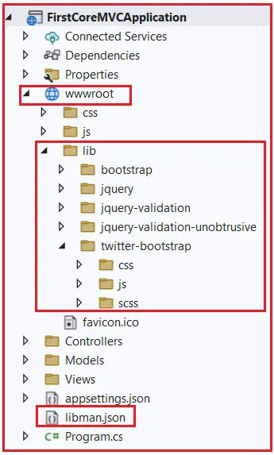

### How to Install Bootstrap in ASP.NET Core MVC Application

In this article, I am going to discuss How to Install Bootstrap in ASP.NET Core MVC Web Application. Our previous article discusses Razor View Engine and Razor Syntax in ASP.NET Core MVC Web Applications. As part of this article, I am going to discuss the following pointers.


1. Different Tools to Install Client-Side Packages in ASP.NET Core.
2. What is Library Manager or Libman in ASP.NET Core?
3. How to Check and Upgrade the Version in Visual Studio?
4. How to Install Bootstrap in ASP.NET Core Using Library Manager?
5. What is the libman.json file in ASP.NET Core?
6. How to Clean and Restore Client-Side Libraries Using Libman in ASP.NET Core?
7. How to Uninstall or Update a Client-Side Library using the libman.json file?

### Different Tools to Install Client-Side Packages in ASP.NET Core:


You can use many tools to install client-side packages, such as jQuery and Bootstrap, using Visual Studio. Some of the popular tools are as follows:

1. Bower
2. NPM
3. WebPack, etc.

But, here in this article, I will not use any of the above tools; instead, we will use Library Manager, known as LibMan, to install the client-side packages in ASP.NET Core MVC Application. In our upcoming article, I will show you how to install the client-side packages using Bower, NPM, and WebPack.

### What is Library Manager or Libman in ASP.NET Core?

The Library Manager or LibMan is one of the most popular lightweight, client-side library manager tools. This tool is used to download client-side libraries and frameworks such as Bootstrap and jQuery from a file system or a CDN (Content Delivery Network). In order to use Library Manager, you should have Visual Studio 2017 version 15.8 or later.

### How to Check and Upgrade the Version in Visual Studio?

In order to check the Visual Studio Version, you need to follow the below steps.

Click on the “Help” menu and then select the “About Microsoft Visual Studio” option from the context menu. This will open the “About Microsoft Visual Studio” Window, which shows the version number of Visual Studio in the image below. I have installed Visual Studio 2022 on my machine with Version 17.6.4.


### How to Install Bootstrap in ASP.NET Core Using Library Manager?

You must follow the steps below to install Bootstrap in ASP.NET Core MVC Application using the Library Manager (Libman).

1. Right-click on the “Project Name” in the Solution Explorer and then select Add > Client-Side Library, which will open the “Add Client-Side Library” Window.

2. Leave the default provider as it is, which “cdnjs” is in this case. The other providers are filesystem, jsdelivr, and unpkg.

3. In the “Library” text box, type “twitter-bootstrap“. You can also get intelligence support once you start typing. Once you select the matching entry, then it tries to install the latest version of Bootstrap. However, if you want, you can manually type the version number. Here, we are installing the latest version of Bootstrap, i.e. (twitter-bootstrap@5.3.0).

4. There are two radio buttons to select whether you to include “All library files” or “Choose Specific files“. If you select the “All library files” radio button, all the files will be downloaded. On the other hand, if you select the “Choose Specific files” radio button, then you need to check the selected checkboxes as per your requirement. Here I am selecting the “All library files” radio button.

5. In the “Target Location” text box, specify the folder location where you want the library files to be installed. By default, the static files are only served from the wwwroot folder. I am going with the default location, i.e., “wwwroot/lib/twitter-bootstrap/”.

6. Finally, click on the “Install” button, as shown in the image below.


Once it is successfully installed, then you will find two things. One is the libman.json file, and the second one is the required bootstrap files. Please have a look at the following image.



### What is the Libman.json file in ASP.NET Core MVC?

The libman.json file is the Library Manager manifest file. You will find the following code in the libman.json file.

```json
{
  "version": "1.0",
  "defaultProvider": "cdnjs",
  "libraries": [
    {
      "library": "twitter-bootstrap@5.3.0",
      "destination": "wwwroot/lib/twitter-bootstrap/"
    }
  ]
}
```

As you can see in the above code, we have an entry for the Bootstrap library that we just installed using Libman. It is also possible to install client-side libraries like Bootstrap and jQuery by editing the above manifest file.

### How to Clean Client-Side Libraries using LibMan in ASP.NET Core?

If you want to clean the library files created using the Library Manager, right-click on the libman.json file and select the “Clean Client-Side Libraries” option from the context menu, as shown in the below image. 


Once you click on the “Clean Client-Side Libraries” option, then it will delete all the library files from the respective destination folder. The point that you need to remember is that it will only delete the files from the folder but not in the libman.json file. Please look at the following image and see the Twitter-bootstrap folder; its files are deleted, but the libman.json file is still there.


### How to Restore Client-Side Libraries using Libman in ASP.NET Core?

If you want to restore the deleted files, you need to right-click on the libman.json file and select the “Restore Client-Side Libraries” option from the context menu, as shown in the image below. 


Once you click on the “Restore Client-Side Libraries” option, it will again download and install the required library files into the specified destination folder, as shown in the image below.


### How to Add a Library using the libman.json file?

Now, we need to add the jQuery Library, but not using the way we add Bootstrap. So, basically, we want to add the jQuery library using the libman.json file. To do so, modify the libman.json file as follows.

```json
{
  "version": "1.0",
  "defaultProvider": "cdnjs",
  "libraries": [
    {
      "library": "twitter-bootstrap@5.3.0",
      "destination": "wwwroot/lib/twitter-bootstrap/"
    },
    {
      "provider": "cdnjs",
      "library": "jqueryui@1.13.2",
      "destination": "wwwroot/lib/jqueryui/"
    }
  ]
}

```

Then right-click on the libman.json file and select the “Restore Client-Side Libraries” option from the context menu, and it should add the respective jQuery library, as shown in the image below.


### How to Uninstall or Update a Client-Side Library using Libman.json File in ASP.NET Core MVC?

If you want to uninstall or update a client-side library using the libman.json file, then you need to follow the below steps.

1. Open the libman.json file. 

2. Click on the client-side library which you want to uninstall or update

3. A light bulb icon will appear on the left side

4. Click on the light bulb icon, and then you will see the options of whether to update or uninstall that specific client-side library, as shown in the below image.


Another approach to uninstall a client-side library is to remove the entry from the libman.json file, and upon saving the file, the respective client-side libraries are uninstalled from the respective folder location. For example, if we modify the libman.json file as shown below, you will immediately see the respective library being deleted from the wwwroot project folder.

```json
{
  "version": "1.0",
  "defaultProvider": "cdnjs",
  "libraries": [
    {
      "library": "twitter-bootstrap@5.3.0",
      "destination": "wwwroot/lib/twitter-bootstrap/"
    }
  ]
}
```

Now, you can check the lib folder, which is inside the wwwroot folder, and you should see that the JqueryUI folder was deleted, as shown in the below image.


Another approach to upgrade or downgrade a client-side library is to change the version number directly in the libman.json file, as shown in the below image. The respective client-side library will be updated to the version you modified after saving the file. While updating the version number, you will also get the visual studio intelligence shown in the image below.


In the next article, I am going to discuss How to Use Bootstrap in ASP.NET Core MVC Web Applications. Here, in this article, I try to explain How to Install Bootstrap in ASP.NET Core MVC Application. I hope you enjoy this How to Install Bootstrap in ASP.NET Core MVC article.

