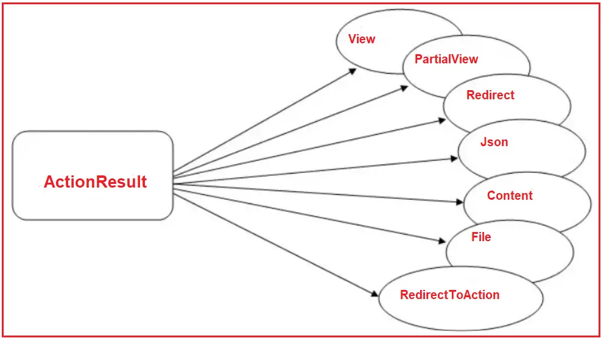

### Action Results in ASP.NET Core MVC

In this article, I will give an overview of the Action Results in ASP.NET Core MVC Web Application with Examples. At the end of this article, you will understand the different types of Action Results and when to use which action results in ASP.NET Core MVC Application. Before understanding Action Results, let’s understand Action Methods in ASP.NET Core MVC.

### What are Action Methods in ASP.NET Core MVC?

Action methods in ASP.NET Core MVC are the public methods defined within a Controller class that responds to incoming HTTP requests. **Each action method typically handles a particular HTTP request type (like GET or POST)**. They are responsible for executing the logic needed to process the request and generate a response. Action methods are annotated with attributes like [HttpGet], [HttpPost], [HttpDelete], etc., to specify the types of requests they can handle. Each action method corresponds to a specific URL or a set of URLs, and they can return various types of responses, such as views, JSON data, or files. When creating an Action Method, we **must follow the below rules**:

1. The action method must be public.

2. It cannot be overloaded.

3. It cannot be a static method.

4. IActionResult is the base class of all the result types an action method returns.

5. They can accept parameters from the request (e.g., query strings, route data, form data).

### ActionResult Class in ASP.NET Core MVC:

The ActionResult class is an abstract class in ASP.NET Core MVC that serves as the base class for various result types that an action method can return. It allows action methods to return different types of results, such as views, JSON, files, redirects, or HTTP status codes. It encapsulates everything needed to generate a response to the client, including the HTTP status code, data, and any headers. So, it provides a unified way of handling different types of responses. ActionResult is an abstract class, meaning it cannot be instantiated directly. Instead, it serves as a base class for derived result types.

As you can see in the diagram below, View, Partial View, Redirect, Json, Content, File, RedirectToAction, etc., are derived from the abstract Action Result class, and these types can also be used as the return type of an action method.

Some common derived classes of ActionResult include:

- ViewResult: Represents a view.

- JsonResult: Represents JSON data.

- FileResult: Represents a file.

- RedirectResult: Represents a redirection to a URL.

- ContentResult: Represents plain text content.

- StatusCodeResult: Represents an HTTP status code.

If you go to the definition of the ActionResult class, you will see the following signature. As you can see in the image below, ActionResult is an Abstract class inherited from the IActionResult interface. This class provides a default implementation of IActionResult. It has two virtual methods which can be overridden in the child classes.

The ActionResult abstract class in ASP.NET Core MVC defines two key methods: ExecuteResultAsync and ExecuteResult. These methods execute the action result and generate the response.

### ExecuteResult(ActionContext context)

This method is responsible for executing the action result synchronously and writing the response to the HTTP context. Although synchronous methods are straightforward, they are less efficient for I/O-bound operations compared to asynchronous methods.

This method can be overridden in derived classes of ActionResult to provide specific behavior for different types of results. However, in modern ASP.NET Core applications, the asynchronous version (ExecuteResultAsync) is preferred for I/O-bound operations to avoid blocking threads and improve scalability.

### ExecuteResultAsync(ActionContext context)

This method is an asynchronous version of the ExecuteResult method. It is responsible for executing the action result asynchronously and writing the response to the HTTP context. Asynchronous operations improve the scalability and responsiveness of web applications, especially when dealing with I/O-bound tasks like database operations, file access, or network calls.

This method is typically overridden in derived classes of ActionResult to provide specific behavior for different types of results. For example, ViewResult, JsonResult, and FileResult override this method to implement their specific response generation logic.

**Points to Remember:**

- When the framework processes an action method that returns an IActionResult or ActionResult, it will typically call ExecuteResultAsync on the result object. This allows the framework to handle I/O-bound operations (such as database calls, file access, or network requests) without blocking threads.

- While the framework primarily uses ExecuteResultAsync, the synchronous ExecuteResult method is provided for backward compatibility and for scenarios where asynchronous execution is not necessary, such as when creating Custom Middleware or Components.

### Types of Action Results in ASP.NET Core MVC:

Action results in ASP.NET Core MVC can be categorized into different groups based on their functionality and the type of response they generate. 

**View Results:**

View Results in ASP.NET Core MVC are action results used to render a view, typically returning HTML to the client. It is the most common result type when returning a web page in response to an HTTP request. There are two main types of View Results in ASP.NET Core MVC:

- ViewResult: When an action method returns a ViewResult, it renders a Razor view (.cshtml file) associated with the action method. 

- PartialViewResult: You can also return a partial view using PartialViewResult, which is a subclass of ViewResult.

#### Content Results:

Content Results in ASP.NET Core MVC are action results that return raw content as the HTTP response. They can return plain text, HTML, or any other type of textual content such as JSON, XML, etc. 

- ContentResult:  The ContentResult is useful for returning plain text or HTML directly from the action method without using views. It returns the result as a string in the response body.

- JsonResult:  The JsonResult in ASP.NET Core MVC Sends a JSON response. This is commonly used in AJAX applications. You can return this by calling Json() with an object that will be serialized into JSON format.

#### File Results

File Results are used to return files as responses. They can return files from the server’s file system, byte arrays, or streams, including files such as PDFs, images, and documents. They also provide options for serving files directly to the client with appropriate content types and file names.

- FileResult: The FileResult in ASP.NET Core MVC returns binary file data to the client. We can return various file types using methods like File() and specifying the file path or a byte array, along with the content type. You can use it to return files, such as PDFs, images, etc., to the client for downloading.

### Redirect Results:

Redirect Results are used to redirect the client to a different URL or action. This is useful for navigating between pages or performing redirection after form submissions. Redirects to a different URL, another action method, or even an external site. There are three main types of Redirect Results in ASP.NET Core MVC:

- RedirectResult: Redirects to a specified URL. It is useful in scenarios where you want to redirect the user to an external URL.

- RedirectToActionResult: Redirects to another action method within the same or different controller.

- RedirectToRouteResult: This represents a response that redirects to a specific route configured in your application.

#### Status Results:

Status Results are used to return HTTP status codes. This is useful for indicating success, failure, or other status conditions. Allows us to return various HTTP status codes, such as 404 Not Found, 400 Bad Request, or 200 OK. There are several types of Status Results in ASP.NET Core MVC:

- StatusCodeResult: Returns a specific HTTP status code.
- BadRequestResult: Returns HTTP 400 Bad Request.
- UnauthorizedResult: Returns HTTP 401 Unauthorized.
- NotFoundResult: Returns a 404 Not Found status code.
- OkResult: Returns a 200 OK status code.
- NoContentResult: Returns HTTP 204 No Content status code.

### What Should Be the Return Type of an Action Method: Action Result or Specific Derived Type?

The choice between using ActionResult as a return type or a specific derived type depends on the specific needs of the action method. Using ActionResult allows for flexible return types, which can be useful in scenarios where the action method needs to return different types of results based on the business logic. However, returning a specific derived type provides a clearer contract about what to expect from the action method, which can enhance understandability and maintainability. 

### Using ActionResult Return Type:

If your action method returns different kinds of results based on different conditions, then you should use ActionResult as the return type. For a better understanding, please look at the example code below. As the Index method returns two types of Results, i.e., View Result and Json Result, we use the Action method’s return type as ActionResult.

### Using Specific Derived Types:

With this approach, you explicitly define the return type of your action method as a specific derived type like ViewResult, JsonResult, RedirectResult, etc. This approach can provide more clarity and improve readability by making it explicit what type of response the action method will produce. In the example below, the action method will return one type of result, i.e., JsonResult, so it is advisable to use JsonResult as the action method’s return type.

In the next article, I will discuss View Results in an ASP.NET Core MVC Application. Here, in this article, I give an overview of Action Results in ASP.NET Core MVC applications. I hope you enjoy this Action Result in an ASP.NET Core article.

