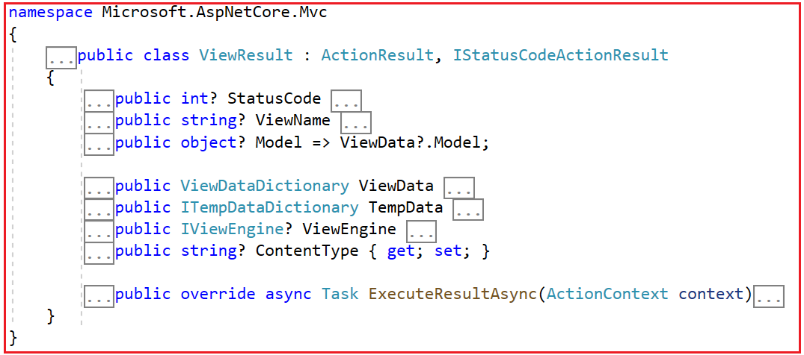
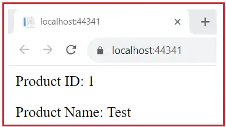

### View Result in ASP.NET Core MVC

In this article, I will discuss the View Result in the ASP.NET Core MVC Applications with Examples. Please read our previous article, where we discussed the basic concepts of Action Results in ASP.NET Core MVC Application. In ASP.NET Core MVC, ViewResult refers to one of the possible types of action results returned by the controller action methods. In the controller action method, the return type indicates what should be returned to the client (typically a web browser).

### ViewResult in ASP.NET Core MVC

The ViewResult class represents an action result that renders a view. This is typically used in a controller action to return a view to the client. A view is a file with a .cshtml extension that contains the HTML markup with C# code using Razor syntax. This allows for dynamic HTML generation based on the data passed from the controller.

The ViewResult class derives from the ActionResult base class. If you go to the definition of ViewResult class, then you will see the following signature. As you can see, it is a concrete class with a few properties, overriding the ExecuteResultAsync method, which is used to generate the dynamic HTML response.



### Understanding ExecuteResultAsync Method of ViewResult class:

In ASP.NET Core MVC, the ExecuteResultAsync method of the ViewResult class is responsible for rendering a view to generate the HTML output that will be sent to the client’s browser. This method is invoked when the action result returned by a controller action is a ViewResult. The following steps occur when the ExecuteResultAsync method is called:

ExecuteResultAsync方法负责渲染一个视图生成HTML响应。调用时机是控制器动作方法返回一个ViewResult时。

- **View Discovery**: The method searches for a view file based on the specified view name. If the view name is not explicitly set, it defaults to the action name. The view discovery process involves searching in various locations, including the Views folder (e.g., Views/ControllerName/ActionName.cshtml), and shared views (e.g., Views/Shared/ViewName.cshtml).

- **View Rendering**: Once the view is located, the method uses the view engine (typically Razor) to render the view. During rendering, the view engine processes any markup and server-side code (e.g., Razor syntax) present in the view file. The method also incorporates any data passed to the view, typically through the ViewData, ViewBag, or the model.

- **Response Generation**: After rendering the view, the generated HTML content is written to the response stream. This content forms the HTTP response body that will be sent to the client’s browser.

- **Response Finalization**: The method sets any additional HTTP headers and status codes as necessary. Finally, the response is finalized and sent to the client.

**Note**: The ExecuteResultAsync method receives an ActionContext parameter, which provides the context for the current request, including HTTP context, route data, and action descriptor.


### How Do We Use ViewResult in ASP.NET Core MVC?

Here’s how you typically use ViewResult in ASP.NET Core MVC Web:

- **Define a Razor View**: Start by creating a Razor view (with the .cshtml extension) in the appropriate “Views” folder of your project. This view will contain the HTML markup and any embedded Razor code needed to render dynamic content.

- **Create an Action Method**: Within your controller, create an action method that will return a ViewResult. This method will process data and pass it to the view.

- **Return a View**: In the action method, return a ViewResult by calling the View() extension method. You can pass a model object to the View() method if you need to supply dynamic data to the view.

### Example to Understand ViewResult in ASP.NET Core MVC:

Let us understand how to use ViewResult in ASP.NET Core MVC Application with one example. First, create a new ASP.NET Core MVC Project using the Model View Controller template and name the project ActionResultInASPNETCoreMVC.

### Creating Model:

Next, create a model class to hold the product data. So, create a class file named Products.cs within the Models folder and copy and paste the following code into it.

```C#
namespace ActionResultInASPNETCoreMVC.Models
{
    public class Product
    {
        public int Id {get;set;}
        public string? Name {get;set;}
    }
}
```


### Modify the Home Controller:

Next, modify the Home Controller as follows. In the code below, the return type of the Index action method is ViewResult. The ViewResult returned by the View() method will render the Index.cshtml Razor view, and we pass the product model object to the Index.cshtml view to populate dynamic content within the view.

```c#
using ActionResultInASPNETCoreMVC.Models;
using Microsoft.AspNetCore.Mvc;
namespace ActionResultInASPNETCoreMVC.Controllers
{
    public class HomeController : Controller
    {
        public ViewResult Index()
        {
            Product product = new Product()
            {
                Id = 1,
                Name = "Test",
            };
            return View(product);
        }
    }
}

```

### Modifying the Index View:

Next, modify the Index.cshtml file as follows:

```razor
@model Product
@{
    ViewData["Title"] = "Home Page";
    Layout = null;
}

<div class="text-left">
    <p>Product ID: @Model.Id</p>
    <p>Product Name: @Model.Name</p>
</div>

```

Now, run the application, and you should get the expected output, as shown in the image below.



In the next article, I will discuss the Partial View Result in ASP.NET Core MVC Applications. In this article, I try to explain View Result in ASP.NET Core MVC Application with Examples. I hope you enjoy this ViewResult in ASP.NET Core MVC Application with Examples article.


