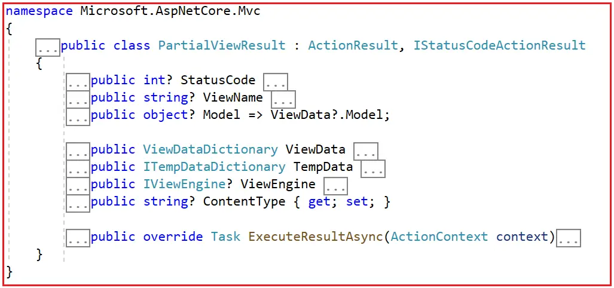
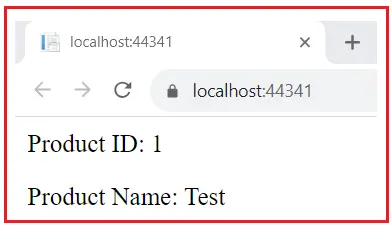
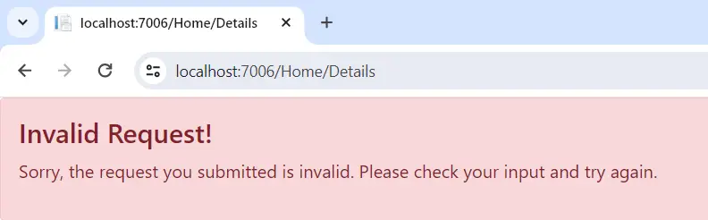

### Partial View Results in ASP.NET Core MVC

In this article, I will discuss the Partial View Result in ASP.NET Core MVC Applications with Examples. Please read our previous article discussing View Result in ASP.NET Core MVC Application.

### PartialViewResult in ASP.NET Core MVC

In ASP.NET Core MVC, PartialViewResult is an action result that renders a partial view to be returned to the client. A partial view is a reusable view component that can be embedded in other views. Partial views are used to render a portion of a view, which can be reused across multiple views. Unlike ViewResult, which typically renders a complete page, PartialViewResult renders a segment of HTML that can be included in other views. This makes it ideal for rendering components like headers, footers, sidebar, widgets, or forms that are **shared across multiple pages**.

- Partial View: A partial view is a Razor view file (.cshtml) without a complete HTML structure. It is meant to be rendered as part of a parent’s view.

- PartialViewResult: This is the action result returned by a controller action to render a partial view.


The PartialViewResult class derives from the ActionResult base class. If you go to the definition of PartialViewResult class, you will see the following signature. As you can see, the PartialViewResult class derives from the ActionResult base class. It contains a few properties, overriding the ExecuteResultAsync method.



### ExecuteResultAsync Method of PartialViewResult Class:

In ASP.NET Core MVC, the ExecuteResultAsync method of the PartialViewResult class is used to render a partial view that is returned to the client as part of an HTTP response. When the MVC framework executes an action that returns a PartialViewResult, it eventually calls the ExecuteResultAsync method of the PartialViewResult class. The following steps occur when a PartialViewResult is returned from an action method:

### Partial View Discovery:

The view engine searches for the partial view file based on the specified view name. By convention, partial view files are often prefixed with an underscore (_) to distinguish them from regular views. The search typically includes locations like the Views/ControllerName/ folder, Views/Shared/ folder, and other configured view locations.

### Partial View Rendering:

Once the partial view is located, the view engine renders it. During rendering, the view engine processes any Razor syntax and server-side code present in the partial view file. The method incorporates any data passed to the partial view, typically through a model, ViewData, or ViewBag. This data must be prepared and passed from the controller action that is returning the PartialViewResult.

The method uses the view engine (e.g., IViewEngine) to locate the partial view. ViewEngine is responsible for finding the appropriate view file based on the name and context of the provided view. The view engine’s FindView or GetView methods are called to search for the view.

### Response Generation:

The rendered content of the partial view is written to the response stream. If the partial view is being rendered within the context of a parent view, this content is then embedded within the parent view at the specified location. If the partial view is being rendered directly as part of an AJAX request or similar, the response may only contain the partial view’s rendered content. In such cases, the HTML generated by the partial view is sent back directly to the client’s browser or calling script and is not necessarily embedded within a larger page structure on the server side. This is a common use case for updating parts of a webpage dynamically without reloading the entire page.

### How to Use PartialViewResult in ASP.NET Core MVC?

Here’s how you can use PartialViewResult in ASP.NET Core MVC:

1. Create a Partial View: Create a Partial View (with the .cshtml extension) in your project’s appropriate “Views” folder. Partial views typically contain a portion of HTML markup and any embedded Razor code needed to generate dynamic content.

2. Create an Action Method: Within your controller, create an action method that will return a PartialViewResult. This method will process data and pass it to the partial view.

3. Return a Partial View: In the action method, return a PartialViewResult by calling the PartialView() method. You can pass a model object to the PartialView() method, and you can also set ViewData and ViewBag if you need to supply dynamic data to the partial view.

### Example to Understand PartialViewResult in ASP.NET Core MVC:

Let us understand how to use PartialViewResult in ASP.NET Core MVC Application with one example. First, create a new ASP.NET Core MVC Project using the Model View Controller template and name the project ActionResultInASPNETCoreMVC.

### Creating Model:

Next, create a model class to hold the product data. So, create a class file named Product.cs within the Models folder and copy and paste the following code into it.

```c#
namespace ActionResultASPNETCoreMVC.Models
{
    public class Product
    {
        public int Id {get;set;}
        public string? Name {get;set;}
    }
}
```

### Creating a Partial View:

Next, create a partial view. Go to the Views => Shared folder, add a partial view with  the name _ProductDetialsPartialView.cshtml and copy and paste the following code into it.

```html
@model Product

<div class="text-left">
    <p>Product ID : @Model.Id</p>
    <p>Product Name: @Model.Name</p>
</div>
```

### Modify the Home Controller

Next, modify the Home Controller as follows. In the below example, the return type of the Index action method is partialViewResult, and PartialView extension method returns an instance of PartialViewResult. This PartialView method will render the "ProductDetailsPartialView.cshtml" partial view. and the product model will populate dynamic content within the partial view.


```c#
using ActionResultInASPNETCoreMVC.Models;
using Microsoft.AspNetCore.Mvc;
namespace ActionResultInASPNETCoreMVC.Controllers
{
    public class HomeController : Controller
    {
        public PartialViewResult Index()
        {
            Product product = new Product()
            {
                Id = 1,
                Name = "Test",
            };
            return PartialView("_ProductDetailsPartialView", product);
        }
    }
}
```

Now, run the application and access the Index Page. You should see the following output.



Now, it displays the content of that partial view without the layout page. This isn’t very useful by itself, so a more useful application might be to call this action in an AJAX scenario and display the returned view.

### How to Call Action Method using jQuery AJAX in ASP.NET MVC?

Partial views are often used with AJAX to update parts of a web page dynamically without a full page reload. Let us proceed and understand how to call the Action Method, which returns a Partial View from a regular View using the jQuery AJAX Method.

### Modifying Home Controller

First, modify the Home Controller as follows. Here, we have two action methods. The Index action method returns the ViewResult, whereas the Details action method returns the PartialViewResult.

```c#
using ActionResultASPNETCoreMVC.Models;
using Microsoft.AspNetCore.Mvc;


namespace ActionResultASPNETCoreMVC.Controllers
{
    public class HomeController : Controller
    {
        public ViewResult Index()
        {
            return View();
        }

        public PartialViewResult Details(int ProductId)
        {
            Product product = new Product()
            {
                Id = ProductId,
                Name = "Test Product"
            };

            return PartialView("_PartialDetailsPartialView", product);
        }
    }
}


```


### Modify the Index.cshtml View

Next, modify the Index.cshtml view as follows. Here, you can see we are using jQuery AJAX to call the Details Action Method of the Home Controller, which returns a Partial View. In order to use jQuery AJAX, we first need to provide the path of the jQuery file, and here we are using jQuery CDN. The AJAX method call is self-explained, so please read the comment lines for a better understanding.

```html
@model Product
@{
    ViewData["Title"] = "Home Page";
}

<div id="someDiv" class="text-left">
</div>

<!-- Include the jQuery library from Google's hosted libraries -->
<script src="https://ajax.googleapis.com/ajax/libs/jquery/3.7.0/jquery.min.js"></script>

<script>
    // Ensure the DOM is fully loaded before executing the script
    $(document).ready(function () {
        // Define an object 'rawdata' with a property 'ProductId' set to '10'
        var rawdata = { 'ProductId': '10' };

        // Make an AJAX request
        $.ajax({
            // Specify the request type as GET
            type: "GET",
            // Specify the URL to which the request is sent
            url: "/Home/Details/",
            // Include the data to be sent with the request
            data: rawdata,
            // Define a callback function to handle a successful response
            success: function (viewHTML) {
                // Find the HTML element with the ID 'someDiv' and set its inner HTML to the response from the server
                $("#someDiv").html(viewHTML);
            },
            // Define a callback function to handle an error response
            error: function (errorData) {
                // Call a function 'onError' with the error data as an argument
                onError(errorData);
            }
        });
    });
    // Define the onError function to handle error responses
    function onError(errorData) {
        // Display the error data in an alert box
        alert("An error occurred: " + errorData.responseText);
    }
</script>
```

Now, run the application, and you will get the output as expected. In our upcoming articles, we will discuss how to perform the CRUD operations using jQuery AJAX in ASP.NET Core MVC Application.

### How Do We Prevent the Partial Action Method from being invoked via normal GET and POST Requests?

Now, the Details Action Method, which returns a Partial View, is accessible using Normal GET and Post Request.  We want to restrict this. That means the Details Action Method should invoked via AJAX Request, not from general GET and Post request. For this, we need to create a Custom Attribute, and within the custom attribute, we need to check whether the request is a normal GET and POST request or an AJAX request. If it is a normal GET or POST request, we need to return a 404 error; if it is an AJAX Request, we need to return the data. Let us proceed and see how we can do this.

The X-Requested-With header returns a string indicating whether it’s an AJAX request. An AJAX request will have this header set to XMLHttpRequest. This header value won’t be present for normal GET and POST Requests (non-Ajax requests). Create a Custom class inheriting from the ActionMethodSelectorAttribute class and override the IsValidForRequest method. This is the method where we need to provide the custom logic for request validation. So, add a class file named AjaxOnlyAttribute.cs and then copy and paste the following code into it.

```c#
using Microsoft.AspNetCore.Mvc.Abstractions;
using Microsoft.AspNetCore.Mvc.ActionConstraints;
using Microsoft.Extensions.Primitives;

namespace ActionResultInASPNETCoreMVC.Models
{
    // Define a custom attribute that inherits from ActionMethodSelectorAttribute
    public class AjaxOnlyAttribute : ActionMethodSelectorAttribute
    {
        // Override the IsValidForRequest method to provide custom logic for request validation
        // routeContext: Provides information about the current routing context.
        // actionDescriptor: Provides information about the action method.
        public override bool IsValidForRequest(RouteContext routeContext, ActionDescriptor actionDescriptor)
        {
            // Check if the request headers are not null and contain the "X-Requested-With" header
            if (routeContext.HttpContext.Request.Headers != null &&
                routeContext.HttpContext.Request.Headers.ContainsKey("X-Requested-With") &&
                routeContext.HttpContext.Request.Headers.TryGetValue("X-Requested-With", out StringValues requestedWithHeader))
            {
                // Check if the "X-Requested-With" header contains the value "XMLHttpRequest" indicating an AJAX request
                if (requestedWithHeader.Contains("XMLHttpRequest"))
                {
                    // If the condition is met, return true to indicate the request is valid for AJAX
                    return true;
                }
            }

            // If the conditions are not met, return false to indicate the request is not valid for AJAX
            return false;
        }
    }
}

```

### Method Parameter Explanation:

- **RouteContext (RouteContext routeContext)**: Provides context information about the current routing context. This allows us to access request data such as headers, query string parameters, route data, and more, which can be used to make decisions about the validity of the request for the specific action.

- **ActionDescriptor (ActionDescriptor actionDescriptor)**: This contains detailed information about the action method being considered for execution. This includes the controller name, action name, attributes applied to the action, parameters, and other metadata. This information can be used to identify the action method and make decisions based on its attributes or other characteristics.

Then decorate the AjaxOnlyAttribute with the Details action method as shown below.

```C#
using ActionResultInASPNETCoreMVC.Models;
using Microsoft.AspNetCore.Mvc;
namespace ActionResultInASPNETCoreMVC.Controllers
{
    public class HomeController : Controller
    {
        public ViewResult Index()
        {
            return View();
        }

        [AjaxOnly]
        public PartialViewResult Details(int ProductId)
        {
            Product product = new Product()
            {
                Id = ProductId,
                Name = "Test Product",
            };
            return PartialView("_ProductDetailsPartialView", product);
        }
    }
}

```

With the above changes in place, the Details action method can only be invoked via AJAX Request. Now, if you try to access the Details action method using Normal GET or POST request, you will get a 404 Error.

### Checking the Request Path in the Code:

It is also possible to check whether the request is coming via AJAX directly within the action method. For a better understanding, please modify the Home Controller as follows. If the Request is coming as an AJAX request, it will return the _ProductDetailsPartialView partial view to the client. If it is a normal GET or POST Request, it will return the _InvalidRequestPartialView Partial view to the client. The following code is self-explained, so please read the comment lines for a better understanding.

```c#

using ActionResultInASPNETCoreMVC.Models;
using Microsoft.AspNetCore.Mvc;

namespace ActionResultInASPNETCoreMVC.Controllers
{
    public class HomeController : Controller
    {
        // Define the Index action method which returns a ViewResult
        public ViewResult Index()
        {
            // Return the default view associated with this action
            return View();
        }

        // Define the Details action method which returns a PartialViewResult
        public PartialViewResult Details(int ProductId)
        {
            // Get the HTTP method of the current request (e.g., GET, POST)
            string method = HttpContext.Request.Method;

            // Get the value of the "X-Requested-With" header from the current request
            string? requestedWith = HttpContext?.Request?.Headers.XRequestedWith;

            // Check if the HTTP method is either POST or GET
            if (method == "POST" || method == "GET")
            {
                // Check if the request was made via AJAX (i.e., the "X-Requested-With" header is "XMLHttpRequest")
                if (requestedWith == "XMLHttpRequest")
                {
                    // Create a new Product object with the provided ProductId and a sample name
                    Product product = new Product()
                    {
                        Id = ProductId,
                        Name = "Test Product",
                    };
                    // Return the partial view "_ProductDetailsPartialView" with the product model
                    return PartialView("_ProductDetailsPartialView", product);
                }
            }

            // If the request is not valid (not an AJAX request), return the "_InvalidRequestPartialView" partial view
            return PartialView("_InvalidRequestPartialView");
        }
    }
}
```

### Creating _InvalidRequestPartialView:

Next, create a Partial View named _InvalidRequestPartialView within the Views/Shared folder and copy and paste the following code.

```html
<link rel="stylesheet" href="~/lib/bootstrap/dist/css/bootstrap.min.css" />

<div class="alert alert-danger" role="alert">
    <h4 class="alert-heading">Invalid Request!</h4>
    <p>Sorry, the request you submitted is invalid. Please check your input and try again.</p>
    <!-- Optionally, you can include additional details about the invalid request -->
</div>
```

With the above changes in place, run the application, and it should work as expected. If you access the Index action method, it will return the response. But if you access the Details action method via a normal GET request, you will get the following error message:



In the next article, I will discuss the JSON Result in ASP.NET Core MVC Applications. In this article, I try to explain the Partial View Result in ASP.NET Core MVC Application with Examples. I hope you enjoy this Partial View Result in ASP.NET Core MVC Application article.

