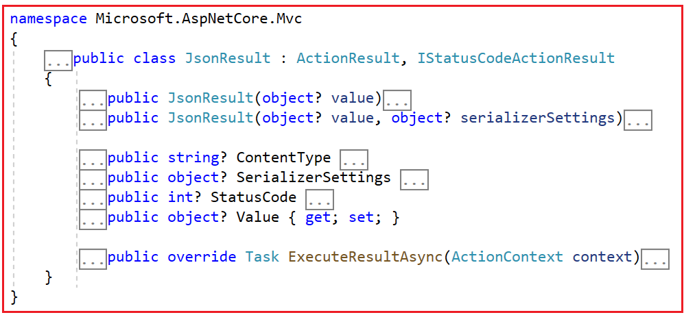
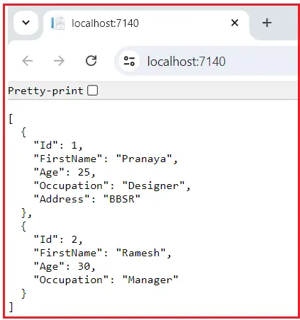
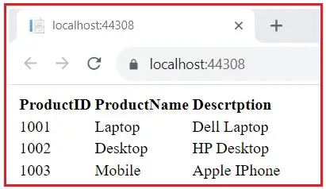

### JSON Result in ASP.NET Core MVC

In this article, I will discuss the JSON Result in ASP.NET Core MVC Web Application with Examples. Please read our previous article about the Partial View Result in ASP.NET Core MVC Application.

### JSON Result in ASP.NET Core MVC

The JsonResult is a type of action result that formats the given data as JSON (JavaScript Object Notation) and sends it as a response to the client. This class encapsulates the data you want to send in JSON format (i.e., key-value pairs), along with the status code. This allows clients, such as web browsers or mobile applications, to consume and work with the data easily. So, JsonResult is used when we want to return JSON-formatted data from a controller action method to the client. JSON (JavaScript Object Notation) is a lightweight data-interchange format that is easy for humans to read and write and for machines to parse and generate.

When we return a JsonResult from a controller action, ASP.NET Core MVC serializes the specified data into JSON format and sends it back to the client as the HTTP response body. This is commonly used for AJAX requests where the client-side JavaScript code expects to receive data in JSON format or when building APIs. 

Now, if you go to the definition of JosnResult, you will see the following signature. This class has two constructors, a few properties, and an overriding ExecuteResultAsync method.



### Key Characteristics of JsonResult:

The following are the Key Characteristics of JsonResult in ASP.NET Core MVC:

- **Content Type**: By default, the content type of the response is set to application/json.

- **Status Code**: You can specify the HTTP status code for the response. If not explicitly set, the default status code is 200 OK.

- **Data Serialization**: The data provided to the JsonResult constructor is automatically serialized to JSON using the default JSON serializer configured in ASP.NET Core, which is typically System.Text.Json in .NET Core 3.x and later.

### How does the ExecuteResultAsync Method of the JsonResult class Work in ASP.NET Core MVC?

The ExecuteResultAsync method executes the result of an action method that returns JSON data. Here is how the ExecuteResultAsync method works within the JsonResult class:

#### Data Serialization:

Before the ExecuteResultAsync method is called, the JSON data to be returned is typically set within the Value property of the JsonResult object. This data can be any object or primitive type that can be serialized into JSON format.

#### Execution:

When the action method returns a JsonResult object, the ASP.NET Core MVC framework calls the ExecuteResultAsync method of that JsonResult object.

#### Serialization and Output:

Within the ExecuteResultAsync method:

- The JSON data set in the Value property is serialized into a JSON string using the configured JSON serializer (System.Text.Json).

- This serialization process converts the object or primitive type into a JSON string representation.

- Once serialized, this JSON string is written to the response body.

- The method also sets the appropriate HTTP headers indicating that the content is JSON (Content-Type: application/json).

### How Do We Use JsonResult in ASP.NET Core MVC?

In ASP.NET Core MVC, the JsonResult class returns data in JSON format from your controller actions. First, create a controller action that will return the JSON data as follows. The following example demonstrates the use of JsonResult in an ASP.NET Core MVC controller to send JSON data back to the client. The JsonResult serializes the provided object (jsonData) into JSON format. The following code is self-explained, so please read the comment lines for a better understanding.

```c#
using Microsoft.AspNetCore.Mvc;
namespace ActionResultInASPNETCoreMVC.Controllers
{
    public class HomeController : Controller
    {
        // Defining an action method named Index that returns a JsonResult
        public JsonResult Index()
        {
            // Creating an anonymous object with properties Name, ID, and DateOfBirth
            var jsonData = new
            {
                Name = "Pranaya",
                ID = 4,
                DateOfBirth = new DateTime(1988, 02, 29)
            };

            // Returning a JsonResult object with the jsonData as the content to be serialized to JSON
            return new JsonResult(jsonData);
        }
    }
}
```

### Using JsonResult Helper Method:

Alternatively, you can use the Json helper method provided by the Controller class to create a JsonResult. This method is commonly used to simplify the creation of JSON results:

```C#
using Microsoft.AspNetCore.Mvc;
namespace ActionResultInASPNETCoreMVC.Controllers
{
    public class HomeController : Controller
    {
        // Defining an action method named Index that returns a JsonResult
        public JsonResult Index()
        {
            // Creating an anonymous object with properties Name, ID, and DateOfBirth
            var jsonData = new
            {
                Name = "Pranaya",
                ID = 4,
                DateOfBirth = new DateTime(1988, 02, 29)
            };

            // Returning a JsonResult using the Json method of the Controller class
            // The Json method takes the jsonData object and serializes it to JSON format
            // and sets appropriate headers for the response to indicate the content type as application/json.
            return Json(jsonData);
        }
    }
}

```

### Returning a Collection of Objects:

We can also return a collection of any type from an Action method using JsonResult. To better understand, please modify the Home Controller as follows. Here, we are returning an array from the action method.

```c#
using Microsoft.AspNetCore.Mvc;
namespace ActionResultInASPNETCoreMVC.Controllers
{
    public class HomeController : Controller
    {
        public JsonResult Index()
        {
            var jsonArray = new[]
            {
                new { Name = "Pranaya", Age = 25, Occupation = "Designer" },
                new { Name = "Ramesh", Age = 30, Occupation = "Manager" }
            };

            return Json(jsonArray);
        }
    }
}

```

### Specifying JSON Serializer Settings in ASP.NET Core MVC:


We can customize the behavior of JSON responses using the JsonSerializerOptions available in .NET. This allows us to set settings like naming policies, date formats, and more. For a better understanding, please modify the Home Controller as follows. The following code is self-explained, so please read the comment lines.

```c#
using Microsoft.AspNetCore.Mvc;
using System.Text.Json;
using System.Text.Json.Serialization;

namespace ActionResultInASPNETCoreMVC.Controllers
{
    public class HomeController : Controller
    {
        public JsonResult Index()
        {
            // Create a new instance of JsonSerializerOptions
            var options = new JsonSerializerOptions
            {
                // Property names will remain as defined in the class
                PropertyNamingPolicy = null,

                // JSON will be formatted with indents for readability
                WriteIndented = true,

                // Properties with null values will be ignored
                DefaultIgnoreCondition = JsonIgnoreCondition.WhenWritingNull,

                // Read-only properties will be ignored during serialization
                IgnoreReadOnlyProperties = true, 
            };

            // Create a list of Employee objects with sample data
            var jsonArray = new List<Employee>()
            {
                new Employee() { Id = 1, FirstName = "Pranaya", Age = 25, Occupation = "Designer", Address = "BBSR" },
                new Employee() { Id = 2, FirstName = "Ramesh", Age = 30, Occupation = "Manager" }
            };

            // Return the list as a JSON result, using the specified JsonSerializerOptions
            return Json(jsonArray, options);
        }
    }

    // Define the Employee class
    public class Employee
    {
        // Read-write properties
        public int Id { get; set; } 
        public string FirstName { get; set; } 
        public int Age { get; set; } 
        public string Occupation { get; set; } 

        // Read-only property
        public string Address { get; } 

        // Mixed case property names
        public string mixedCaseProperty { get; set; } 

        // Property with private setter to make it read-only for serialization
        public string ReadOnlyPropertyWithPrivateSetter { get; private set; } = "ReadOnlyValue"; 

        // Property with null value to show DefaultIgnoreCondition
        public string? NullValueProperty { get; set; } 
    }
}

```

### Understanding JsonSerializerOptions Class:

#### PropertyNamingPolicy

This property controls the naming policy applied to the properties of serialized objects. It determines how property names are written in the JSON output.

- If set to JsonNamingPolicy.CamelCase, the JSON output will have property names in camelCase (e.g., FirstName becomes firstName). The default is CamelCase.

- If set to null, the property names will be serialized as defined in the C# class (no transformation).

#### WriteIndented

This property controls whether the JSON output should be formatted with indents for better readability.

- When set to true, the JSON output will be formatted with indents and line breaks, making it more human-readable.

- When set to false, the JSON output will be compact without any unnecessary whitespace, which is more efficient for data transfer. The default is false.

#### DefaultIgnoreCondition

This property determines the conditions under which properties are ignored during serialization.

- Setting DefaultIgnoreCondition to JsonIgnoreCondition.WhenWritingNull will ignore properties with null values. If a property is null, it will not be included in the JSON output.

- The default is JsonIgnoreCondition.Never, which means properties are always included.

#### IgnoreReadOnlyProperties

This property specifies whether read-only properties should be ignored during serialization.

- When set to true, the JSON output will exclude properties with only a getter (or private setter) from the JSON output.

- When set to false, the JSON output will include properties with only a getter (or private setter). The default is false.

Now, run the application, and you should get the following output when you access the Index action method:



### Using Implicit JSON Result in ASP.NET Core MVC:

Sometimes, you don’t need to return a JsonResult instance explicitly. ASP.NET Core can automatically serialize objects to JSON when you return them directly:

```C#
using Microsoft.AspNetCore.Mvc;
namespace ActionResultInASPNETCoreMVC.Controllers
{
    public class HomeController : Controller
    {
        public IActionResult Index()
        {
            var jsonArray = new[]
            {
                new { Name = "Pranaya", Age = 25, Occupation = "Designer" },
                new { Name = "Ramesh", Age = 30, Occupation = "Manager" }
            };

            return Ok(jsonArray); // This will be automatically serialized to JSON
        }
    }
}

```

### Calling JsonResult Action Method using jQuery AJAX:

Now, let us try to understand how we can call an action method in ASP.NET Core MVC, which returns JSON data using jQuery AJAX.  First, Create a Model in the Models folder named Product.cs, then copy and paste the following code into it.

```c#
namespace ActionResultInASPNETCoreMVC.Models
{
    public class Product
    {
        public int Id { get; set; }
        public string? Name { get; set; }
        public string? Description { get; set; }
    }
}
```

### Modify Home Controller:

Next, modify the Home Controller as follows:

```c#
using ActionResultInASPNETCoreMVC.Models;
using Microsoft.AspNetCore.Mvc;
using System.Text.Json;

namespace ActionResultInASPNETCoreMVC.Controllers
{
    public class HomeController : Controller
    {
        public ViewResult Index()
        {
            return View();
        }

        public ActionResult Details(string Category)
        {
            var options = new JsonSerializerOptions()
            {
                // Property names will remain as defined in the class
                PropertyNamingPolicy = null,

                // JSON will be formatted with indents for readability
                WriteIndented = true,
            };
            
            try
            {
                //Based on the Category Fetch the Data from the database 
                //Here, we have hard coded the data
                List<Product> products = new List<Product>
                {
                    new Product{ Id = 1001, Name = "Laptop",  Description = "Dell Laptop" },
                    new Product{ Id = 1002, Name = "Desktop", Description = "HP Desktop" },
                    new Product{ Id = 1003, Name = "Mobile", Description = "Apple IPhone" }
                };

                //Please uncomment the following two lines if you want see what happend when exception occurred
                //int a = 10, b = 0;
                //int c = a / b;
                return Json(products, options);
            }
            catch (Exception ex)
            {
                var errorObject = new
                { 
                    Message = ex.Message, 
                    StackTrace = ex.StackTrace, 
                    ExceptionType = "Internal Server Error" 
                };

                return new JsonResult(errorObject, options)
                {
                    StatusCode = StatusCodes.Status500InternalServerError // Status code here 
                };
            }
        }
    }
}

```

Next, modify the Index.cshtml view as follows:

```html
@{
    ViewData["Title"] = "Home Page";
    Layout = null;
}

<div>
    <table id="tblProducts" class="tblProducts">
        <thead>
            <tr>
                <th align="left" class="productth">ProductID</th>
                <th align="left" class="productth">ProductName</th>
                <th align="left" class="productth">Descrtption</th>
            </tr>
        </thead>
        <tbody>
        </tbody>
    </table>
</div>

<script src="https://ajax.googleapis.com/ajax/libs/jquery/3.7.0/jquery.min.js"></script>

<script>
    // Wait until the document is fully loaded
    $(document).ready(function () {
        // Remove all rows from the table body with id 'tblProducts'
        $("#tblProducts tbody tr").remove();

        // Define the data to be sent to the server
        var rawdata = { 'Category': 'Electronics' };

        // Make an AJAX request to the server
        $.ajax({
            type: "GET", // HTTP method to be used for the request
            url: "/Home/Details/", // URL to which the request is sent
            data: rawdata, // Data to be sent to the server
            dataType: 'json', // Expected data type of the server response

            // Function to be called if the request succeeds
            success: function (data) {
                var items = ''; // Initialize an empty string to accumulate the HTML

                // Iterate over each item in the received data
                $.each(data, function (i, item) {
                    // Construct a table row with the item data
                    var rows = "<tr>"
                        + "<td class='prtoducttd'>" + item.Id + "</td>"
                        + "<td class='prtoducttd'>" + item.Name + "</td>"
                        + "<td class='prtoducttd'>" + item.Description + "</td>"
                        + "</tr>";

                    // Append the constructed row to the table body with id 'tblProducts'
                    $('#tblProducts tbody').append(rows);
                });
            },

            // Function to be called if the request fails
            error: function (errorData) {
                // Alert the error response
                alert(errorData);

                // Parse the error response JSON
                var ErrorResponse = jQuery.parseJSON(errorData.responseText);

                // Alert the details of the error
                alert("Message: " + ErrorResponse.Message);
                alert("StackTrace: " + ErrorResponse.StackTrace);
                alert("ExceptionType: " + ErrorResponse.ExceptionType);
            }
        });
    });
</script>
```

Now, run the application, and you should get the expected output, as shown in the image below.



### Why JSON Result in ASP.NET Core MVC?

- Lightweight Data Transfer: JSON (JavaScript Object Notation) is a lightweight data-interchange format that efficiently transmits data between a server and a client. JSON serialization is efficient and can help reduce the data transfer size over the network.

- API Responses: JSON is the standard format for many Web APIs, making it a natural choice for building RESTful APIs in ASP.NET Core Web API projects.

- Client Compatibility: JSON is widely supported across various programming languages and platforms, making it easy to consume JSON data in different client applications, such as web browsers, mobile apps, and desktop applications.


In the next article, I will discuss the Content Result of ASP.NET Core MVC Application. In this article, I try to explain the JSON Result in ASP.NET Core MVC Application with Examples. I hope you enjoy this Json Result in ASP.NET Core MVC Application article.
