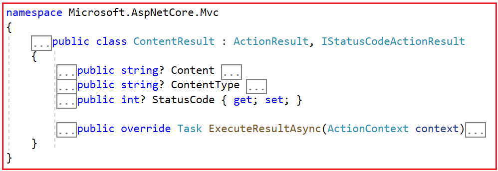

### Content Result in ASP.NET Core MVC

In this article, I will discuss the Content Result in ASP in ASP.NET Core MVC Application with Examples. Please read our previous article discussing the JSON Result in ASP.NET Core MVC Application.

### Content Result in ASP.NET Core MVC:

The ContentResult in ASP.NET Core MVC is a type of action result that returns a string as the content of the HTTP response. This is useful when we want to return a plain text response directly from a controller action. It’s less commonly used than more structured results like ViewResult or JsonResult, but it’s ideal for situations where we need to return a simple message or any content type that doesn’t require a full view or HTML structure. This is useful for returning plain text, XML, or JSON content that is not part of a view. While returning the data from the action method, all we need to do is specify the content and MIME type.

If you go to the definition of ContentResult, you will see the following signature. This class has a few properties and overrides the ExecuteResultAsync method.



Here:

- Content: The string to be sent to the response body.

- ContentType: The MIME type of the content you are returning. If not specified, the default is text/plain.

- StatusCode: Optional HTTP status code for the response. If not specified, the default is 200 Ok.

### How Does the ExecuteResultAsync Method of ContentResult class Work in ASP.NET Core MVC?

The ExecuteResultAsync method in the ContentResult class is responsible for executing the result of an action method that returns custom content. The following is a detailed explanation of how the ExecuteResultAsync method works within the ContentResult class:

### Setting Content, Status Code, and Content-Type:

Before ExecuteResultAsync is called, the content, status code, and content type of the response are typically set within the ContentResult object. These properties include:

- Content: The actual string content is to be written in the response body.

- ContentType: The MIME type of the content (e.g., “text/plain”, “text/html”, “application/json”).

- StatusCode: The HTTP status code indicates the outcome of the request.

### Execution:

When an action method returns a ContentResult object, the ASP.NET Core MVC framework invokes the ExecuteResultAsync method of that ContentResult object. This method takes an ActionContext as a parameter, which contains information about the current request and response. The ExecuteResultAsync method is asynchronous, ensuring that the response writing process does not block the executing thread.

### Setting Headers:

- If ContentType is provided, it sets the ContentType header of the HTTP response. If not specified, it might default to text/plain, depending on the implementation.

- If a specific status code is set in the StatusCode property of ContentResult, it is applied to the HTTP response. If not specified, the status code defaults to 200 (OK).

### Writing Output:

Within the ExecuteResultAsync method, the content set in the Content property is written to the response body using the specified content type. The method first sets the response’s content type and status code. It then writes the content to the response body, ensuring that the correct content type is applied.


### What are MIME Types?

MIME types, which stand for “Multipurpose Internet Mail Extensions,” are standardized identifiers used to specify the nature and format of a file, document, or data being transferred over the Internet. Originally designed to expand the ability to send different kinds of data via email, MIME types now play an important role in web development and communication over the Internet, particularly in HTTP, which defines the type of content being transmitted.

In Web Development, MIME types enable browsers to recognize a file’s type. As a result, the browser can choose a suitable displaying method. Common MIME types are, for example, text/html for HTML files or image/jpeg for JPEG files.

### How Do We Use ContentResult in ASP.NET Core MVC?


As already discussed, in ASP.NET Core MVC, we can use the ContentResult class to return raw content, such as text, HTML, XML, or JSON, directly to the client without involving view rendering. So, let us start by creating a controller action that will return the raw content. For example, let’s say you want to return a simple plain text message. When returning Plain text, specify the MIME type as “text/plain,” as shown in the example below.

```c#
using Microsoft.AspNetCore.Mvc;
namespace ActionResultInASPNETCoreMVC.Controllers
{
    public class HomeController : Controller
    {
        // Define an action method named Index that returns a ContentResult
        public ContentResult Index()
        {
            // Declare a string variable to hold the plain text content
            string plainText = "This is plain text content.";

            // Create and return a new ContentResult object
            return new ContentResult
            {
                // Set the ContentType property to "text/plain" to indicate the MIME type of the content
                ContentType = "text/plain",

                // Set the Content property to the plainText string, which contains the content to be returned
                Content = plainText
            };
        }
    }
}
```

### Using ContentResult Helper Method:

Alternatively, you can use the Content helper method provided by the Controller class to create a ContentResult. This method simplifies the creation of content results. When returning Plain text, specify the MIME type as “text/plain,” as shown in the example below.

```c#
using Microsoft.AspNetCore.Mvc;
namespace ActionResultInASPNETCoreMVC.Controllers
{
    public class HomeController : Controller
    {
        // Define an action method named Index that returns a ContentResult
        public ContentResult Index()
        {
            // Declare a string variable to hold the plain text content
            string plainText = "This is plain text content.";

            // Return a ContentResult using the Content method of the base Controller class
            // The Content method is a helper method that creates a ContentResult with the specified content and content type
            return Content(plainText, "text/plain");
        }
    }
}
```

### Returning HTML:

You can return static HTML pages as raw content using ContentResult. This can be useful for displaying simple information pages or promotional content. When returning HTML content, specify the MIME type as “text/html,” as shown in the example below.

```c#
using Microsoft.AspNetCore.Mvc;
namespace ActionResultInASPNETCoreMVC.Controllers
{
    public class HomeController : Controller
    {
        // Define an action method named Index that returns a ContentResult
        public ContentResult Index()
        {
            // Declare a string variable to hold the HTML content
            string htmlContent = "<html><body><h1>Hello, Welcome to Dot Net Tutorials</h1></body></html>";

            // Return a ContentResult using the Content method of the base Controller class
            // The Content method is a helper method that creates a ContentResult with the specified content and content type
            // The first parameter is the HTML content to be written to the response body
            // The second parameter is the content type, set to "text/html" to indicate that the response's content type is HTML
            return Content(htmlContent, "text/html");
        }
    }
}
```

### Returning XML:

If your application provides data in XML format, you can use ContentResult to return XML content. This can be useful when integrating with systems that require XML data exchange. When returning XML data, specify the MIME type as “application/xml“, as shown in the example below.

```c#
using Microsoft.AspNetCore.Mvc;
namespace ActionResultInASPNETCoreMVC.Controllers
{
    public class HomeController : Controller
    {
        // Define an action method named Index that returns a ContentResult
        public ContentResult Index()
        {
            // Declare a string variable to hold the XML content
            string xmlContent = "<?xml version=\"1.0\" encoding=\"UTF-8\"?><data><item>Hello Dot Net Tutorials</item></data>";

            // The first parameter is the XML content to be written to the response body
            // The second parameter is the content type, set to "application/xml" to indicate that the response's content type is XML
            return Content(xmlContent, "application/xml");
        }
    }
}

```

### Returning JSON:

Similar to XML, we can use ContentResult to return JSON content. While JsonResult might be a better choice for most JSON use cases, ContentResult can still be employed when you need more control over the JSON serialization process. When returning JSON data, specify the MIME type as “application/json“, as shown in the example below.

```c#

using Microsoft.AspNetCore.Mvc;
using Newtonsoft.Json;

namespace ActionResultInASPNETCoreMVC.Controllers
{
    public class HomeController : Controller
    {
        // Define an action method named Index that returns a ContentResult
        public ContentResult Index()
        {
            // Create an anonymous object containing data to be serialized into JSON
            var jsonData = new { Name = "Pranaya", Age = 35, Occupation = "Manager" };

            // Serialize the jsonData object to a JSON string using JsonConvert.SerializeObject
            var jsonSerializedString = JsonConvert.SerializeObject(jsonData);

            // Return a ContentResult using the Content method of the base Controller class
            // The first parameter is the JSON string to be written to the response body
            // The second parameter is the content type, set to "application/json" to indicate that the response's content type is JSON
            return Content(jsonSerializedString, "application/json");
        }
    }
}
```

### Returning String Directly:

You can use ContentResult to return plain text responses to the client. This is useful for displaying messages, instructions, or simple notifications. The default MIME type is “text/plain”. You can also directly return a string without specifying a content type. In this case, the default content type will be used, which is text/plain, as shown in the example below.

```c#
using Microsoft.AspNetCore.Mvc;
namespace ActionResultInASPNETCoreMVC.Controllers
{
    public class HomeController : Controller
    {
        // Define an action method named Index that returns a ContentResult
        public ContentResult Index()
        {
            // Declare a string variable to hold the simple string content
            string content = "This is a simple string.";

            // Return a ContentResult using the Content method of the base Controller class
            // The Content method is a helper method that creates a ContentResult with the specified content
            // In this case, only the content string is provided, and the content type defaults to "text/plain"
            return Content(content);
        }
    }
}
```

### Customizing Content using ContentResult in ASP.NET Core MVC:

You can customize various properties of the ContentResult, such as the content type, status code, and more, according to your specific use case.

```c#
using Microsoft.AspNetCore.Mvc;
namespace ActionResultInASPNETCoreMVC.Controllers
{
    public class HomeController : Controller
    {
        public ContentResult Index()
        {
            string customContent = "Custom content with specific settings.";
            return new ContentResult
            {
                Content = customContent,
                ContentType = "text/plain",
                StatusCode = 200, // OK status code
            };
        }
    }
}
```

### When to Use ContentResult in ASP.NET Core MVC:

We need to ContentResult in ASP.NET Core MVC:

- When you need to return a simple string response directly to the client.

- When you need to control the content type of the response, such as returning XML or custom text formats.

- When your response doesn’t fit into the typical JSON or HTML formats that JsonResult or ViewResult handles.


In the next article, I will discuss the FileResult in ASP.NET Core MVC Applications with Examples. In this article, I will explain the ContentResult in ASP.NET Core MVC Applications with Examples. I hope you enjoy this Content Result in an ASP.NET Core MVC Application article.