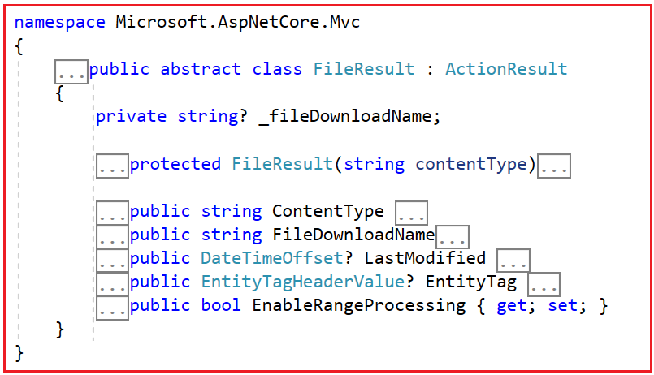
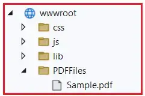
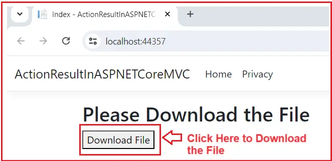

### File Result in ASP.NET Core MVC

In this article, I will discuss the File Result in an ASP.NET Core MVC Application with Examples. Please read our previous article, which discussed the ContentResult in an ASP.NET Core MVC Application.

### File Result in ASP.NET Core MVC

In ASP.NET Core MVC, a FileResult is an action result representing a file to be returned to the client for download or display. It’s used when we want to send a file (such as an Image, PDF, or any other type of file) as the response to an HTTP request. This could be a file stored on the server, a file generated dynamically, or even a file stream. Now, if you go to the definition of FileResult, you will see the following signature. This class has one constructor and a few properties.



### Properties of FileResult Class:

- ContentType: The ContentType property specifies the file’s MIME type. This tells the browser what kind of file is being sent so it can handle it appropriately. 

- FileDownloadName: This property is used to suggest a filename when the client downloads the content. If this property is set, the browser uses it as the default name for the file when saving it to disk. If not set, the file will be saved using the filename in the URL or without a specific name, depending on browser behavior and the URL used to access the resource. 

- LastModified: The LastModified property indicates the file’s last modified date and time. This can be used for caching purposes. If the file hasn’t changed since the last time the client requested it, the client can use a cached version instead of downloading it again. The server includes this timestamp in the HTTP response headers to support conditional requests using the Last-Modified header.

- EntityTag: The EntityTag (ETag) property is another mechanism for caching. It’s a unique identifier representing the specific version of the file. If the ETag matches the one the client has, the client can use the cached version.

- EnableRangeProcessing: The EnableRangeProcessing property allows for partial content responses, which is useful for large files. This enables the client to request only a specific part of the file, which is particularly useful for streaming media files.

### Types of FileResult:

Depending on the scenario, you can use different types of file results. The following are the subclasses of the FileResult class.

- FileContentResult – This result type uses a byte array to send file content directly to the response.

- FileStreamResult – This type uses a Stream object to send file content, which is useful for large files.

- VirtualFileResult – This result serves a file specified by a virtual path, allowing the file to reside anywhere in the application’s content root or web root.

- PhysicalFileResult: PhysicalFileResult returns a file directly from a physical file path on disk. It is suitable for serving files from a specific path on the server’s file system.

### Example to Understand FileResult in ASP.NET Core MVC:

Before proceeding further, let us first create a folder with the name PDFFiles within the wwwroot folder and then add a pdf file with the name Sample.pdf within this PDFFiles folder. Your folder structure should look as shown below.



### Example using FileContentResult in ASP.NET Core MVC:

The FileContentResult is used to return file content directly from a byte array. It is useful when you have the file content already loaded into memory and want to send it as a response. For a better understanding, please modify the Home Controller as follows.

```C#
using Microsoft.AspNetCore.Mvc;
using Microsoft.Net.Http.Headers;
namespace ActionResultInASPNETCoreMVC.Controllers
{
    public class HomeController : Controller
    {
        public ActionResult Index()
        {
            return View();
        }

        // Define an action method that returns a FileResult
        public FileResult DownloadFile()
        {
            // Get the current directory of the application and construct the file path for the PDF file
            string filePath = Directory.GetCurrentDirectory() + "\\wwwroot\\PDFFiles\\" + "Sample.pdf";

            // Read all the bytes of the PDF file into a byte array
            var fileBytes = System.IO.File.ReadAllBytes(filePath);

            // Create a FileResult object using the byte array and specify the content type as "application/pdf"
            var fileResult = File(fileBytes, "application/pdf");

            // Set the name of the file to be downloaded by the user
            fileResult.FileDownloadName = "MySampleFile.pdf";

            // Set the last modified date of the file
            fileResult.LastModified = new DateTimeOffset(System.IO.File.GetLastWriteTimeUtc(filePath));

            // Set the entity tag (ETag) for the file
            fileResult.EntityTag = new EntityTagHeaderValue("\"fileVersion1\"");

            // Enable range processing for the file
            fileResult.EnableRangeProcessing = true;

            // Return the FileResult object
            return fileResult;
        }
    }
}
```

### Modifying the Index View:

Now, we will modify the Index View with a button that, when clicked, will invoke the DownloadFile action method to download the file and stay on the same Index view. So, modify the Index.cshtml view as follows:

```html
@{
    ViewData["Title"] = "Index";
}

<h2>Please Download the File</h2>

<!-- Form to trigger the download action -->
<form id="downloadForm" method="get" action="/Home/DownloadFile">
    <button type="submit">Download File</button>
</form>
```

Now, run the application and access the Home/Index URL, which will open the following page. Please click on the Download File button to download the File. Here, the downloaded file name will be MySampleFile.pdf.



### How File Result Works in ASP.NET Core MVC

In ASP.NET Core MVC, the FileResult class represents an action result that sends binary content to the response. Here is how the FileResult works in ASP.NET Core MVC Application:

#### Creating a FileResult Object:

In ASP.NET Core MVC, to return a file from a controller action, we typically use one of the helper methods provided by the ControllerBase class, such as File, which returns a FileResult object. This can be FileContentResult, FileStreamResult, or VirtualFileResult. These are the subclasses of the FileResult class that help in serving files from different sources like byte arrays, streams, or virtual paths, respectively.

#### Setting File Information:

Before returning the FileResult from the action method, we need to set properties such as the file content (for FileContentResult), the stream (for FileStreamResult), or the virtual path (for VirtualFileResult). Additionally, we set the content type (MIME type) to inform the client about the type of file being sent and, optionally, the file download name if you want the client to see a specific file name in the download dialog.

#### Execution:

When the action method returns a FileResult object, the ASP.NET Core MVC framework processes it by calling the ExecuteResultAsync method. Each subclass of FileResult (e.g., FileContentResult, FileStreamResult, VirtualFileResult) implements this method to handle writing the file content to the response.

### Writing Content to Response:

Within the ExecuteResultAsync method, the file content is written to the response body. This method is responsible for setting the appropriate HTTP headers, such as:

- **Content-Disposition**: Specifies how the content should be presented (e.g., as an attachment to prompt a download dialog).

- **Content-Type**: Specifies the MIME type of the file.

- **Content-Length**: Optionally specifies the size of the file.

The method ensures that the file content is correctly written to the response stream, allowing the client to receive and handle the file appropriately. We have already discussed the examples using FileContentResult. Let us proceed to understand the other mechanism for returning a file from the action method.

### Example to Return a File using FileStreamResult in ASP.NET Core MVC:

FileStreamResult returns file content from a Stream. It is ideal for streaming large files from a file system or other sources directly to the response, avoiding loading the entire file into memory. Let’s rewrite the previous example using the FileStreamResult class. The following example code is self-explained, so please go through the comment lines for a better understanding.

```c#
using Microsoft.AspNetCore.Mvc;
using Microsoft.Net.Http.Headers;
namespace ActionResultInASPNETCoreMVC.Controllers
{
    public class HomeController : Controller
    {
        public ActionResult Index()
        {
            return View();
        }

        // Define an action method that returns a FileStreamResult
        // You can alsu use FileResult as the return type
        public FileStreamResult DownloadFile()
        {
            // Get the current directory of the application and construct the file path for the PDF file
            string filePath = Path.Combine(Directory.GetCurrentDirectory(), "wwwroot", "PDFFiles", "Sample.pdf");

            // Create a FileStream to the PDF file
            var fileStream = new FileStream(filePath, FileMode.Open, FileAccess.Read);

            // Create a FileStreamResult object using the file stream and specify the content type as "application/pdf"
            var fileResult = new FileStreamResult(fileStream, "application/pdf")
            {
                // Set the name of the file to be downloaded by the user
                FileDownloadName = "MySampleFile.pdf",

                // Set the last modified date of the file
                LastModified = new DateTimeOffset(System.IO.File.GetLastWriteTimeUtc(filePath)),

                // Set the entity tag (ETag) for the file
                EntityTag = new EntityTagHeaderValue("\"fileVersion1\""),

                // Enable range processing for the file
                EnableRangeProcessing = true
            };

            // Return the FileStreamResult object
            return fileResult;
        }
    }
}

```

### Example to return a File using VirtualFileResult in ASP.NET Core MVC:

VirtualFileResult is used to return a file from a virtual path within the web application’s file system. It is commonly used for files that are part of the web application’s content, such as files in the wwwroot folder. Let’s rewrite the previous example using the VirtualFileResult class. The following example code is self-explained, so please go through the comment lines for a better understanding.

```c#
using Microsoft.AspNetCore.Mvc;
namespace ActionResultInASPNETCoreMVC.Controllers
{
    public class HomeController : Controller
    {
        public ActionResult Index()
        {
            return View();
        }

        // Define an action method that returns a VirtualFileResult
        public VirtualFileResult DownloadFile()
        {
            // Define the virtual path for the PDF file
            string virtualFilePath = "/PDFFiles/Sample.pdf";

            // Create a VirtualFileResult object using the virtual path and specify the content type as "application/pdf"
            var fileResult = new VirtualFileResult(virtualFilePath, "application/pdf")
            {
                // Set the name of the file to be downloaded by the user
                FileDownloadName = "MySampleFile.pdf",

                // Optionally, set the last modified date of the file
                // LastModified = new DateTimeOffset(System.IO.File.GetLastWriteTimeUtc(filePath)),

                // Optionally, set the entity tag (ETag) for the file
                // EntityTag = new EntityTagHeaderValue("\"fileVersion1\""),

                // Enable range processing for the file
                // EnableRangeProcessing = true
            };

            // Return the VirtualFileResult object
            return fileResult;
        }
    }
}
```

### How Does the VirtualFileResult Works in ASP.NET Core MVC?


The VirtualFileResult does not return file content directly as a stream or byte array. Instead, it operates by writing the file specified by the virtual path directly to the response stream. Here is how the VirtualFileResult Works in ASP.NET Core MVC.

- **Virtual Path**: You specify the path to the file relative to the root of the application. This path is treated as a virtual path.

- **Content Type**: You set the file’s MIME type, which informs the browser about the type of file being sent.

- **Response Stream**: When the action result is executed, VirtualFileResult reads the file specified by the virtual path and writes it directly to the HTTP response’s output stream. It does not convert the file into a byte array or separate stream; the transfer is handled internally.

### Example to Return a File using PhysicalFileResult in ASP.NET Core MVC:

PhysicalFileResult returns a file directly from a physical file path on disk. It is suitable for serving files from a specific path on the server’s file system. Let’s rewrite the previous example using the PhysicalFileResult class. The following example code is self-explained, so please go through the comment lines for a better understanding.

```c#
using Microsoft.AspNetCore.Mvc;
namespace ActionResultInASPNETCoreMVC.Controllers
{
    public class HomeController : Controller
    {
        public ActionResult Index()
        {
            return View();
        }

        // Define an action method that returns a PhysicalFileResult
        public PhysicalFileResult DownloadFile()
        {
            // Get the current directory of the application and construct the file path for the PDF file
            string filePath = Path.Combine(Directory.GetCurrentDirectory(), "wwwroot", "PDFFiles", "Sample.pdf");

            // Create a PhysicalFileResult object using the file path and specify the content type as "application/pdf"
            var fileResult = new PhysicalFileResult(filePath, "application/pdf")
            {
                // Set the name of the file to be downloaded by the user
                FileDownloadName = "MySampleFile.pdf",
            };

            // Return the PhysicalFileResult object
            return fileResult;
        }
    }
}

```

### How Does the PhysicalFileResult Works in ASP.NET Core MVC?

In ASP.NET Core MVC, the PhysicalFileResult returns a file from a physical path on the server. It is another subclass of FileResult and is specifically designed to handle files located on the server’s file system outside the application’s virtual file system.

Like VirtualFileResult, the PhysicalFileResult also does not directly return the file content as a stream or byte array in the action method. Instead, it handles the file content in the following way:

- **Physical Path**: You need to provide the physical file path on the server where the file is stored.

- **Content Type**: You need to specify the file’s MIME type, which is essential for informing the client about the type of file being sent.

- **Response Stream**: When the action result executes, PhysicalFileResult opens a read stream for the specified file and writes it directly to the HTTP response’s output stream. The framework manages this internally.

### Differences between VirtualFileResult and PhysicalFileResult in ASP.NET Core MVC:


**VirtualFileResult** is used when you want to return a file from a virtual path. This path is relative to the web root directory of your application. It is typically used for files stored within the application’s directory structure. It is useful when you are working with files within your web application’s content directory (like wwwroot or other folders configured as part of your application’s web root).

**PhysicalFileResult** is used when you want to return a file from an absolute physical path on the server. This path can be outside the web root directory and can be any valid path on the server where the application has access permissions. It is suitable when you need to serve files stored outside the web application’s root directory, such as files in a different directory on the server.

### Understanding Different MIME Types:

When working with File Result, we need to understand the different MIME types that we used to specify the file type being returned from the action method. The following are the different MIME types:

**Image MIME Types**:

- JPEG: image/jpeg
- PNG: image/png
- GIF: image/gif
- BMP: image/bmp
- SVG: image/svg+xml
- WebP: image/webp
  
**Common File MIME Types**:

- PDF: application/pdf
- Microsoft Word: application/msword
- Microsoft Excel: application/vnd.ms-excel
- Microsoft PowerPoint: application/vnd.ms-powerpoint
- ZIP Archive: application/zip
- JSON: application/json
- XML: application/xml
- Text: text/plain
- HTML: text/html

**Audio and Video MIME Types**:

- MP3 Audio: audio/mpeg
- WAV Audio: audio/wav
- OGG Audio: audio/ogg
- MP4 Video: video/mp4
- WebM Video: video/webm
- OGG Video: video/ogg

### Use Cases of File Result in ASP.NET Core MVC:

FileResult in ASP.NET Core MVC is used to serve files to clients for download or display. It’s particularly helpful when you want to allow users to access files from your application. Here are some use cases for FileResult in ASP.NET Core MVC:

- **File Downloads**: The most common use case is allowing users to download files from your application. These could include documents, images, audio files, videos, software installers, etc.

- **Exporting Data**: You can generate data in your application and then use FileResult to allow users to download the data in various formats, such as CSV, Excel, or PDF.

- **Serving Documents**: If your application provides documents such as PDFs, Word documents, or PowerPoint presentations, FileResult can serve them to users.

In the next article, I will discuss the Redirect Result in ASP.NET Core MVC Application. In this article, I try to explain the File Result in ASP.NET Core MVC Application with Examples. I hope you enjoy this File Result in the ASP.NET Core MVC Application article.