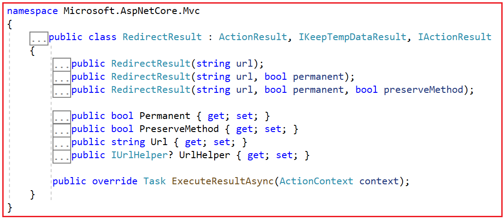

### Redirect Results in ASP.NET Core MVC

In this article, I will discuss the Redirect Results in ASP.NET Core MVC Web Applications with Examples. Please read our previous article about the File Result in ASP.NET Core MVC Applications.

### Redirect Results in ASP.NET Core MVC

In ASP.NET Core MVC, a RedirectResult is used to redirect the user’s browser to a new URL. That means redirect results are used to send a response to the client that instructs the browser to navigate to a different URL. This is useful in various scenarios, such as after a form submission, navigating the user to a different page based on certain conditions, or redirecting to external URLs for authentication or other purposes. Several types of redirect results are available in ASP.NET Core MVC. They are as follows:

### RedirectResult:

This is the basic form of redirection. This result redirects the user to a specified URL. It sends an HTTP status code of 302 by default, which tells the browser to perform a temporary redirect to the specified URL. You can also specify a permanent redirect by sending a 301 status code. This performs a standard HTTP redirection. For example, if you want to redirect to a different action within the same application or an external URL, you would use RedirectResult.


### RedirectToActionResult:

This is used to redirect to a different action method within the same controller or another controller in the same application. It is useful for redirecting within the same application without having to specify a full URL. Here, we only need to specify action names and controller names.

### RedirectToRouteResult:

This action result redirects the user to a specific route defined in the route table. It’s useful when you need to redirect to a route defined in your routing configuration.

### RedirectResult in ASP.NET Core MVC

In ASP.NET Core MVC, RedirectResult is a type of action result that provides a way to redirect the user’s browser to a new URL. It is useful for managing the flow of a web application, especially after form submissions, login operations, or other scenarios where you need to send the user to a different URL, either within the application or to an external site.

If you go to the definition of RedirectResult, you will see that it is a class with 3 constructors, a few properties, and one overriding method, as shown in the image below.



### Key properties and methods of RedirectResult

The following are the Key Properties of RedirectResult in ASP.NET Core MVC:

- **Url**: The URL to which the client is redirected.

- **Permanent**: A boolean value indicating whether the redirect is permanent (301 Moved Permanently) or temporary (302 Found). The default is false (temporary).

- **PreserveMethod**: A boolean value indicating whether to preserve the HTTP method during the redirection (e.g., preserve the POST method). That means if the Original action method type is POST, then it will redirect to the URL by issuing an HTTP Post Request. Similarly, if the Original action method type is GET, then it will redirect to the URL by issuing an HTTP GET Request.

### How Does the ExecuteResultAsync Method of RedirectResult class Work in ASP.NET Core MVC?

Here is how the ExecuteResultAsync method works within the RedirectResult class:

- **Setting Redirect URL**: Before returning a RedirectResult from an action method, we need to set the Url property. This specifies the destination URL where the client should be redirected.

- **Execution**: When an action method returns a RedirectResult object, the ASP.NET Core MVC framework processes this by invoking the ExecuteResultAsync method of the RedirectResult object.

- **Generating HTTP Redirect Response**: Within the ExecuteResultAsync method, the framework generates an HTTP response with a status code indicating redirection. By default, this is a 302 Found status code unless specified otherwise (e.g., 301 Moved Permanently for permanent redirects).

- **Setting Location Header**: The method sets the Location header of the HTTP response to the specified URL. This header tells the client’s browser where to navigate next.

### Example to Understand Redirect Result in ASP.NET Core MVC

Let us understand this with an example. Suppose you want to redirect to an external URL. This method takes the URL to redirect. For example, if we want to redirect to the URL https://dotnettutorials.net, we need to use the Redirect method, as shown below.

```c#
using Microsoft.AspNetCore.Mvc;
namespace ActionResultInASPNETCoreMVC.Controllers
{
    public class HomeController : Controller
    {
        public RedirectResult Index()
        {
            return new RedirectResult("https://dotnettutorials.net");
        }
    }
}
```

### Using RedirectResult Helper Method:

Alternatively, you can use the Redirect helper method provided by the Controller class to create a RedirectResult. This method simplifies the creation of redirect results.

```c#
using Microsoft.AspNetCore.Mvc;
namespace ActionResultInASPNETCoreMVC.Controllers
{
    public class HomeController : Controller
    {
        public RedirectResult Index()
        {
            return Redirect("https://dotnettutorials.net");
        }
    }
}
```

### Customizing RedirectResult:

You can customize the RedirectResult further by instantiating it directly and setting its properties. For a better understanding, please modify the Home Controller class as follows:

```c#
using Microsoft.AspNetCore.Mvc;

namespace ActionResultInASPNETCoreMVC.Controllers
{
    public class HomeController : Controller
    {
        // Defining the Index action method which returns a RedirectResult
        public RedirectResult Index()
        {
            // Creating a new RedirectResult object with the URL to redirect to
            var redirectResult = new RedirectResult("https://dotnettutorials.net")
            {
                // Setting the Permanent property to false, meaning the redirection is temporary
                Permanent = false,
                // Setting the PreserveMethod property to true, meaning the HTTP method used (GET, POST, etc.) will be preserved in the redirect
                PreserveMethod = true
            };

            // Returning the RedirectResult object to the client, causing the browser to redirect to the specified URL
            return redirectResult;
        }
    }
}
```

### How PreserveMethod Works?

**PreserveMethod = true**:

When set to true, this ensures that the HTTP method of the original request is maintained during the redirection. This is useful in scenarios where the redirection should not change the method of the request, such as when handling form submissions.

- **POST Method**: If the original request was a POST, the redirection will also use the POST method, preserving the request body.
  
- **GET Method**: Similarly, if the original request was a GET, the redirection will use the GET method.

**PreserveMethod = false (default)**:

When set to false, the redirection will use the default HTTP method, which is typically GET, regardless of the original request method.

### RedirectToRouteResult in ASP.NET Core MVC

In ASP.NET Core MVC, the RedirectToRouteResult class redirects the client to a route defined in the route table. This is useful when you want to redirect to a URL generated based on route values instead of specific action and controller names. The following are the Key Properties of RedirectToRouteResult:

- **RouteName**: The name of the route to redirect to.

- **RouteValues**: A dictionary of route values to pass to the route. This can be used to provide additional parameters.

- **Fragment**: The URL fragment (the part after the # in the URL).

- **Permanent**: A boolean indicating whether the redirection is permanent (301) or temporary (302). The default is false (temporary).

### How Does ExecuteResultAsync Method of RedirectToRouteResult Class Work in ASP.NET Core MVC?

Here is how the ExecuteResultAsync method works within the RedirectToRouteResult class:

#### Setting Route Values:

Before returning the RedirectToRouteResult from an action method, the RouteValues property must be set. These route values specify the route to which the client should be redirected. The route values typically include keys for the controller, action, and any additional parameters required by the route. However, the RedirectToRouteResult class can also use named routes directly without specifying controller and action names.

#### Execution:

When an action method returns a RedirectToRouteResult object, the ASP.NET Core MVC framework processes it by invoking the ExecuteResultAsync method on the RedirectToRouteResult object during the result execution phase of the request processing pipeline.

#### Redirecting:

Inside the ExecuteResultAsync method, the framework uses the URL helper to generate a URL based on the specified route values. The URL is constructed according to the application’s route configuration. The method then creates an HTTP redirect response, typically with status code 302 (which indicates a temporary redirect). This response includes the generated URL in the Location header, instructing the client’s browser to navigate to the specified route.

#### Example to Understand RedirectToRouteResult in ASP.NET Core MVC

Let us understand RedirectToRouteResult with examples. First, we need to create a Route with the name AboutRoute within our Program.cs class file, which should execute the About Action method of the Home Controller. So, modify the Home Controller as follows. Here, you can see that we have registered the AboutRoute and then the default Route.

```c#
using Microsoft.AspNetCore.Http.Json;
using Microsoft.AspNetCore.Mvc;
using System;

namespace ActionResultInASPNETCoreMVC
{
    public class Program
    {
        public static void Main(string[] args)
        {
            var builder = WebApplication.CreateBuilder(args);

            // Add services to the container.
            builder.Services.AddControllersWithViews();

            var app = builder.Build();

            // Configure the HTTP request pipeline.
            if (!app.Environment.IsDevelopment())
            {
                app.UseExceptionHandler("/Home/Error");
                // The default HSTS value is 30 days. You may want to change this for production scenarios, see https://aka.ms/aspnetcore-hsts.
                app.UseHsts();
            }

            app.UseHttpsRedirection();
            app.UseStaticFiles();

            app.UseRouting();

            app.UseAuthorization();

            //URL Pattern: about
            app.MapControllerRoute(
                name: "AboutRoute",
                pattern: "about",
                defaults: new { controller = "Home", action = "About" }
            );

            //URL Pattern: Controller/Action
            app.MapControllerRoute(
                name: "default",
                pattern: "{controller=Home}/{action=Index}/{id?}");

            app.Run();
        }
    }
}
```


### Modifying the Home Controller:

Next, modify the Home Controller as follows. Here, you can see within the Index action method, we redirect to the AboutRoute using the RedirectToRoute method.

```c#
using Microsoft.AspNetCore.Mvc;
namespace ActionResultInASPNETCoreMVC.Controllers
{
    public class HomeController : Controller
    {
        public RedirectToRouteResult Index()
        {
            // Perform some logic

            // Redirect to a different route
            // You need to specify the Route Name, not the Route Pattern
            return RedirectToRoute("AboutRoute");
        }

        public string About()
        {
            return "Hello and Welcome to Dot Net Tutorials";
        }
    }
}
```

### RedirectToRouteResult with Parameters:

In the below example, we are directing the user to the AboutRoute Route with some data.

```c#

using Microsoft.AspNetCore.Mvc;
namespace ActionResultInASPNETCoreMVC.Controllers
{
    public class HomeController : Controller
    {
        public RedirectToRouteResult Index()
        {
            // Perform some logic

            // Redirect to a different route
            // You need to specify the Route Name, not the Route Pattern
            return RedirectToRoute("AboutRoute", new { name = "Index" });
        }

        public string About(string name)
        {
            return "Hello and Welcome to Dot Net Tutorials " + name;
        }
    }
}

```

The RedirectToRouteResult is also used whenever we need to move from one action method to another within the same or different controller in an ASP.NET Core MVC Application. For example, in the below code, we redirect to the Home Controller’s About action method from the Home Controller’s Index action method.

```c#
using Microsoft.AspNetCore.Mvc;
namespace ActionResultInASPNETCoreMVC.Controllers
{
    public class HomeController : Controller
    {
        public RedirectToRouteResult Index()
        {
            // Perform some logic

            // Redirect to a different route
            // You need to specify the Route Name, not the Route Pattern
            //return RedirectToRoute("AboutRoute", new { name = "Index" });

            return RedirectToRoute(new { controller = "Home", action = "About", name="Index" });
        }

        public string About(string name)
        {
            return "Hello and Welcome to Dot Net Tutorials " + name;
        }
    }
}

```

**Note**: Specifying the controller’s name is optional if you redirect to an action method within the same controller, but navigating to a different controller is mandatory.

### RedirectToRouteResult with All Properties

Let’s create an example using all the properties of RedirectToRouteResult. So, modify the Home Controller class as follows. The following code is self-explanatory; please read the comments for a better understanding.

```C#
using Microsoft.AspNetCore.Mvc;

namespace ActionResultInASPNETCoreMVC.Controllers
{
    public class HomeController : Controller
    {
        // Defining the Index action method which returns a RedirectToRouteResult
        public RedirectToRouteResult Index()
        {
            // Defining route values as an anonymous object with controller, action, id, and name
            var routeValues = new { controller = "Home", action = "About", id = 123, name = "test" };

            // Creating a new RedirectToRouteResult object with specified route values
            var redirectResult = new RedirectToRouteResult(
                routeName: null,          // No specific route name
                routeValues: routeValues, // Route values defined earlier
                permanent: false,         // Temporary redirection
                fragment: "AboutSection"  // URL fragment identifier
            );

            // Returning the RedirectToRouteResult object to the client, causing a redirect based on route values
            return redirectResult;
        }

        // Defining the About action method which takes id and name as parameters and returns a string
        public string About(int id, string name)
        {
            // Returning a formatted string with id and name
            return $"Hello and Welcome to Dot Net Tutorials: Id:{id}, Name:{name}";
        }
    }
}
```

### RedirectToActionResult in ASP.NET Core MVC

In ASP.NET Core MVC, the RedirectToActionResult class redirects a user to a different action method within the same or a different controller. It allows you to redirect users to a different action based on the action name and controller name. Specifying the controller’s name is optional if you redirect to an action method within the same controller, but navigating to a different controller is mandatory. This is useful when we want to perform a client-side redirect to another action, typically after a successful form submission or some other server-side processing.

### Properties of RedirectToActionResult:

The RedirectToActionResult has several key properties. They are as follows:

- **ActionName**: The name of the action method to redirect to.

- **ControllerName**: The name of the controller containing the action method. This property is optional; if not specified, the current controller is used.

- **RouteValues**: An object that contains the route data, which will be passed to the action method. This can be used to provide additional parameters.

- **Fragment**: The URL fragment (the part after the # in the URL).

- **Permanent**: A boolean indicating whether the redirection is permanent (301) or temporary (302). The default is false (temporary).

### How Does the ExecuteResultAsync Method of RedirectToActionResult class Work in ASP.NET Core MVC?

Here is how the ExecuteResultAsync method works within the RedirectToActionResult class:

#### Setting Action and Controller Names:

The RedirectToActionResult object must have the ActionName, ControllerName, and optionally RouteValues properties set. These properties determine the target action and controller for the redirection. If ControllerName is not set, the redirection will be to an action in the current controller.

#### Execution:

When an action method returns a RedirectToActionResult, the ASP.NET Core MVC framework invokes the ExecuteResultAsync method on the RedirectToActionResult object during the result execution phase of the request processing pipeline.

#### Redirecting:

Inside the ExecuteResultAsync method, the framework generates a URL using the provided action name, controller name, and route values. The URL helper handles the URL generation and constructs the URL based on the application’s route configuration. The method then creates an HTTP redirect response (usually with status code 302, which indicates a temporary redirect). This response includes the generated URL in the Location header, instructing the client’s browser to navigate to the specified action.

### Example to Understand RedirectToActionResult in ASP.NET Core MVC

Let us understand RedirectToActionResult with examples. So, please modify the Home Controller as follows:

```c#
using Microsoft.AspNetCore.Mvc;
namespace ActionResultInASPNETCoreMVC.Controllers
{
    public class HomeController : Controller
    {
        public RedirectToActionResult Index()
        {
            // Perform Some Logic

            // Redirect to a different action within the same controller
            // Specifying the Controller name is Optional
             return RedirectToAction("AboutUs", "Home" );
           //  return RedirectToAction("AboutUs");
        }

        public string AboutUs(string name)
        {
            return "Hello and Welcome to Dot Net Tutorials " + name;
        }
    }
}

```

In the above example, when the Index action is invoked, it performs some logic (which you can replace with your logic). Then, it uses RedirectToAction to redirect the user to the AboutUs action method within the same controller.

### Passing Additional Route and Query String Parameters using RedirectToActionResult:

You can also use additional overloads of the RedirectToAction helper method to provide route values and query string parameters. For a better understanding, please modify the Home Controller as follows:

```c#
using Microsoft.AspNetCore.Mvc;
namespace ActionResultInASPNETCoreMVC.Controllers
{
    public class HomeController : Controller
    {
        public RedirectToActionResult Index()
        {
            // Perform Some Logic

            // Redirect to the About action with a Route Parameter
            //return RedirectToAction("About", new { id = 123 });

            // Redirect to the About action with a Route Parameter Id and a Query String Parameter name 
            return RedirectToAction("About", "Home", new { id = 123, name = "Index" });
        }

        public string About(int id, string name)
        {
            return $"Hello and Welcome to Dot Net Tutorials, Id{id}, Name:{name} ";
        }
    }
}
```

### Customizing RedirectToActionResult in ASP.NET Core MVC

Let us see an example of how to customize the RedirectToActionResult in the ASP.NET Core MVC application. In this example, we will use all the Properties of RedirectToActionResult. So, modify the Home Controller as follows: The following code is self-explained, so please read the comment lines for a better understanding.

```c#
using Microsoft.AspNetCore.Mvc;

namespace ActionResultInASPNETCoreMVC.Controllers
{
    public class HomeController : Controller
    {
        // Define an action method named Index that returns a RedirectToActionResult
        public RedirectToActionResult Index()
        {
            // Create an anonymous object to hold route values (id and name)
            var routeValues = new { id = 123, name = "Test" };

            // Create a new instance of RedirectToActionResult
            // Specify the action name ("About"), controller name ("Home"), route values, 
            // and additional options (permanent and preserveMethod)
            var redirectResult = new RedirectToActionResult(
                actionName: "About",          // The action to redirect to
                controllerName: "Home",       // The controller to redirect to
                routeValues: routeValues,     // The route values to pass to the action
                permanent: false,             // Indicates if the redirect is permanent (HTTP 301)
                preserveMethod: true,         // Indicates if the HTTP method should be preserved
                fragment: "AboutSection"       //Indicates the URL Fragment, i.e., append in the URL as #AboutSection
            );

            // Return the RedirectToActionResult to the framework, which will handle the redirection
            return redirectResult;
        }

        // Define an action method named About that takes two parameters (id and name)
        // This method returns a string response
        public string About(int id, string name)
        {
            // Return a formatted string that includes the id and name parameters
            return $"Hello and Welcome to Dot Net Tutorials, Id{id}, Name:{name} ";
        }
    }
}

```

### When Should We Use RedirectResult, RedirectToRouteResult, and RedirectToActionResult in ASP.NET Core MVC Applications?


- **RedirectResult**: When you need to redirect to an absolute URL. For example, redirecting to an external website or an absolute URL within your application.

- **RedirectToRouteResult**: When you need to redirect to a specific route by specifying route values. This is useful when you want to dynamically determine the route to redirect to based on the route configuration. For example, redirecting to a URL by specifying route parameters dynamically.

- **RedirectToActionResult**: When you need to redirect to a specific action within your application. This is the most common type of redirect used in ASP.NET Core MVC because it allows you to specify the controller and action you want to redirect to directly. For example, Redirecting to another action within the same controller or a different controller.

In the next article, I will discuss the StatusResult in ASP.NET Core MVC Application. In this article, I explain Redirect Results in ASP.NET Core MVC Application with Examples. I hope you enjoy this Redirect Results in ASP.NET Core MVC Application article.
