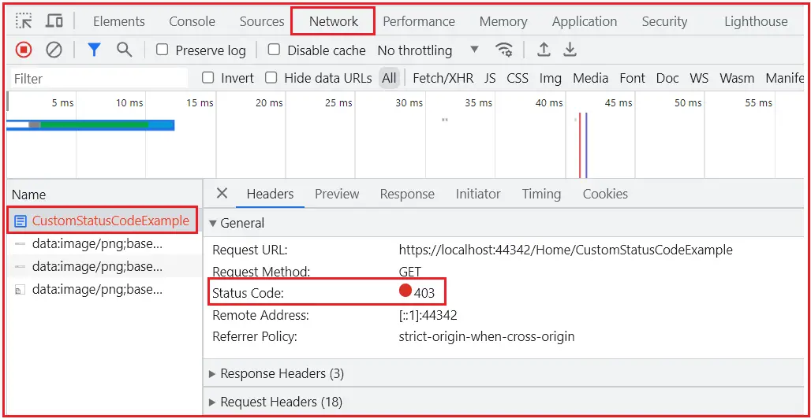

### Status Results in ASP.NET Core MVC

In this article, I will discuss the StatusResult in ASP.NET Core MVC Web Applications with examples. Please read our previous article discussing Redirect Results in ASP.NET Core MVC Application.

### HTTP Status Codes:

The Hyper Text Transport Protocol status code is one of the important components of an HTTP Response. The server issues the status code and provides information about the response. Whenever the client gets a response from the server, the response should have one HTTP Status code.

Status codes are three-digit numbers returned by the server to provide information about the outcome of a client’s request. These codes are grouped into different categories based on their first digit, which helps understand the response. All the HTTP Status codes are divided into five categories. Here, XX will represent the actual number.

- **1XX: Informational Response (Example: 100, 101, 102, etc.)**. Status codes in the 1xx range indicate that the server has received the client’s request and is continuing the process. These codes are primarily used for informational purposes and do not typically require any action from the client.

- **2XX: Successful Response (Example. 200, 201, 203, 204, etc.)**. Whenever you get 2XX as the response code, it means the request is successful. Status codes in the 2xx range indicate that the server successfully received, understood, and accepted the client’s request. These codes typically indicate that the requested action was successfully completed.

- **3XX: Redirection Response (Example. 301, 302, 304, etc.)**. Whenever you get 3XX as the response code, it means it is re-directional, i.e., some re-directional is happening on the server. Status codes in the 3xx range indicate that the client needs further action to complete the request. These codes are used when a resource has been moved or is temporarily unavailable, and the client needs to take additional steps to access the resource.

- **4XX: Client Error Response (Example: 400, 401, 404, 405, etc.)**. Whenever you get 4XX as the response code, it means there is some problem with your request. Status codes in the 4xx range indicate that the client’s request was unsuccessful due to an error on the client’s request. These codes are often associated with issues such as invalid requests, unauthorized access, or missing resources.

- **5XX: Server Error Response (Example: 500, 502, 503, 504, etc.)**. Whenever you get 5XX as the response code, it means there is some problem in the server. Status codes in the 5xx range indicate that the server encountered an error while processing the client’s request. These codes are typically associated with issues on the server side, indicating that the requested action could not be completed due to server-related problems.

### Status Results in ASP.NET Core MVC

Status Results in ASP.NET Core MVC are action results that allow you to return HTTP status codes along with optional content. Several types of Status Results are available in ASP.NET Core MVC. They are as follows:

- **StatusCodeResult**: This represents a response with a specific HTTP status code and no additional content.

- **NotFoundResult**: This represents a response with the HTTP status code 404 (Not Found).

- **BadRequestResult**: Represents a response with the HTTP status code 400 (Bad Request).

- **OkResult**: Represents a response with the HTTP status code 200 (OK).

- **UnauthorizedResult**: Represents an HTTP 401 (Unauthorized) response.

Status Results indicate success, failure, or various error conditions to the client. Using Status Results, you can ensure that the client understands the result of their request based on the provided HTTP status code.

### StatusCodeResult in ASP.NET Core MVC:

In ASP.NET Core MVC, the class StatusCodeResult returns an HTTP status code without any additional content or response body. But, using the StatusCode helper method, we can return optional content. It’s typically used when you explicitly want to indicate a specific HTTP status code for a response. Let’s modify the Home Controller as follows to understand this concept in ASP.NET Core MVC.

```c#
using Microsoft.AspNetCore.Mvc;
namespace ActionResultInASPNETCoreMVC.Controllers
{
    public class HomeController : Controller
    {
        public IActionResult NotFoundExample()
        {
            // Return a 404 Not Found response
            return new StatusCodeResult(404);
        }

        public IActionResult CustomStatusCodeExample()
        {
            // Return a custom status code
            return new StatusCodeResult(403); 
        }
    }
}
```

The NotFoundExample action method returns a 404 (Not Found) response using the StatusCodeResult class with the status code 404. The CustomStatusCodeExample action method returns a custom 403 (Forbidden) response using the StatusCodeResult class with the status code 403. If you visit Home/NotFoundExample, you will get the 404 response we set in the action method.


Now, if you inspect the request, you will see the server returns a 404 status code, as shown in the image below.


If you visit Home/CustomStatusCodeExample, you will get the 403 response we set in the action method.


Now, if you inspect the request using the browser developer tool, you will see the server is returning the 403 status code, as shown in the image below.



### Using StatusCodeResult Helper Method:

Alternatively, you can use the StatusCodeResult helper method provided by the Controller class to create a StatusCodeResult. This method simplifies the creation of the Status Code Result. For a better understanding, please modify the Home Controller class as follows:

```c#
using Microsoft.AspNetCore.Mvc;
namespace ActionResultInASPNETCoreMVC.Controllers
{
    public class HomeController : Controller
    {
        public StatusCodeResult NotFoundExample()
        {
            // Return a 404 Not Found response
            return StatusCode(404);
        }

        public IActionResult CustomStatusCodeExample()
        {
            // Return a custom status code
            return StatusCode(403); 
        }
    }
}
```

If you want to return a message along with the HTTP Status Code, you need to use the other overloaded version, which takes the object value as a parameter. In this case, we must use the IActionResult and ActionResult as the action method’s return type. For a better understanding, please modify the Home Controller class as follows:

```c#
using Microsoft.AspNetCore.Mvc;
namespace ActionResultInASPNETCoreMVC.Controllers
{
    public class HomeController : Controller
    {
        public ActionResult NotFoundExample()
        {
            // Return a 404 Not Found response
            return StatusCode(404, new { message = "Resource Not Found" });
        }

        public IActionResult CustomStatusCodeExample()
        {
            // Return a custom status code
            return StatusCode(403, "Resource Not Found");
        }
    }
}
```

The StatusCodeResult class is indeed used in ASP.NET Core MVC to create and return the desired HTTP status code as a response from the controller action.

### HttpUnauthorizedResult in ASP.NET Core MVC

In ASP.NET Core MVC, the UnauthorizedResult class returns an HTTP 401 (Unauthorized) response. This is often used when a user is not authenticated and lacks the credentials to access a particular resource or perform an action. Returning an UnauthorizedResult is the same as returning StatusCodeResult with HTTP Status Code Unauthorized, i.e., 401; it’s more readable.

In the example below, the UnauthorizedExample action returns a 401 (Unauthorized) response using the UnauthorizedResult class. The shorthand method Unauthorized() can also be used to achieve the same result.

```c#
using Microsoft.AspNetCore.Mvc;
namespace ActionResultInASPNETCoreMVC.Controllers
{
    public class HomeController : Controller
    {
        public IActionResult UnauthorizedExample()
        {
            // Return a 401 Unauthorized response
            return new UnauthorizedResult();
            // Or use the shorthand helper method:
            //return Unauthorized();
        }
    }
}

```

Now, if you want to return some message along with the 401 Status Code, you need to use the other overloaded version of the helper method, which takes the object value as a parameter. For a better understanding, please modify the Home Controller class as follows:

```c#
using Microsoft.AspNetCore.Mvc;
namespace ActionResultInASPNETCoreMVC.Controllers
{
    public class HomeController : Controller
    {
        public IActionResult UnauthorizedExample()
        {
            // Return a 401 Unauthorized response
            return Unauthorized(new { Message = "You Have Not Access to This Page" });
        }
    }
}

```

Now, run the application and navigate to Home/UnauthorizedExample, and you should see the following/


This is useful when you want to indicate to the client that the request was not authorized due to a lack of proper authentication or authorization credentials.

### NotFoundResult in ASP.NET Core MVC

In ASP.NET Core MVC, the NotFoundResult class returns an HTTP 404 (Not Found) response. This is often used when a requested resource is unavailable on the server.

For a better understanding, please modify the Home Controller class as follows. In the example below, the NotFoundExample action method returns a 404 (Not Found) response using the NotFoundResult class. The shorthand method NotFound() can also be used to achieve the same result.

```c#
using Microsoft.AspNetCore.Mvc;
namespace ActionResultInASPNETCoreMVC.Controllers
{
    public class HomeController : Controller
    {
        public NotFoundResult NotFoundExample()
        {
            // Return a 404 Not Found response
            return new NotFoundResult(); 
            // Or use the shorthand:
            // return NotFound();
        }
    }
}
```

Now, if you want to return some message along with the 404 Status Code, you need to use the other overloaded version of the helper method, which takes the object value as a parameter. For a better understanding, please modify the Home Controller class as follows:

```c#
using Microsoft.AspNetCore.Mvc;
namespace ActionResultInASPNETCoreMVC.Controllers
{
    public class HomeController : Controller
    {
        public ActionResult NotFoundExample()
        {
            // Return a 404 Not Found response
            //return new NotFoundResult("Resource Not Found"); 
            // Or use the shorthand:
             return NotFound("Resource Not Found");
        }
    }
}
```

This is useful when you want to indicate to the client that the requested resource does not exist on the server.

### OkResult in ASP.NET Core MVC:

In ASP.NET Core MVC, the OkResult class returns an HTTP 200 (OK) response. This is often used when the server successfully handles a requested resource. Along with OKResult, you can also use the Ok method, which is also used to return an HTTP 200 (OK) response, indicating that the request was successful.

For a better understanding, please modify the Home Controller class as follows. In the example below, the OkExample action method returns a 200 (OK) response using the OKResult class. The shorthand method OK() can also be used to achieve the same result.

```c#
using Microsoft.AspNetCore.Mvc;
namespace ActionResultInASPNETCoreMVC.Controllers
{
    public class HomeController : Controller
    {
        public IActionResult OkExample()
        {
            // Return a 200 OK response
            return new OkResult();
            // Or use the shorthand:
            // return Ok(); 
        }
    }
}

```

Now, if you want to return some message along with the 404 Status Code, you need to use the other overloaded version of the OK helper method, which takes the object value as a parameter. For a better understanding, please modify the Home Controller class as follows. In this case, the Ok method will automatically serialize the object to JSON and set the appropriate content type in the response.

```C#
using Microsoft.AspNetCore.Mvc;
namespace ActionResultInASPNETCoreMVC.Controllers
{
    public class HomeController : Controller
    {
        public IActionResult OkExample()
        {
            // Return a 200 OK response along with Custom Message
            var data = new { Message = "Success" };
            // Returns a JSON object with a 200 OK response
            return Ok(data); 
        }
    }
}
```

In the next article, I will discuss the Object Result in ASP.NET Core MVC Application. Here, in this article, I try to explain the Status Results in ASP.NET Core MVC Applications with Examples. I hope you enjoy this Status Results in the ASP.NET Core MVC Application article.

