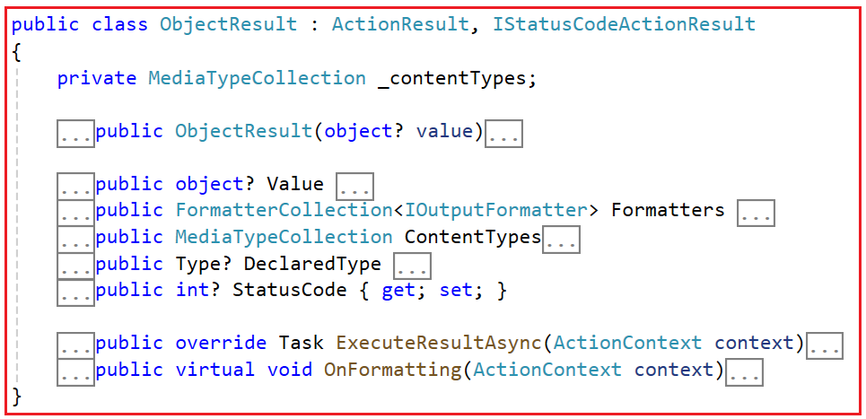

### Object Result in ASP.NET Core MVC

In this article, I will discuss the Object Result in ASP.NET Core MVC Web Application with Examples. Please read our previous article discussing StatusResult in ASP.NET Core MVC Application.

In ASP.NET Core MVC, the ObjectResult is an action result that returns an arbitrary object to the client. Unlike other result types such as JsonResult, ContentResult, or FileResult, which have predefined formats, the ObjectResult allows you to return any object from a controller action, and ASP.NET Core MVC will serialize it to the appropriate format based on the request’s Accept header and the available formatters configured in the application. This means that you can return various types of content, such as JSON, XML, or even custom formats, depending on the client’s preferences and the configuration of your application.

The ObjectResult class derives from the ActionResult base class and implements the IStatusCodeActionResult interface. If you go to the definition of ObjectResult class, then you will see the following signature. As you can see, it is a concrete class with a few properties and methods, and it overrides the ExecuteResultAsync method.



### How Does the ExecuteResultAsync Method of ObjectResult class Work in ASP.NET Core MVC?

The ExecuteResultAsync method in the ObjectResult class is responsible for executing the result of an action method that returns an object result. Here is how the ExecuteResultAsync method works within the ObjectResult class:

- **Setting Response Data**: Before returning the ObjectResult from the action method, we need to set the Value property to specify the object that will be serialized and sent as the HTTP response body. We can also optionally set other properties such as StatusCode, SerializerSettings, etc.

- **Execution**: When the action method returns an ObjectResult object, the ASP.NET Core MVC framework handles it by calling the ExecuteResultAsync method of that ObjectResult object.

- **Serialization and Writing to Response**: Within the ExecuteResultAsync method, the ASP.NET Core MVC framework serializes the Value object into the appropriate format (JSON, XML, etc.) based on the content negotiation process and writes it to the response body along with the specified status code and content type.

### Example to Understand Object Result in ASP.NET Core MVC:

Let us understand ObjectResult in ASP.NET Core MVC with a few examples. First, modify the Home Controller as follows. Here, you can see that while creating the ObjectResult instance, we pass the person object to the constructor. By default, ASP.NET Core will serialize the person object to JSON because JSON serialization is the most common use case.

```C#
using Microsoft.AspNetCore.Mvc;
namespace ActionResultInASPNETCoreMVC.Controllers
{
    public class HomeController : Controller
    {
        public IActionResult GetPerson()
        {
            var person = new { FirstName = "Pranaya", LastName = "Rout", Age = 35 };

            // Return an ObjectResult with JSON serialization
            return new ObjectResult(person); 

            // Or use the shorthand:
            // return Ok(person);
        }
    }
}
```

### Setting ObjectResult Properties:

We can also set the status code, content type, and other properties of the response using the properties of the ObjectResult class. For a better understanding, please modify the Home Controller as follows. Here, while creating the ObjectResult instance, we are setting the Status Code to 200 and ContentTypes to “application/json.”

```C#
using Microsoft.AspNetCore.Mvc;
namespace ActionResultInASPNETCoreMVC.Controllers
{
    public class HomeController : Controller
    {
        public IActionResult GetPerson()
        {
            var person = new { FirstName = "Pranaya", LastName = "Rout", Age = 35 };

            var result = new ObjectResult(person)
            {
                StatusCode = 200, // HTTP status code
                ContentTypes = new Microsoft.AspNetCore.Mvc.Formatters.MediaTypeCollection
                {
                    "application/json" // Content type(s)
                }
            };

            return result;
        }
    }
}

```

In most cases, if you’re returning data in JSON format, using the ObjectResult is not strictly necessary, as the Ok method, which returns a 200 (OK) response, can be used as shorthand:

```C#
using Microsoft.AspNetCore.Mvc;
namespace ActionResultInASPNETCoreMVC.Controllers
{
    public class HomeController : Controller
    {
        public IActionResult GetPerson()
        {
            var person = new { FirstName = "Pranaya", LastName = "Rout", Age = 35 };

            // Return a 200 OK response with JSON serialization
            return Ok(person);
        }
    }
}

```

This approach is cleaner and commonly used for returning data in JSON format for APIs and similar scenarios.

### Differences Between ObjectResult and OKResult in ASP.NET Core MVC:

In ASP.NET Core MVC, both ObjectResult and OkResult are used to return HTTP responses, but they are used in different scenarios and offer different levels of customization. Let’s understand the differences between these two result types:

### ObjectResult

It is used to return an HTTP response containing an arbitrary object that will be serialized and returned as the response body. It’s commonly used to return data in various formats, such as JSON, XML, or other custom content types.

This can be used to return any status code, not just 200 OK. You can set different status codes based on your application’s requirements.

If you need to return different status codes or provide custom content types, or if you are building more complex APIs, then you need to use ObjectResult as shown in the below example:

```C#
using Microsoft.AspNetCore.Mvc;
namespace ActionResultInASPNETCoreMVC.Controllers
{
    public class HomeController : Controller
    {
        public IActionResult GetPerson()
        {
            var person = new { FirstName = "Pranaya", LastName = "Rout", Age = 30 };

            var result = new ObjectResult(person)
            {
                StatusCode = 201, // Created status code
                ContentTypes = new Microsoft.AspNetCore.Mvc.Formatters.MediaTypeCollection
                {
                    "application/json", // JSON content type
                    "application/xml" // XML content type
                }
            };

            return result;
        }
    }
}
```

### OKResult

- It is specifically used to return a standard HTTP 200 (OK) response. 

- It always returns a 200 OK status code suitable for explicitly indicating success.

- This does not allow you to provide content to be serialized directly. It’s a simple way to indicate success without including a response body.


In most cases, if you are returning data in JSON format and you want to indicate a successful response, you can use OK, as shown in the code below:

```C#
using Microsoft.AspNetCore.Mvc;
namespace ActionResultInASPNETCoreMVC.Controllers
{
    public class HomeController : Controller
    {
        public IActionResult GetPerson()
        {
            var person = new { FirstName = "Pranaya", LastName = "Rout", Age = 35 };

            // Return a 200 OK response with JSON serialization
            return Ok(person);
        }
    }
}
```

### Why Content Negotiation?

We know that there are three pillars of the internet and they are:

- The Resource
- The URL
- The Representation

The first two (i.e., the resource and the URL) are very straightforward, but the last one (i.e., the representation) is a little confusing to understand. Representation is very important in the modern web. Why? because people are currently not only using Web Applications but also various types of Mobile applications. The important and interesting fact is that these devices expect data in various formats.

For example, a few clients want the data in normal HTML, while some want it in normal text format. Others may need the data in JSON format, and others want it in XML format.

### What is Content Negotiation in ASP.NET Core?

Content negotiation is a mechanism used in ASP.NET Core (and other web frameworks) that allows clients and servers to determine the best way to exchange data. We can also define Content Negotiation as the process of selecting the best representation for a given response when multiple representations are available.

One of the REST service standards is that the client should be able to decide in which format they want the response: XML, JSON, etc. This is called Content Negotiation.

Now, the fact should be clear: Content Negotiation means that the client and the server can negotiate. It is always impossible to return data in the format requested by the client. That’s why it is called negotiation, not demand. In such cases, the Web Server will return the data in the default format. Now, the question that should come to your mind is, how does the server know or identify in which format the client wants the response? Let us understand this in detail.

### How Content Negotiation Works in ASP.NET Core?

Here’s a basic overview of how content negotiation works in ASP.NET Core:

- **Client Request**: When a client (like a web browser, mobile app, or other server) requests an API endpoint, it can specify its preferred data formats using the Accept header. For example, a client might specify application/json if it prefers JSON data or application/xml for XML data.

- **Server Response**: After processing the request, the server checks the Accept header and tries to format the response data in one of the formats specified by the client. If the server can’t fulfill any of the client’s preferred formats, it will typically respond in its default format.

- **Formatters**: In ASP.NET Core, output formatters handle the actual transformation of data into the desired format. 

- **Returning Results**: In your controller actions, you can use methods like Ok(), ObjectResult(), etc., and the content negotiation process will automatically ensure that the returned data is in the format preferred by the client. If you want to bypass content negotiation for a particular action and always return data in a specific format, you can use methods like Json() to return JSON data.

- **Input Formatters**: While output formatters deal with responses, input formatters handle incoming request data. This allows the client to send data in various formats (e.g., JSON, XML), and the input formatter will try to deserialize it into the appropriate object type for use within the application.

### How Do We Return XML Response in ASP.NET Core?

By default, ASP.NET Core returns the data in JSON format. If you want to return XML data, then you need to configure XML Formatter as follows:

`builder.Services.AddControllers().AddXmlSerializerFormatters();`

**Note**: We must create an ASP.NET Core Web API Project to test this. We will discuss this in detail in our ASP.NET Web API section.

### When Should We Use Object Result in ASP.NET Core MVC?

The following are some of the scenarios when you might consider using ObjectResult:

- **Custom Status Codes**: You need to return a specific HTTP status code other than the standard ones (e.g., 201 Created, 404 Not Found, etc.).

- **Custom Content Types**: You want to specify a non-standard content type for the response, like XML, plain text, or a custom media type.

- **API Responses**: When building APIs, you might want to return responses with a consistent structure, including status codes, data, and possibly additional metadata.

- **Multiple Formats**: You want to provide different response formats (e.g., JSON, XML) based on the client’s content negotiation.

In the next article, I will discuss the Empty Result in ASP.NET Core MVC Applications. In this article, I try to explain the Object Result in ASP.NET Core MVC Application with Examples. I hope you enjoy this Object Result in the ASP.NET Core MVC Application article.