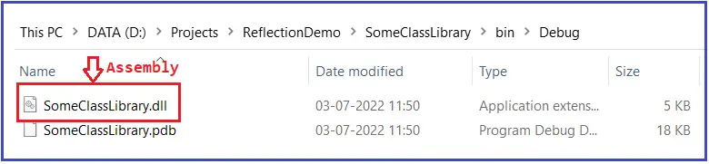

### Reflection in C# with Examples

In this article,I am going to discuss Reflection in C# with Examples.Reflection in C# determines or inspects the content of an assembly.You can also use reflection to dynamically create an instance of a type, bind the type to an existing object, or get the type from an existing object and invoke its methods or access its fields and properties. In this article, we are basically going to discuss what is reflection in C#, how to implement reflection, and finally, we will discuss when to use reflection in C#.

反射可以查看程序集的内容，也可以使用反射动态创建一个类型的实例，绑定类型到已经存在的对象，或获取一个现有对象的类型后调用它的方法或访问它的字段或属性。


### What is Reflection in C#?
Reflection is needed when you want to determine or inspect the content of an assembly. Here, content means the metadata of an assembly like what are the methods in that assembly, what are the properties in that assembly, are they public, are they private, etc.

通过使用反射可以检测或观察一个程序集的内容，所谓内容，即程序集的元数据，如其中的方法，属性以及它们是什么访问属性。

For example, one of the biggest implementations of Reflection is Visual Studio itself. Suppose, in visual studio, we create an object of the String class, and when we press obj. then visual studio intelligence shows all the properties, methods, fields, etc. of that object as shown in the below image. And this is possible because of the Reflection in C#.

Visual Studio的智能提示功能就是使用的反射的例子


So, basically, Reflection inspects the assembly and shows the metadata of that assembly. Now, I hope you understand the definition of Reflection. Now, let us proceed and understand how to implement reflection in C#.

### How to Implement Reflection in C#?

So, now we are going to write a simple example implementing reflection in C# language. So, first, create a console application with the name ReflectionDemo. And to this ReflectionDemo solution, let us add a class library project with the name SomeClassLibrary. Once you add the Class Library Project, your solution should look like the following.

为了理解反射如何实现，创建一个控制台应用和一个类库应用。它们位于同一个解决方案内。


As you can see, the Class Library Project is created with a class called Class1.cs. Now, modify the Class1.cs class file as follows. As you can see, here we have created some private and public fields, some private and public properties, and some private and public methods.

```csharp
using System;

namespace SomeClassLibrary
{
    public class Class1
    {
        public int X;
        private int Y;
        public int P1 {get;set;}
        public int P2 {get;set;}

        public void Method1()
        {
            Console.WriteLine("Method1 Invoked");
        }

        public void Method2()
        {
            Console.WriteLine("Method2 Invoked");
        }
    }
}
```

Now, build the Class Library Project. And once you build the Class Library Project an assembly (with extension .DLL) will be generated inside the Project’s bin=> Debug location as shown in the below image.

构建类库项目，得到一个该项目的程序集




So, basically, in my machine, in the following location, the SomeClassLibrary.dll assembly is created. Copy the location.

D:\Projects\ReflectionDemo\SomeClassLibrary\bin\Debug

Now, remove the Class Library Project from the solution. To do so, right-click on the Class Library Project and then click on the Remove option as shown in the below image.

VS中删除类库项目


Once you click on the Remove option, one popup will come simply click Yes to remove the project. Once you remove the Class Library Project, then your solution will contain only the ReflectionDemo Console Application as shown in the below image.

一旦删除了类库项目，解决方案就只剩下控制台项目。


### Browse the Properties, Methods, and Variables of SomeClassLibrary Assembly

Now, what we need to do is, we need to display the Properties, Methods, and Variables of the SomeClassLibrary assembly using Reflection. Implementing reflection is a three steps process. The steps are as follows.

1. Step1: Import the Reflection Namespace
2. Step2: Get the Type of the Object
3. Step3: Browse the Metadata of the Object

So, basically, first, we need to import the Reflection namespace and then we need to get the type of the object and once we get the type of the object, then we can go and browse the metadata i.e. browse the methods, properties, variables, etc. So, let us implement these three steps one by one.

为了观察程序集的内容，需要完成3个步骤

1. 引入反射命名空间
2. 获取对象的类型
3. 浏览对象的元数据


### Step1: Import the Reflection namespace

`using System.Reflection;`

### Step2: Get the type of the Object

First, we need to get the Reference of the assembly. To get the reference of the assembly we need to use the Assembly.Loadfile method and we need to provide the Path of the assembly (you need to provide the DLL Path where exactly the DLL exists in your machine) as follows.

`var MyAssembly = Assembly.LoadFile(@”D:\Projects\ReflectionDemo\SomeClassLibrary\bin\Debug\SomeClassLibrary.dll”);`

首先获取程序集的引用。


Once you get the reference of the assembly, the next step is to get the class reference. What it means once you get the assembly reference, from that assembly reference you need to get the class reference. That reference might contain multiple classes. For this, we need to call the GetType method on the assembly reference, and to this get type method, we need to provide the fully qualified name of the class i.e. Namespace.ClassName is as follows. We need to fetch the details of the class Class1.

一旦有了程序集的引用，就可以通过该引用获取程序集中类型的引用，需要注意的是要使用完全限定名称

`var MyType = MyAssembly.GetType(“SomeClassLibrary.Class1”);`

Once you get the class reference i.e. the type, then you need to create an instance of that class or type. To create an instance of a class dynamically in C#, we need to use Activator.CreateInstance method and to this method, we need to pass the type object as follows.

`dynamic MyObject = Activator.CreateInstance(MyType);`

通过类型引用，创建该类型的实例

Once the above step is executed, the object is created. Once the object is created, next we need to get the type of the class. To get the type of the class, we can use the GetType method as follows. 

`Type parameterType = MyObject.GetType();`

Using this parameterType object we can access the metadata i.e. we can access the methods, properties, fields, etc. of a class.

对象创建完成后，我们可以通过对象去获取对象的类型。

### Step3: Browse the Metadata of the Object

In this step, we need to browse the metadata of the assembly. To get all the public members of the type, we need to use GetMembers() method, to get all the public methods, we need to use GetMethods() method, to get all the public variables or fields, we need to use GetFields() method, and to get all the public properties of the assembly we need to use GetProperties() method as shown in the below image.


Some of the useful methods are as follows:

1. GetFields(): It returns all the public fields of the current System.Type.
2. GetProperties(): It returns all the public properties of the current System.Type.
3. GetMethods(): It returns all the public methods of the current System.Type.
4. GetMembers(): It returns all the public members of the current System.Type.

The following is the complete example code. The following example code is self-explained, so please go through the comment liens for a better understanding.

```csharp
using System;
//Step1: Import the Reflection namespace
using System.Reflection;

namespace ReflectionDemo
{
    class Program
    {
        static void Main(string[] args)
        {
            //Browse the Properties, Methods, variables of SomeClassLibrary Assembly

            //Step2: Get the Type

            //Get the Assembly Reference
            var MyAssembly = Assembly.LoadFile(@"D:\Projects\ReflectionDemo\SomeClassLibrary\bin\Debug\SomeClassLibrary.dll");

            //Get the Class Reference
            var MyType = MyAssembly.GetType("SomeClassLibrary.Class1");

            //Create an instance of the type
            dynamic MyObject = Activator.CreateInstance(MyType);

            //Get the Type of the Instance
            Type parameterType = MyObject.GetType();

            //Step3: Browse the Metadata

            //To Get all Public Fields/variables
            Console.WriteLine("All Public Fields");
            foreach (MemberInfo memberInfo in parameterType.GetFields())
            {
                Console.WriteLine(memberInfo.Name);
            }

            //To Get all Public Methods
            Console.WriteLine("\nAll Public Methods");
            foreach (MemberInfo memberInfo in parameterType.GetMethods())
            {
                Console.WriteLine(memberInfo.Name);
            }

            //To Get all Public Properties
            Console.WriteLine("\nAll Public Properties");
            foreach (MemberInfo memberInfo in parameterType.GetProperties())
            {
                Console.WriteLine(memberInfo.Name);
            }

            Console.ReadKey();
        }
    }
}
```

Output:


Here, you can see in all methods, it also fetches the object class methods. This is because the object is the superclass of all classes in the .NET Framework. Here, get_P1 and set_P1 are the setter and getter methods of the public property P1. So, this is how you can go and extract metadata of an assembly using Reflection in C#. 

object类是.net框架的所有类的基类，所以我们也看到了object中的成员。

### Example to show Type Details using Reflection in C#:

So, basically what we want to do is, once we get the Type then we want to show the class name, fully qualified class name, and namespace name. For this, we need to call the Name, FullName, and Namespace properties as shown in the below example.

```csharp
using System;
using System.Reflection;

namespace ReflectionDemo
{
    class Program
    {
        static void Main(string[] args)
        {
            //Get the Assembly Reference
            var MyAssembly = Assembly.LoadFile(@"D:\Projects\ReflectionDemo\SomeClassLibrary\bin\Debug\SomeClassLibrary.dll");

            //Get the Class Reference
            var MyType = MyAssembly.GetType("SomeClassLibrary.Class1");
            
            // Print the Type details
            Console.WriteLine($"Full Name = {MyType.FullName}");
            Console.WriteLine($"Just the Class Name = {MyType.Name}");
            Console.WriteLine($"Just the Namespace Name = {MyType.Namespace}");

            Console.ReadKey();
        }
    }
}
```

Ouput:


So, this is how you can extract the type information of an assembly using Reflection in C#. Now, let us see some other benefits of using Reflection in C#.

### How to Invoke Methods Dynamically Using Reflection in C#?

One of the good features of reflection is it will inspect the metadata of an assembly and we already discussed this. Another good feature of using Reflection is that we can invoke the members of an assembly in C# using Reflection. So, if you remember we have defined one public method i.e. Method1 in our class library assembly and we want to invoke that method using reflection. To invoke the method of assembly using reflection, we need to use the InvokeMember method as shown in the below image.


The following is the signature of the InvokeMember method.

InvokeMember(string name, BindingFlags invokeAttr, Binder binder, object target, object[] args): This method invokes the specified member, using the specified binding constraints and matching the specified argument list. It returns an object representing the return value of the invoked member. This method takes the following parameters:

1. name: The string containing the name of the constructor, method, property, or field member to invoke. In our case it is Method1.
2. invokeAttr: A bitmask comprised of one or more System.Reflection.BindingFlags that specify how the search is conducted. The access can be one of the BindingFlags such as Public, NonPublic, Private, InvokeMethod, GetField, and so on. The type of lookup need not be specified. If the type of lookup is omitted, BindingFlags.Public | BindingFlags.Instance | BindingFlags.Static is used.
3. binder: An object that defines a set of properties and enables binding, which can involve the selection of an overloaded method, coercion of argument types, and invocation of a member through reflection. -or- A null reference to use the System.Type.DefaultBinder. Note that explicitly defining a System.Reflection.Binder objects may be required for successfully invoking method overloads with variable arguments. Here, we are passing a null value.
4. target: The object on which to invoke the specified member. In our example, the object is MyObject.
5. args: An array containing the arguments to pass to the member to invoke. As our method does not take any arguments, we pass null here.
Note: This method of invocation is completely done at runtime. If the method exists at runtime, it will invoke the method else it will throw an exception. That means Reflection in C# does the complete dynamic invocation of the method during runtime.

### Example to Invoke a Method Dynamically using Reflection in C#:

The complete example code is given below.

```csharp
using System;
//Step1: Import the Reflection namespace
using System.Reflection;

namespace ReflectionDemo
{
    class Program
    {
        static void Main(string[] args)
        {
            //Browse the Properties, Methods, variables of SomeClassLibrary Assembly

            //Step2: Get the type

            //Get the Assembly Reference
            var MyAssembly = Assembly.LoadFile(@"D:\Projects\ReflectionDemo\SomeClassLibrary\bin\Debug\SomeClassLibrary.dll");

            //Get the Class Reference
            var MyType = MyAssembly.GetType("SomeClassLibrary.Class1");

            //Create an instance of the type
            dynamic MyObject = Activator.CreateInstance(MyType);

            //Get the Type of the class
            Type parameterType = MyObject.GetType();

            //Step3: Browse the Metadata

            //To Get all Public Fields/variables
            Console.WriteLine("All Public Members");
            foreach (MemberInfo memberInfo in parameterType.GetMembers())
            {
                Console.WriteLine(memberInfo.Name);
            }

            Console.WriteLine("\nInvoking Method1");

            parameterType.InvokeMember("Method1",
                                        BindingFlags.Public | 
                                        BindingFlags.InvokeMethod | 
                                        BindingFlags.Instance,
                                        null, MyObject, null
                                      );
            
            Console.ReadKey();
        }
    }
}
```

Output:


### What are the real-time uses of Reflection in C#?

1. If you are creating applications like Visual Studio Editors where you want to show internal details i.e. Metadata of an object using Intelligence.
2. In unit testing sometimes we need to invoke private methods to test whether the private members are working properly or not.
3. Sometimes we would like to dump properties, methods, and assembly references to a file or probably show it on a screen.
4. Late binding can also be achieved by using Reflection in C#. We can use reflection to dynamically create an instance of a type, about which we don’t have any information at compile time. So, Reflection enables us to use code that is not available at compile time.
5. Consider an example where we have two alternate implementations of an interface. You want to allow the user to pick one or the other using a config file. With reflection, you can simply read the name of the class whose implementation you want to use from the config file and instantiate an instance of that class. This is another example of late binding using reflection.

Note: Reflection is used to find all types in an assembly and/or dynamically invoke methods in an assembly. This includes information about the type, properties, methods, and events of an object. With Reflection, we can dynamically create an instance of a type, bind the type to an existing object, or get the type from an existing object and invoke its methods or access its fields and properties.

So, basically using reflection we can inspect the metadata of an assembly as well as we can invoke methods are runtime. There is a keyword called dynamic which was introduced in C# 4.0 and does the same thing as reflection. There are many confusions between dynamic and reflection in C#. So, in the next article, I am going to discuss what is dynamic and what are the differences between dynamic and reflection in C#.