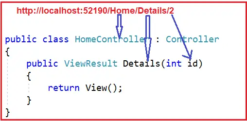

### Attribute Routing in ASP.NET Core MVC Application

In this article, I will discuss Attribute Routing in ASP.NET Core MVC Web Applications with Examples. Please read our previous article, which discusses How to Create Custom Route Constraints in ASP.NET Core MVC web applications. As part of this article, we will discuss the following pointers.


1. What is Attribute Routing in ASP.NET Core MVC?
2. Why do We Need Attribute Routing in ASP.NET Core MVC Applications?
3. How do We Use Attribute Routing in ASP.NET Core MVC?
4. Can we Apply Multiple Route Attributes to a Single Action Method in ASP.NET Core MVC?
5. Attribute Routing with Parameters in ASP.NET Core MVC Application
6. Attribute Routing with Optional Parameters in ASP.NET Core.
7. Can we use both Attribute and Convention-Based Routing in a Single ASP.NET Core MVC Application?
8. How Do We Apply Route Attributes at the Controller Level in the ASP.NET Core MVC Application?
9. How Do We Ignore the Route Attribute Placed at the Controller Level in ASP.NET Core MVC?
10. Defining Route using HTTP Methods.
11. What is the Difference Between [Route] and [HttpGet],[HttpPost],etc,Attributes?


### What is Attribute Routing in ASP.NET Core MVC?

Attribute Routing gives us more control over the URIs by defining routes directly at action methods or controllers in our ASP.NET Core MVC Web Application. With Attribute Routing, you can now define routes directly on actions and controllers by decorating them with attributes like [Route], [HttpGet], [HttpPost], etc. This type of routing makes it easier to understand the routes by looking directly at the controllers and actions.

Note: The Convention-Based routing is still fully supported by ASP.NET Core MVC. In fact, we can use both these routing approaches in the same project. If both Routings are present, then .NET Core overrides conventional routes. This is because .NET Core gives preference to Attribute Routing.

### Why do we need Attribute Routing in ASP.NET Core MVC Applications?

Let us understand the need for Attribute Routing in the ASP.NET Core MVC Web Application with an example. We will work with the example we created in our Routing in ASP.NET Core MVC articles.

#### Adding Student Model:

First, add a class file named Student.cs, within the Models folder, and copy and paste the following code.

```csharp
namespace RoutingInASPDotNetCoreMVC.Models
{
    public class Student
    {
        public int Id {get;set;}
        public string? Name{get;set;}
    }
}
```

#### Modifying Student Controller:

We have already created the Student controller within the Controllers folder. If not, please right-click on the Controllers folder and add a new ASP.NET Core MVC Empty controller named **StudentController.cs**, and then copy and paste the following code.

```csharp
using Microsoft.AspNetCore.Mvc;
using RoutingInASPDotNetCoreMVC.Models;

namespace RoutingInASPDotNetCoreMVC.Controllers
{
    public class StudentController : Controller
    {
        //This is going to be our data source
        //In Real-Time you will get the data from the database
        static List<Student> students = new List<Student>()
        {
            new Student(){Id=1,Name="Pranaya"},
            new Student(){Id=2,Name="Priyanka"},
            new Student(){Id=3,Name="Anurag"},
            new Student(){Id=4,Name="Sambit"}
        };


        //This method is going to return all the students
        public List<Student> GetAllStudents()
        {
            return students;
        }

        //This method is going to return a student bsaed on the student id

        public Student GetStudentById(int studentId)
        {
            //Returning the First Student Information
            Student? studentDetails = students.FirstOrDefault(s=>s.Id==studentId);
            return studentDetails??new Student();
        }


        //This method is going to return the courses of a student base on the student id

        public List<string> GetStudentCourses(int studentId)
        {
            //Real-Time you will get the courses from database,here we have hardcode the data
            List<string> CourseList = new List<string>();
            if(studentId==1)
            {
                CourseList = new List<string>(){"ASP.NET Core","C#.NET","SQL Server"};
            }
            else if(studentId==2)
            {
                CourseList = new List<string>(){"ASP.NET Core MVC","C#.NET","ADO.NET Core"};
            }
            else if(studentId==3)
            {
                CourseList = new List<string>(){"ASP.NET Core Web Api","C#.NET","Entity Framework Core"};
            }
            else 
            {
                CourseList = new List<string>(){"Bootstrap","jQuery","AngularJs"};
            }

            return CourseList;
        }
    }
}

```

#### Modifying Program.cs Class file:

Next, modify the Main method of the Program class as follows. This is the default class file you will get when creating a new ASP.NET Core Web Application using the Model-View-Controller Project template. Here, we have configured the MVC Middleware Component and the Convention-Based Routing.

```csharp
namespace RoutingInASPDotNetCoreMVC
{
    public class Program
    {
        public static void Main(string[] args)
        {
            var builder = WebApplication.CreateBuilder(args);

            //Add services to the container.
            builder.Services.AddControllersWithViews();

            var app = builder.Build();

            // Configure the HTTP request pipeline.
            if(!app.Environment.IsDevelopment())
            {
                app.UseExceptionHandler("/Home/Error");
                //The default HSTS value is 30 days.You may want to change this for production scenarios,see https://aka.ms/aspnetcore-hsts.
                app.UseHsts();
            }

            app.UseHttpsRedirection();
            app.UseStaticFiles();
            app.UseRouting();
            app.UseAuthorization();
            app.MapControllerRoute(
                name:"default",
                pattern:"{controller}/{action}/{id:int?}",
                defaults: new {controller="Home",action="Index"}
            );
            app.Run();
        }
    }
}
```

Now, you can access the three action methods of the Student Controller using the following URLs, and it will work as expected.

`https://localhost:44359/Student/GetAllStudents`
`https://localhost:44359/Student/GetStudentByID?studentID=1`
`https://localhost:44359/Student/GetStudentCourses?studentID=1`

In some scenarios, Convention-Based routing makes it very difficult to support certain URL patterns. However, attribute routing in the ASP.NET Core MVC application can easily achieve those URL patterns. 

在一些场景中，基于规则的路由对确定的URL模式提供支持非常困难。然而，属性路由则易于达成这种URL模式。


In our example, if we want the URL Pattern “/student/1/courses” and if that URL Pattern should be mapped to GetStudentCourses(int studentID), then this type of URL Pattern is very difficult to create using convention-based routing in an ASP.NET Core MVC Application. However, we can easily achieve this type of URL pattern by using attribute routing in an ASP.NET Core MVC application.

例如上面的例子中，路由模式：**/student/1/course**。基于规则的路由无法支持。

### How Do We Use Attribute Routing in ASP.NET Core MVC?

Attribute routing allows us to define routes directly on our controller and action methods using the Route Attributes. Applying the Route attribute at the Controller level applies to all the controller’s action methods. We can also use the **[HttpGet]**, **[HttpPost]**, **[HttpPut]**, **[HttpDelete]**, and **[HttpPatch]** Attributes at the action method level to define the Route Pattern. Let us first modify the Student Controller as shown below. Here, we have applied the Route Attribute at the Action methods level.

属性路由允许我们直接使用属性在控制器或动作方法上定义路由。

```csharp
using Microsoft.AspNetCore.Mvc;
using RoutingInASPDotNetCoreMVC.Models;

namespace RoutingInASPDotNetCoreMVC.Controllers
{
    public class StudentController : Controller
    {
        //This is going to be our data source
        //In Real-Time you will get the data from the database
        static List<Student> students = new List<Student>()
        {
            new Student() { Id = 1, Name = "Pranaya" },
            new Student() { Id = 2, Name = "Priyanka" },
            new Student() { Id = 3, Name = "Anurag" },
            new Student() { Id = 4, Name = "Sambit" }
        };

        //This method is going to return all the Students
        //URL Pattern: /Student/All
        [Route("Student/All")]
        public List<Student> GetAllStudents()
        {
            return students;
        }

        //This method is going to return a student based on the student id
        //URL Pattern: /Student/1/Details
        [Route("Student/{studentID}/Details")]
        public Student GetStudentByID(int studentID)
        {
            //Returning the First Student Information
            Student? studentDetails = students.FirstOrDefault(s => s.Id == studentID);
            return studentDetails ?? new Student();
        }

        //This method is going to the courses of a student based on the student id
        //URL Pattern: /Student/1/Courses
        [Route("Student/{studentID}/Courses")] 
        public List<string> GetStudentCourses(int studentID)
        {
            //Real-Time you will get the courses from database, here we have hardcoded the data
            List<string> CourseList = new List<string>();
            if (studentID == 1)
                CourseList = new List<string>() { "ASP.NET Core", "C#.NET", "SQL Server" };
            else if (studentID == 2)
                CourseList = new List<string>() { "ASP.NET Core MVC", "C#.NET", "ADO.NET Core" };
            else if (studentID == 3)
                CourseList = new List<string>() { "ASP.NET Core WEB API", "C#.NET", "Entity Framework Core" };
            else
                CourseList = new List<string>() { "Bootstrap", "jQuery", "AngularJs" };
            
            return CourseList;
        }
    }
}
```

With the above Attribute Routing in place, we can now access the above three action methods for the student controller using the following URLs.

`https://localhost:44359/Student/All`
`https://localhost:44359/Student/1/Details`
`https://localhost:44359/Student/1/Courses`

### Can we Apply Multiple Route Attributes to a Single Action Method in ASP.NET Core MVC?

Yes, we can apply Multiple Route Attributes to a Single Action Method in the ASP.NET Core MVC Application. Let us understand this with an example. Please modify the Home Controller as shown below, and please have a look at the Index Action method, where we have applied three attributes.

我们可以应用多个路由属性在一个动作方法之上。

```csharp
using Microsoft.AspNetCore.Mvc;
namespace RoutingInASPDotNetCoreMvc.Controllers
{
    public class HomeController : Controller
    {
        [Route("")]
        [Route("Home")]
        [Route("Home/Index")]
        public string Index()
        {
            return "Index() Action Method of HomeController";
        }
    }
}
```

If you notice, we have applied the Route attribute three times to the Index() action method of the Home Controller class. With each instance of the Route attribute, we specified a different route template. With the above three Route attributes applied to the Index action method, we can now access the Index() action method of the HomeController using the following three URLs.

`https://localhost:44359/`
`https://localhost:44359/home`
`https://localhost:44359/home/index`

If you apply the same Route Attributes multiple times with an Action Method and if you apply the same **Route Template** to different action methods, then you will get **AmbiguousMatchException**. Now run the application and navigate to the above three URLs, and you will see the Home page as expected.

如果你在多个应用方法之上应用相同的路由属性，会发生二义性异常

### Attribute Routing with Parameters in ASP.NET Core MVC Application:

As we already discussed, we can specify the Route Parameters as part of the route template with Conventional-Based Routing. We can also do the same with Attribute Routing in ASP.NET Core. That means we can also define Route Attributes with Route Parameters. To understand this, modify the Home Controller as shown below.

```csharp
using Microsoft.AspNetCore.Mvc;
namespace RoutingInASPDotNetCoreMVC.Controllers
{
    public class HomeController:Controller
    {
        [Route("")]
        [Route("Home")]
        [Route("Home/Index")]
        public string Index()
        {
            return "Index() Action Method of HomeController";
        }

        [Route("Home/Details/{id}")]
        public string Details(int id)
        {
            return "Details() Action Method of HomeController, id value = " + id;
        }
    }
}
```

As you can see in the above code, the Details() action method has the id parameter. Notice that in the route template, we also specified the ID parameter (**[Route(“Home/Details/{id}”)]**). So, the URL (**/Home/Details/10**) will execute the **Details(int id)** action method and map the value 10 to the id parameter of the Details action method. This is done through the model binding process, which will be discussed in our upcoming articles. Run the application and navigate to the following URL; you should see the output as expected.

`https://localhost:44359/Home/Details/10`

### Attribute Routing with Optional Parameters in ASP.NET Core MVC Application:

We can also make the Route Parameter optional in Attribute Routing. You can define a Route Parameter as optional by adding **a question mark (?)** to the route parameter. You can also specify the default value by using the **parameter = value**. 

In our example, the **Details(int id)** action method of the HomeController is currently executed only if we pass the id parameter value. If we do not pass the id parameter value, we will get a 404 error. For example, if we navigate to the following URL, we will get a 404 error.

`https://localhost:44359/Home/Details`

Let us modify the Route attribute of the Details action method as shown below to make the route parameter id optional by adding “?” at the end, i.e. [**Route(“Home/Details/{id?}”)**]. 

```csharp
using Microsoft.AspNetCore.Mvc;
namespace RoutingInASPDotNetCoreMVC.Controllers
{
    public class HomeController : Controller
    {
        [Route("")]
        [Route("Home")]
        [Route("Home/Index")]
        public string Index()
        {
            return "Index() Action Method of HomeController";
        }

        [Route("Details/{id?}")]
        public string Details(int id)
        {
            return "Details() Action method of HomeController, Id value = ” + id;
        }
    }
}
```

Now run the application and navigate to the following URL. You will see the output as expected instead of a 404 error.

`https://localhost:44359/Home/Details`

We can also make the parameter optional by specifying a default value. For a better understanding, please modify the Home Controller class as follows. Within the Route Attribute of Details action method, we have specified the default value for the id parameter as 10.

```csharp
using Microsoft.AspNetCore.Mvc;
namespace RoutingInASPDotNetCoreMVC.Controllers
{
    public class HomeController : Controller
    {
        [Route("")]
        [Route("Home")]
        [Route("Home/Index")]
        public string Index()
        {
            return "Index() Action method of HomeController";
        }

        [Route("Home/Details/{id=10}")]
        public string Details(int id)
        {
            return "Details() Action method of HomeController,Id value = "+ id;
        }
    }
}

```

If you run the application and navigate to the URL below without specifying the ID parameter, it will take the default value 10.
https://localhost:44359/Home/Details

### Controller and Action Method Names in Attribute Routing:

With Attribute Routing in ASP.NET Core MVC Application, the Controller and Action Method names do not play any role. To understand this, modify the Home Controller as shown below.

使用属性路由，控制器与动作方法的名字可以不扮演任何角色，即两者的名字可以不出现在请求中。


```csharp
using Microsoft.AspNetCore.Mvc;

namespace RoutingInASPDotNetCoreMVC.Controllers
{
    public class HomeController : Controller
    {
        [Route("")]
        [Route("Home")]
        [Route("Home/Index")]
        public string StartPage()
        {
            return "StartPage() Action method of HomeController";
        }
    }
}
```

As you can see, we have specified the Route attribute three times with the StartPage() action method of the HomeController. So, this StartPage action method will be executed for the following 3 URLs.

`https://localhost:44359/`
`https://localhost:44359/home`
`https://localhost:44359/home/index`

### Can we use both Attribute and Convention-Based Routing in a Single ASP.NET Core MVC Application?

Yes. Both routing mechanisms can be combined in a single ASP.NET Core MVC Web Application. The controller action methods with the [Route] attribute use Attribute Routing, and those without the [Route] attribute use Convention-based routing. To better understand, please modify the Home Controller class as shown below.

可以在同一个控制器中使用两种路由模式

```csharp
using Microsoft.AspNetCore.Mvc;

namespace RoutingInASPDotNetCoreMVC.Controllers
{
    public class HomeController : Controller
    {
        [Route("")]
        [Route("MyHome")]
        [Route("MyHome/Index")]
        public string StartPage()
        {
            return "StartPage() Action Method of HomeController";
        }

        public string Privacy()
        {
            return "Privacy() Action Method of HomeController";
        }
    }
}
```

As you can see in the above code, we have applied the Route Attribute with the StartPage action method, and we have not applied the Route Attribute with the Privacy action method. So, in this case, StartPage will use Attribute Routing, and we can access this method using the following 3 URLs.

`https://localhost:44359/`
`https://localhost:44359/home`
`https://localhost:44359/home/index`

On the other hand, the Privacy action method will use Contention-Based Routing and can be accessed by using the following URL only.

`https://localhost:44359/home/privacy`

Note: It is not possible to access an action method using both Attribute and Convention Routing. If Attribute Routing is applied to an action method, then you can access that method using Attribute Routing only; you cannot access the same method using Convention Routing. Similarly, if Attribute Routing is not applied to an action method, then you can access that method using Conventional Routing only; you cannot access the same method using Attribute Routing.

**注意**:一个动作方法不能同时使用两种路由

### Applying Route Attribute at the Controller Level in the ASP.NET Core MVC:

In the ASP.NET Core MVC Web Application, applying the Route() Attribute to the Controller class and individual action methods is possible. If you want to make attribute routing less repetitive, you need to use the Route Attribute on the controller level. Let us understand this with an example. First, modify the Home Controller class, as shown below. Here, we have created the Home controller with two action methods.

```csharp
using Microsoft.AspNetCore.Mvc;
namespace RoutingInASPDotNetCoreMVC.Controllers
{
    public class HomeController : Controller
    {
        [Route("")]
        [Route("Home")]
        [Route("Home/Index")]
        public string Index()
        {
            return "Index() Action Method of HomeController";
        }
        [Route("Home/Details/{id?}")]
        public string Details(int id)
        {
            return "Details() Action Method of HomeController, ID Value = " + id;
        }
    }
}
```

With the above code in place, we can access the Index() action method using the following 3 URLs.
`/`
`/Home`
`/Home/Index`

Along the same line, we can access the Details(int? id) action method using the following 2 URLs. 
`/Home/Details`
`/Home/Details/2`

If you look at our code, you will see that we are using Route Attributes at the action method level to define routes. Further, you will notice that all the routes in the HomeController start with the same prefix, i.e., Home. That means Home is the common prefix for all the routes in the Home Controller.

Here, instead of writing the common prefix Home at each action method, we can specify the Home for the Home Controller (for all its action methods) using the [Route] attribute at the controller level.

So, modify the Home Controller class as follows. Here, you can see we have applied [Route(“Home”)] at the controller level, and we have removed that Home prefix from each action method Route Attribute. The Route Attribute we define at the Controller level will be applied to each action method.

```csharp
using Microsoft.AspNetCore.Mvc;
namespace RoutingInASPDotNetCoreMVC.Controllers
{
    [Route("Home")]
    public class HomeController : Controller
    {
        [Route("")]
        [Route("Index")]
        public string Index()
        {
            return "Index() Action Method of HomeController";
        }

        [Route("Details/{id?}")]
        public string Details(int id)
        {
            return "Details() Action Method of HomeController, ID Value = " + id;
        }
    }
}
```

The Route template applied on the controller level is prepended to the route template applied to the action method level. When you navigate to the following four URLs, you will get the output as expected.
`https://localhost:44359/home`
`https://localhost:44359/home/index`
`https://localhost:44359/home/details`
`https://localhost:44359/home/details/10`

However, when you navigate to the application’s root URL (http://localhost:44359), you will get a 404 error. To solve this, you need to include the route template that begins with “/” i.e. [Route(“/”)] on the Index() action method, as shown in the image below. 



So, modify the Home Controller as follows:

```csharp
using Microsoft.AspNetCore.Mvc;
namespace RoutingInASPDotNetCoreMVC.Controllers
{
    [Route("Home")]
    public class HomeController : Controller
    {
        [Route("")]
        [Route("/")]
        [Route("Index")]
        public string Index()
        {
            return "Index() Action Method of HomeController";
        }

        [Route("Details/{id?}")]
        public string Details(int id)
        {
            return "Details() Action Method of HomeController, ID Value = " + id;
        }
    }
}
```

With the above changes in place, run the application and navigate to the root URL to see the expected output. As you can see in the above code, we have applied the [Route(“Home”)] attribute at the Controller level. This Route attribute eliminates the need to repeat the common prefix “Home” on each controller action method. However, sometimes, we may need to override the route attribute defined at the controller level. 

### How Do We Ignore the Route Attribute Placed at the Controller Level in ASP.NET Core MVC?
To ignore the Route Template placed at the Controller level, you must use **/** or **~/** at the action method level. If the action method route template starts with / or ~/, then the controller Route Attribute will not be combined with the action method route attribute. To understand this, let us modify the Home Controller class as shown below. In the following code, the About action method starts with ~/, so this action method will not be combined with the controller route attribute.

在动作方法上使用“/”或“~/”来覆盖控制器层级的路由属性

```csharp
using Microsoft.AspNetCore.Mvc;
namespace RoutingInASPDotNetCoreMVC.Controllers
{
    [Route("Home")]
    public class HomeController : Controller
    {
        [Route("")]
        [Route("/")]
        [Route("Index")]
        public string Index()
        {
            return "Index() Action Method of HomeController";
        }

        [Route("Details/{id?}")]
        public string Details(int id)
        {
            return "Details() Action Method of HomeController, ID Value = " + id;
        }

        [Route("~/About")]
        public string About(int id)
        {
            return "About() Action Method of HomeController";
        }
    }
}
```

Now run the application and navigate to /About URL, and you will see the output as expected.

### Defining Route using HTTP Methods:


We can also achieve this using HTTP Verbs. So, let us rewrite the previous example using HTTP Methods as follows:

```csharp

using Microsoft.AspNetCore.Mvc;
namespace RoutingInASPDotNetCoreMVC.Controllers
{
    [Route("Home")]
    public class HomeController : Controller
    {
        [HttpGet("")]
        [HttpGet("/")]
        [HttpGet("Index")]
        public string Index()
        {
            return "Index() Action Method of HomeController";
        }

        [HttpGet("Details/{id?}")]
        public string Details(int id)
        {
            return "Details() Action Method of HomeController, ID Value = " + id;
        }

        [HttpGet("~/About")]
        public string About(int id)
        {
            return "About() Action Method of HomeController";
        }
    }
}
```

### What is the Difference Between [Route] and [HttpGet], [HttpPost], etc., Attributes?

The [Route] attribute specifies a route template for a controller or action method but does not apply any specific HTTP method. On the other hand, HTTP method attributes like [HttpGet], [HttpPost], [HttpPut], and [HttpDelete] not only define the route template but also restrict the action method to be invoked only with the specified HTTP method.

That’s it for today. In the next article, I will discuss Tokens in Attribute Routing in ASP.NET Core MVC Applications. In this article, I try to explain Attribute Routing in the ASP.NET Core MVC Web Application. I hope you enjoy this Attribute Routing in ASP.NET Core MVC article.s