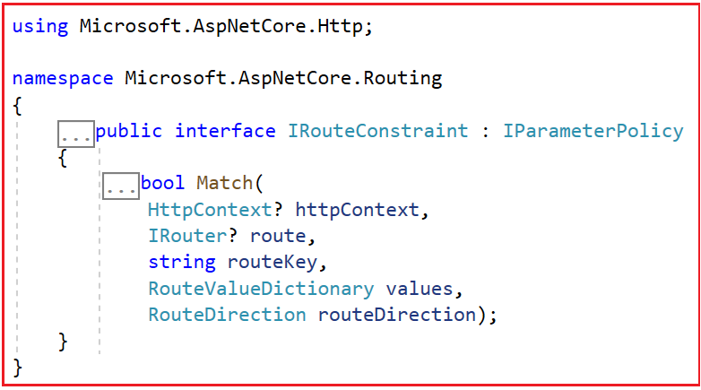

### How to Create Custom Route Constraints in ASP.NET Core MVC

In this article, I will discuss How to Create Custom Route Constraints in ASP.NET Core MVC Web Applications with Examples. Please read our previous article discussing Custom Routing in the ASP.NET Core MVC Web Application. We will work with the same example we created in our previous article.

### Custom Route Constraints in ASP.NET Core MVC Web Application:

In ASP.NET Core MVC, custom route constraints allow us to enforce specific rules when matching route parameters. This is useful when we need to enforce certain conditions for a route to be selected during the request processing. These constraints, like the built-in constraints, are used to validate parameters in the URL before the request even reaches the controller action.

在ASP.NET CORE MVC中，自定义路由约束可以在匹配路由参数强制指定匹配规则。这在需要强制要求请求满足某种条件时变得非常有用。

### When to Use Custom Route Constraints in ASP.NET Core MVC Application

Custom route constraints in ASP.NET Core MVC are used to determine whether a particular URL segment matches a specified condition. The following are some of the scenarios when it’s beneficial to use custom route constraints:

- **When Built-in** Constraints are Insufficient: If the built-in constraints (int, bool, datetime, etc.) don’t cover your validation needs.
- **When Business Logic Demands**: For scenarios like verifying product IDs against a database, ensuring valid user IDs, or any other business-specific logic.
- **When Reusability is Needed**: If you have a validation logic that needs to be applied to multiple routes, a custom route constraint can encapsulate this logic for reuse.

### How Do We Create a Custom Route Constraint in ASP.NET Core MVC?

To create a Custom Route Constraint in ASP.NET Core MVC, we need to create a class that implements the IRouteConstraint interface. This interface has a single method called Match, and we need to implement this Match method to define our custom constraint logic. This method contains the logic to check whether a particular URL parameter meets a specific requirement and returns a boolean indicating whether the constraint is met. If you go to the definition of the IRouteConstraint interface, you will see the following.




This method takes the following five parameters.

### HttpContext? httpContext:

It represents the HTTP context for the current request. It provides access to all HTTP-specific information about the request, such as Request, Response, User, headers, query strings, and services configured in dependency injection. It is useful for accessing request headers, cookies, session data, or other request-specific data that might be required in routing decisions.

### IRouter? route:
It represents the route being matched and can be used to get information about the route being processed. It is rarely used directly in constraints, but it can be useful for advanced scenarios where the constraint needs to interact with the route itself, such as modifying route data.

### string routeKey:
The name of the route parameter that the constraint is being applied to. For example, if your route is defined as **{controller}/{action}/{id:int}**, and you have a constraint on the id parameter, the routeKey would be “id”. It is used to retrieve the specific route value from the values dictionary that needs to be validated.

### RouteValueDictionary values:

A dictionary that contains all the current route values extracted from the URL. This dictionary includes both the route data tokens defined in the route template and any default values specified. It is used to access the actual value that needs to be validated against the constraint. You can retrieve the value of the route parameter specified by routeKey using values.TryGetValue(routeKey, out var value).

### RouteDirection routeDirection:

It indicates whether the route constraint check is being performed while processing an incoming request (RouteDirection.IncomingRequest) or when generating a URL (RouteDirection.UrlGeneration). This can be important if the constraint should only apply in one direction. For example, some constraints might only make sense when processing incoming requests and not when generating URLs.

### Example to Understand Custom Route Constraint in ASP.NET Core MVC

We will create a Custom Route Constraint to validate the Alpha Numeric String. That means if the incoming Route Data Contains both Alphabet and Numeric, it will be considered a valid value; if it contains only alphabet or only numeric, it will be considered an invalid value. For this, we don’t have any built-in constraint in ASP.NET Core, and to achieve this in ASP.NET Core MVC Application, we need to create a Custom Route Constraint.

自定义一个路由规则，验证字母数字，即一个请求的路由数据包含字母或数字，则通过。

So, create a class file named AlphaNumericConstraint.cs within the Models folder and copy and paste the following code. As you can see, the class implements the IRouteConstraint interface and provides the implementation for the Match method. As part of the Match method, we implemented one alphanumeric regex to check the incoming request parameter and determine whether the route parameter contains Alphabets (A-Z, a-z) and numeric (0-9). If it contains both alphabet and numeric, it returns true; otherwise, it returns false.

```csharp
using System.Text.RegularExpressions;

namespace RoutingInASPDotNetCoreMVC.Models
{
    public class AlphaNumericConstraint : IRouteConstraint
    {
        public bool Match(HttpContext httpContext,IRouter route,string routeKey,RouteValueDictionary values,RouteDirection routeDirection)
        {
            //Check if the HttpContext is null to avoid using a null reference later
            if(httpContext == null)
            {
                // Throw an exception if httpContext is null
                throw new ArgumentNullException(nameof(httpContext));
            }

            //Check if the route is null to avoid using a null reference later
            if(route == null)
            {
                //Throw an exception if route is null
                throw new ArgumentNullException(nameof(route));
            }

            //Check if the routeKey is null to ensure we have a valid route key to work with

            if(routeKey == null)
            {
                //Throw an exception if routeKey is null
                throw new ArgumentNullException(nameof(routeKey));
            }

            // Check if the values dictionary is null to ensure we have route data to validate
            if (values == null)
            {
                throw new ArgumentNullException(nameof(values)); 
                // Throw an exception if values dictionary is null
            }   

            //Try to retrieve the value associated with routeKey from the route values dictionary

            if(values.TryGetValue(routeKey,out object? routeValue))
            {
                //Convert the route value to a string for regex matching
                var parameterValueString = Convert.ToString(routeValue);

                //Check if the parameter value string matches the required alphanumeric pattern
                //The regex pattern checks for at least one alphabet character and one numeric character


                if(Regex.IsMatch(parameterValueString??string.Empty,"^(?=.*[a-zA-z])(?=.*[0-9])[A-Za-z0-9]+$"))
                {
                    //Return true if the string is alphanumeric as per the pattern
                    return true; 
                }
                else
                {
                    //Return false if the string does not match the pattern 
                    return false;
                }
            } 

            //Return false if the routeKey is not found in the values dictionary
            return false;
        }
    }
}
```

### Register the Custom Route Constraint:

Before using the Custom Route Constraint, we need to register it with the Routing System. This is typically done in the Program.cs file. We need to register the Custom Route Constraint within the ConstraintMap dictionary. The ConstraintMap is a dictionary that contains the list of built-in route constraints. So, we have to add our Custom Route Constraint to this ConstraintMap dictionary. We can register the Custom Route Constraint service to the built-in dependency Injection container in two ways. They are as follows:

使用自定义路由约束之前，需要先使用路由系统注册约束类。通常在Program.cs中完成这项工作。

### Method 1: Configuring the Custom Route Constraint Service using the AddRouting Method

The following code registers a custom route constraint named “alphanumeric” with the ASP.NET Core routing system. This allows the use of this custom constraint in route definitions to enforce specific rules on route parameters.

```csharp

builder.Services.AddRouting(options=>
{
    //This lambda is configuring the options for routing services that are added to the application's service container.

    options.ContraintMap.Add("alphanumeric",typeof(AlphaNumericConstraint));

    //Adds a new entry to the ConstraintMap dictionary with the key "alphanumeric".
    //"alphanumeric" is the name that you will use in your route definitions to apply this contraint.
    //typeof(AlphaNumericConstraint) specifies the type of the custom constraint that will handle the logic when this key is used in route definitions.
    //AlphaNumericConstraint is a custom class implementing IRouteConstraint,which enforeces that a route parameter meets specific conditions (being alphaanumeric in this case).
});


```

### Method 2: Configuring the Custom Route Constraint Service using the Configure Method

The following code also registers a custom route constraint named “alphanumeric” with the ASP.NET Core routing system. This allows the use of this custom constraint in route definitions to enforce specific rules on route parameters.


```csharp
builder.Services.Configure(routeOptions=>
{
    //This lambda function is used to configure an instance of RouteOptions,
    //which holds settings that direct how routing behaves in your application.

    //Adds a new entry to the ConstraintMap dictionary within the RouteOptions.
    routeOptions.ConstraintMap.Add("alphanumeric",typeof(AlphaNumericConstraint));

    // "alphanumeric" is a string key that represents this particular constraint in route definitions.
    // typeof(AlphaNumericConstraint) points to the custom route constraint class that implements IRouteConstraint.
    // The AlphaNumericConstraint class defines the logic to check if a route parameter is alphanumeric.
});
```

### Use the Custom Route Constraint in Route Configuration:

Once you register the Custom Route Constraint, then you can use the Custom Route Constraint in the Route Template. You have to use the “:” separator between the route parameter and constraints. For example, you can use the alphanumeric (whatever name you provided while registering the service) route constraint as follows:

```csharp
app.MapControllerRoute(
    name:"CustomRoute",
    pattern:"{controller}/{action}/{id:alphanumeric?}",
    defaults:new {controller="Home",action="Index"}
)
```

In the above code, we have specified the id parameter with Custom Route Constraint alphanumeric and made this parameter optional.

```csharp
using RoutingInASPDotNetCoreMVC.Models;

namespace RoutingInASPDotNetCoreMVC
{
    public class Program
    {
        public static void Main(string[] args)
        {
            var builder = WebApplication.CreateBuilder(args);

            // Add services to the container.
            builder.Services.AddControllersWithViews();

            //Configuring the Custom Route Constraint Service using AddRouting Method
            builder.Services.AddRouting(options =>
            {
                options.ConstraintMap.Add("alphanumeric", typeof(AlphaNumericConstraint));
            });

            //Configuring the Custom Route Constraint Service using Configure Method
            //builder.Services.Configure<RouteOptions>(routeOptions =>
            //{
            //    routeOptions.ConstraintMap.Add("alphanumeric", typeof(AlphaNumericConstraint));
            //});

            var app = builder.Build();

            // Configure the HTTP request pipeline.
            if (!app.Environment.IsDevelopment())
            {
                app.UseExceptionHandler("/Home/Error");
                // The default HSTS value is 30 days. You may want to change this for production scenarios, see https://aka.ms/aspnetcore-hsts.
                app.UseHsts();
            }

            app.UseHttpsRedirection();
            app.UseStaticFiles();

            app.UseRouting();

            app.UseAuthorization();

            app.MapControllerRoute(
                name: "CustomRoute",
                pattern: "{controller}/{action}/{id:alphanumeric?}",
                defaults: new { controller = "Home", action = "Index"}
            );

            app.Run();
        }
    }
}

```

**Note**: You can use the Custom Route Constraint in both Convention-Based and Attribute-Based Routing in ASP.NET Core Application.

Next, modify the Student Controller as follows. Now, you can access the Index and Details action method without passing any route values. However, if you want to pass route values for the Details action method, the value should be alphanumeric; otherwise, it will give a 404 Resource Not Found Error.

```csharp 
using Microsoft.AspNetCore.Mvc;
namespace RoutingInASPDotNetCoreMVC.Controllers
{
    public class StudentController:Controller
    {
        public string Index()
        {
            return $"Index() Action Method of Student Controller";
        }

        public string Details(string id)
        {
            return $"Details({id}) Action Method of StudentController";
        }
    }
}

```

In the next article, I will discuss Attribute Routing in ASP.NET Core MVC Applications. In this article, I explain How to Create Custom Route Constraints in ASP.NET Core MVC Web Application with Examples. I hope you enjoy this Custom Route Constraint in ASP.NET Core MVC Web Application article.

