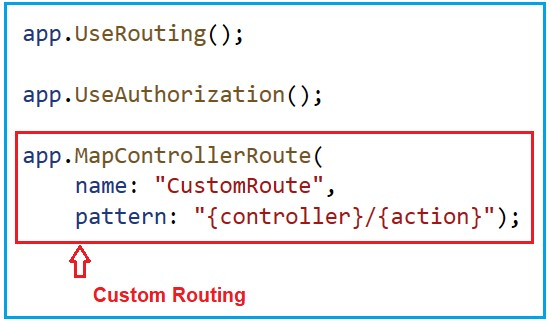

### Custom Routing in ASP.NET Core MVC Application

In this article, I will discuss Custom Routing in the ASP.NET Core MVC Web Application. Please read our previous article discussing the basic Concepts of Routing and the fundamentals of Conventional Routing in ASP.NET Core MVC Applications. We will work with the same example we created in our previous article. As part of this article, we will discuss the following pointers in detail.

1. <p style="color:blue">Custom Routing in ASP.NET Core MVC Application.</p>(自定义路由)
2. Custom Routing Without Default Values in ASP.NET Core MVC.(不带默认值的自定义路由)
3. Route Constraints in ASP.NET Core MVC Web Application.（路由约束）
4. Types of Route Constraints（约束类型）
5. How do you make Route Parameters Optional in the ASP.NET Core MVC?(如何制作路由参数可选项)
6. How do you Provide Default Route Values in the ASP.NET Core MVC?（如何提供默认路由值）

### Custom Routing in ASP.NET Core MVC Application

Custom Routing in ASP.NET Core MVC allows us to define our own routing patterns for our web application, giving us more control over how URLs are mapped to controller actions. This can be useful for creating user-friendly URLs and improving your application’s SEO (Search Engine Optimization). ASP.NET Core offers two primary ways to implement custom routing: conventional routing and attribute routing.

### Custom Routing Without Default Values in ASP.NET Core MVC Application:

In ASP.NET Core MVC, custom routing without using default values can provide strict control over the URL patterns to which the application responds. This approach can enhance the clarity and predictability of the URL structure, making it more straightforward for both developers and users to understand how routes map to controller actions.

So, ASP.NET Core MVC allows configuring routing without default values for route parameters (controller, action, and route data). This allows us to create routes that depend only on the URL values without predetermined or default values. If a route parameter is absent from the URL, it will be treated as missing.

To define Custom Route without default values, we need to modify the MapControllerRoute middleware component within the Program class, as shown in the image below. As you can see, we have removed the default values as well as the Optional Parameter from the Pattern **(pattern: “{controller}/{action}”)**. You can give any name to your route, and here I am providing the Route name as CustomRoute **(name: “CustomRoute”)**.



With the above Custom Routing in Place, when we run the application, it will not access the Home Controller Index Action method by default. That means it will not access any controller action method by default if we don’t specify anything in the URL. Now run the application and navigate to the following URLs, and you will see the output as expected. You need to change the port number.

**https://localhost:44359/Student/Details**
**https://localhost:44359/Student/Index**

This is working fine. However, what if we wanted to have more specific routes? Say something like the following URLs:

**https://localhost:44359/Student/Details/20**
**https://localhost:44359/Student/Index/10**

If you want your controller action methods to match the above URLs, you need to use a Route Constraints feature in the ASP.NET Core MVC Application.

### Route Constraints in ASP.NET Core MVC Web Application:

Route constraints in ASP.NET Core MVC are rules that can be applied to Route Parameters to restrict whether the route should be selected for a given request based on the values of those parameters. That means Route Constraints are a way to restrict or filter the values that a route parameter can take. These constraints help ensure that incoming requests match the expected format or data type before a controller action processes them.

So, Route Constraints ensure that a route will only be selected if the parameters in the URL meet certain conditions. This helps in:

- **Validating input directly within the route setup reduces the need for additional validation within controllers.**
- **Ensuring that URLs map to appropriate endpoints based on parameter types, formats, or values.**
- **Avoid unnecessary processing for requests that do not meet specific criteria for route parameters.**

### Implementing Route Constraints in ASP.NET Core MVC:

Route constraints are used in both attribute-based and conventional-based routing to ensure that the values provided in the URL match the expected data types or formats. Let’s say we want to create a route matching the following URLs.

`https://localhost:44359/Student/Details/20`
`https://localhost:44359/Student/Index/10`

We can achieve this in two ways: Attribute Routing and Conventional Routing. In our upcoming articles, we will discuss how to achieve this using attribute routing. In this article, we will see how to achieve this using conventional routing in ASP.NET Core MVC Applications.

To achieve the above URL Patterns, we need to modify the MapControllerRoute Middleware Component as follows. As you can see, as part of the pattern, we specify the id parameter **(pattern: “{controller}/{action}/{id}”)**. Here, the **id parameter is not optional**; it is mandatory, and while accessing any action method, it is mandatory to pass the Id parameter value.


As we make the action method mandatory for taking the id parameter value, we need to change the action methods of our controller with the id parameter. So, modify the StudentController class as shown below.

```csharp
using Microsoft.AspNetCore.Mvc;

namespace RoutingInASPDotNetCoreMVC.Controllers
{
    public class StudentController:Controller
    {
        public string Index(string id)
        {
            return $"Index({id}) Action Method of StudentController";
        }

        public string Details(string id)
        {
            return $"Details({id}) Action Method of StudentController";
        }
    }
}
```

With the above changes in place, now run the application and navigate to the following URLs, and you will see that methods are executed as expected.
`https://localhost:44359/Student/Details/20`
`https://localhost:44359/Student/Index/10`

This is working fine. But, the problem with the above route is that it can accept any value. Instead of an integer, if you pass a string value, it also accepts and executes the action methods, as shown below.
`https://localhost:44359/Student/Details/ABC`
`https://localhost:44359/Student/Index/ABC`

If you want to restrict the id parameter value to be an integer only, then you need to use a concept called Route Constraint in ASP.NET Core. So, what we need to do is, while defining the Route, we can explicitly tell that this parameter is going to accept only integer, boolean, or any particular data type value.

In our example, we want to restrict the id parameter to accept only integer values. So, we need to modify the MapControllerRoute Middleware Component as follows. As you can see, as part of the pattern, we specify the id parameter to accept int values only **(pattern: “{controller}/{action}/{id:int}”)**. This is called **Inline Route Constraint**. Inline constraints are specified directly within the route template by appending a colon (:) followed by the constraint name to a route parameter.


**Note**: The **{id:int}** in the pattern of MapControllerRoute Middleware Component specifies that whatever is in this part of the URL must be an integer. Otherwise, the URL does not map to this route.

With the above changes in place, now run the application and navigate to the following URLs, and you will see a 404 error. This is because we are passing the Id parameter value as ABC here.
https://localhost:44359/Student/Details/ABC
https://localhost:44359/Student/Index/ABC

Now, pass the id parameter value as an integer, and you should get the output as expected.

### Types of Route Constraints

You can use many route constraints. Some of them are as follows.

- int: Matches any integer.
- bool: Matches a Boolean value.
- datetime: Matches a valid DateTime value.
- decimal: Matches a decimal number.
- double: Matches a double number.
- guid: Matches a Guid value.
- long: Matches a long number.
- min(value): Matches an integer greater than or equal to the specified minimum value.
- max(value): Matches an integer less than or equal to the specified maximum value.
- range(min, max): Matches an integer within a specified range.
- alpha: Matches one or more alphabetical characters.
- regex(expression): Matches input based on the specified regular expression.
- length(min,max): Restricts the length of the parameter value.

### How Do We Make Route Parameters Optional in the ASP.NET Core MVC Application?

In ASP.NET Core MVC, we can make route parameters optional by defining them in the route template with a question mark (?) suffix. This indicates that the parameter may or may not be present in the URL. Before understanding How to Make the Route Parameter an Optional Parameter, let us first change the StudentController class as shown below. 

```csharp
using Microsoft.AspNetCore.Mvc;
namespace RoutingInASPDotNetCoreMVC.Controllers
{
    public class StudentController : Controller
    {
        public string Index()
        {
            return $"Index() Action Method of StudentController";
        }
        public string Details(string id)
        {
            return $"Details({id}) Action Method of StudentController";
        }
    }
}

```

As you can see in the above code, the Index action method takes no parameters, while the Details action method takes one parameter. We need to invoke the Index action method without a parameter as follows.
`https://localhost:44359/Student/Index`

On the other hand, we need to make the id parameter of the Details action method optional. This means that the Details action method should be invoked using the following two URLs.
`https://localhost:44359/Student/Details`
`https://localhost:44359/Student/Details/10`

In order to achieve this, we need to use optional parameters in our convention-based routing by adding a question mark “?” to the optional route parameter constraint. In our example, we want to mark the id parameter as an optional parameter and accept only integer values. So, in the URL pattern, we need to specify the id parameter as **“id:int?“**. We need to modify the MapControllerRoute Middleware Component as follows.


Here, “id:int?” says that id is an optional parameter, but if you pass any value, it should be of type integer. You can define only one optional parameter per route, which must be the last parameter. With the above changes in place, now run the application and navigate to the following URLs, and you will get the data as expected.
`https://localhost:44359/Student/Index`
`https://localhost:44359/Student/Details`
`https://localhost:44359/Student/Details/10`

Points to Remember:
- **Order of Parameters**: Optional parameters should be at the end of the route template. If an optional parameter precedes a required parameter, the routing can become ambiguous and may not behave as expected.
- **Default Values**: Instead of making a parameter optional, you can also provide a default value directly in the route configuration. This can be useful for parameters that should typically have a specific default value.

### How Do We Provide Default Route Values in the ASP.NET Core MVC application?

In ASP.NET Core MVC, we can provide default route values to ensure that specific values are used when certain route parameters are not provided in the URL. This allows our application to handle requests where certain parameters are not specified in the URL, and in that case, it will take default values for those parameters. This is useful for maintaining consistent behavior and reducing the need to specify every parameter in the URL explicitly.

As of now, you can observe that whenever we run the application, by default, it loads the base URL (https://localhost:44359/) of the application and gives us a 404 error. This is because we have not set any default values for our Route parameters. If we have not specified the name of the controller or action method in the URL, which controller and action method should execute?

Let us proceed and understand how we can specify the default values for our Route Parameter. If we do not specify the Controller or Action method name in the URL, it should take the default values from the Route and execute the action method. So, using Default values, we can specify what happens if parts of the route are not provided in the URL. For example, when we navigate to the following two URLs

`https://localhost:44359/`
`https://localhost:44359/Home`

### How Do We Provide Default Route Values in the ASP.NET Core MVC application?
In ASP.NET Core MVC, we can provide default route values to ensure that specific values are used when certain route parameters are not provided in the URL. This allows our application to handle requests where certain parameters are not specified in the URL, and in that case, it will take default values for those parameters. This is useful for maintaining consistent behavior and reducing the need to specify every parameter in the URL explicitly.

As of now, you can observe that whenever we run the application, by default, it loads the base URL (https://localhost:44359/) of the application and gives us a 404 error. This is because we have not set any default values for our Route parameters. If we have not specified the name of the controller or action method in the URL, which controller and action method should execute?

Let us proceed and understand how we can specify the default values for our Route Parameter. If we do not specify the Controller or Action method name in the URL, it should take the default values from the Route and execute the action method. So, using Default values, we can specify what happens if parts of the route are not provided in the URL. For example, when we navigate to the following two URLs
`https://localhost:44359/`
`https://localhost:44359/Home`

We want to map the above two URLs to the Home Controller and Index action method of the Application. To do so, we need to specify the default controller and action method name in the MapControllerRoute Middleware Component URL Pattern. So, modify the MapControllerRoute Middleware Component within the Program class as follows. Here, we have specified the default controller name as Home, the default action method name as Index, and Id as the Route parameter, which is optional as well as that parameter can accept only integer values (pattern: “{controller=Home}/{action=Index}/{id:int?}“).


With the above changes in place, now run the application and visit the following two URLs, and you should get the output as expected.
https://localhost:44359/
https://localhost:44359/Home

You can also map the default values for the route parameter by using the defaults parameter of the MapControllerRoute Extension method, as shown in the image below. 


The following is the complete Program.cs class file code.

```csharp
namespace RoutingInASPDotNetCoreMVC
{
    public class Program
    {
        public static void Main(string[] args)
        {
            var builder = WebApplication.CreateBuilder(args);

            // Add services to the container.
            builder.Services.AddControllersWithViews();

            var app = builder.Build();

            // Configure the HTTP request pipeline.
            if (!app.Environment.IsDevelopment())
            {
                app.UseExceptionHandler("/Home/Error");
                // The default HSTS value is 30 days. You may want to change this for production scenarios, see https://aka.ms/aspnetcore-hsts.
                app.UseHsts();
            }

            app.UseHttpsRedirection();
            app.UseStaticFiles();

            app.UseRouting();

            app.UseAuthorization();

            app.MapControllerRoute(
                name: "CustomRoute",
                pattern: "{controller}/{action}/{id:int?}",
                defaults: new { controller = "Home", action = "Index" }
            );

            app.Run();
        }
    }
}
```

With the above changes in place, run the application, and it should work as expected.

In the next article, I will discuss Custom Route Constraint in ASP.NET Core MVC Applications. In this article, I explain custom routing in ASP.NET Core MVC Web Application with examples. I hope you enjoy this Custom Routing in ASP.NET Core MVC Web Application article.

