### Routing in ASP.NET Core MVC Application


In this article, I will discuss Routing in ASP.NET Core MVC Applications with examples. Please read our previous article discussing ASP.NET Core MVC TempData with Examples. As part of this article, we will discuss the following pointers in detail.


1. What is Routing in ASP.NET Core MVC?
2. How Does Routing Work in ASP.NET Core?
3. What are the Different Types of Routing Supported by ASP.NET Core MVC?
4. What is Conventional Based Routing in ASP.NET Core MVC Web Application?
5. What is Attribute-Based Routing in ASP.NET Core MVC Application?
6. Understanding Conventional-Based Routing in ASP.NET Core MVC.
7. Understanding the Default Route in ASP.NET Core MVC Web Application.
8. Understanding Route Template in ASP.NET Core MVC Application.
9. Configure Multiple Conventional Routing in ASP.NET Core MVC Application.

本文中将讨论ASP.NET CORE MVC中的路由，并通过例子进行说明。文章分9个讨论点。


### What is Routing in ASP.NET Core MVC? ASP.NET CORE MVC中的路由是什么？

Routing in ASP.NET Core MVC is a mechanism that inspects the incoming HTTP request (i.e., URLs) and then maps those HTTP requests to the appropriate controller actions. It enables the framework to determine what code to execute based on the URL of the request. Routing is an important component of ASP.NET Core MVC applications, providing the ability to define URL patterns and manage how URLs are processed and handled by the application.

路由是一种机制，即检测接收到的HTTP请求，然后映射该请求至对应的控制器动作(action)。路由让框架检测那些基于请求的URL的代码被执行。路由作为ASP.NET CORE MVC中的一个重要组件，提供定义URL模式的能力，以及管理URL如何被应用程序处理。


### How Does Routing Work in ASP.NET Core? (路由如何工作？)

In simple words, Routing is a pattern-matching system that monitors an incoming HTTP request and decides what to do with that incoming HTTP request. When the client makes a request, i.e., an HTTP Request, the routing engine first receives it. Once the routing engine receives an HTTP request, the routing engine tries to find the route pattern that matches the requested URL with already registered routes. Routes contain information about the Controller name, action method name, method type (Get, Post, Put, Patch, Delete), method parameters, route data, etc.

简而言之，路由是一个模式匹配系统，监视进来的HTTP请求并决定进来的请求执行什么。

例如，客户端发送一个HTTP请求，当路由引擎接收到该请求时，就会查找请求的URL与已注册的路由模式有没有匹配。路由包含控制器名称，action方法名称，方法类型(Get,Post,Put,Patch,Delete),方法参数，路由数据等等。

If it finds a matching URL pattern for the incoming request, it forwards the request to the appropriate controller and action method. If there is no match for the incoming HTTP request URL Pattern, it returns a 404 HTTP status code to the client. For a better understanding, please have a look at the following diagram.

如果URL与注册的模式匹配，就转发给控制器和动作方法，否则返回404状态码给客户端。

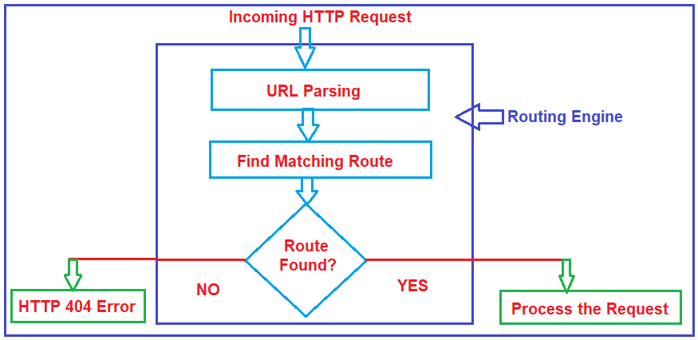

### What are the Different Types of Routing Supported by ASP.NET Core MVC?

We can configure routes in the ASP.NET Core MVC Web Application in two ways. They are as follows:

1. Convention-Based Routing
2. Attribute-Based Routing.

两种路由方式：

1. 基于规范
2. 基于属性

### What is Conventional Based Routing in ASP.NET Core MVC Web Application?

Conventional-based routing in ASP.NET Core MVC defines URL patterns and maps them to controller actions based on conventions rather than explicitly specifying routes on each action or controller. Conventional-based routing follows a set of conventions to map incoming requests to specific controller actions. It is configured globally in the Program.cs file using the MapControllerRoute middleware. This method allows for centralized route configuration, making it easy to manage and understand how URLs map to controllers and actions.

全局定义URL解析模式，该模式：控制器+动作


### What is Attribute-Based Routing in ASP.NET Core MVC Application?

Attribute-based routing in ASP.NET Core MVC allows developers to define routing directly on controller actions or at the controller level using attributes (decorators). This approach provides more control and flexibility over how URLs are mapped to actions compared to conventional routing, where routes are configured globally in the Program.cs file. This approach is useful for APIs and scenarios where URLs need to be explicitly defined and customized.

开发者可以在控制器级别或动作级别使用属性注解路由模式

In this article, we will discuss Conventional Based Routing in Details, and in our upcoming articles, we will discuss Attribute-Based Routing in ASP.NET Core MVC Applications.

### Understanding Routing in ASP.NET Core MVC Application:

First, create an ASP.NET Core Application using the ASP.NET Core Model-View-Controller Template. To create an ASP.NET Core Web Application with the Model-View-Controller Project template. First, open Visual Studio 2022 and click the Create a new project tab, as shown in the image below.

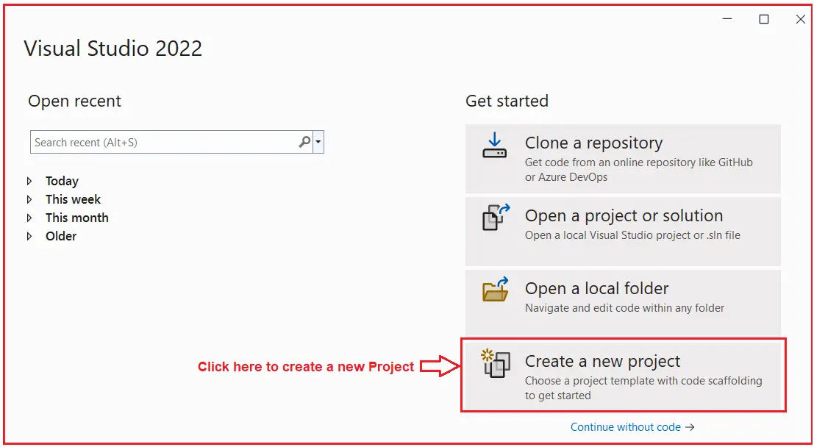

Once you click on the Create a new Project tab, the following Create a new Project window will open. From this window, select C#, All Platforms, and Web from the respective dropdowns, as highlighted below. Select ASP.NET Core Web App (Model-View-Controller), as highlighted below, and click the Next button, as shown in the image below.

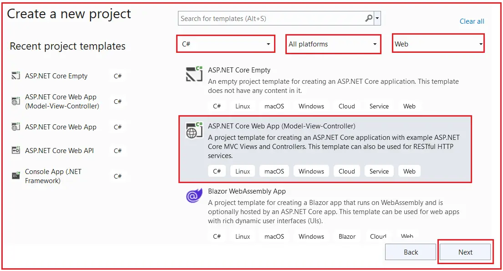

Once you click on the Next button, it will open the Configure Your New Project window. Here, you need to provide the necessary information to create a new ASP.NET Core project. First, give an appropriate name for your project (RoutingInASPDotNetCoreMVC), set the location where you want to create this project, and the solution name for the ASP.NET Core Web application. And finally, click on the Create button, as shown in the image below.

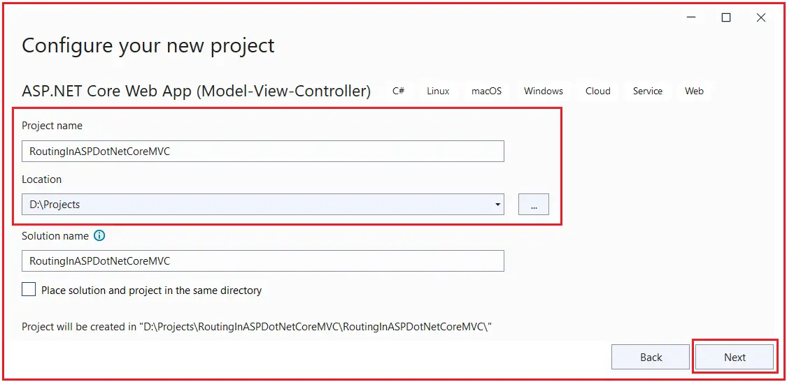

Once you click the Create button, the following Additional Information window will open: Please select Framework .NET 8.0 (Long-term support) and Authentication type None. You must also check the Configure for HTTPS and do not use top-level statements check boxes. Finally, click the Create button, as shown in the image below.


Once you click the Create button, the project will be created using the Model-View-Controller template with the following folder and file structure.

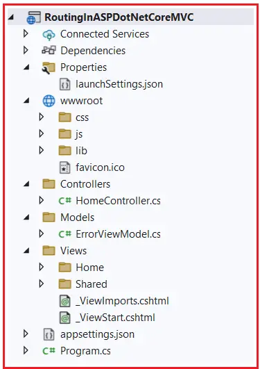

### Modifying the Home Controller:

Once you have created the Project, next modify the Home Controller as follows:

```csharp
using Microsoft.AspNetCore.Mvc;

namespace RoutingInAspDotNetCoreMvc.Controllers
{
    public class HomeController:Controller
    {
        public ViewResult Index()
        {
            return View();
        }

        public ViewResult Details(int id)
        {
            return View();
        }
    }
}
```

In the ASP.NET Core MVC Web Application, the controller action method handles incoming HTTP Requests, i.e., URLs. For example, if we issue a request to **the /Home/Index** URL, then the Index action method of the Home Controller class will handle the request, as shown in the image below.

在ASP.NET CORE MVC网络应用程序中，控制器动作方法处理进来的HTTP请求，例如，URLs为/Home/Index，该请求由Home控制器中的action动作方法处理。换言之，就是该请求触发Home控制器的Index方法执行。

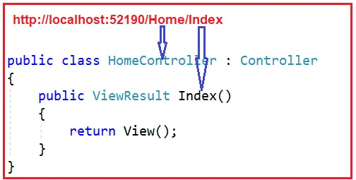

Similarly, if we issue a request to the **/Home/Details/2** URL, then the Details action method of the Home Controller class will handle the request, as shown in the image below. Here, the parameter value 2 is automatically mapped to the id parameter of the Details action method.

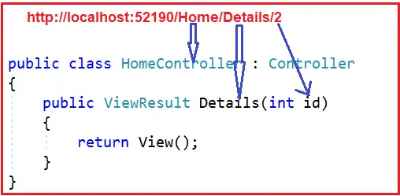

Now, the question that should come to your mind is, we have not explicitly defined any routing rules for our application. Then how is this mapping done, i.e., how is the /Home/Index URL mapped to the Index action method, and how is the /Home/Details/2 URL mapped to the Details action method of the Home Controller class? This is done by the MVC Routing Middleware Component, which is registered into the Request Processing Pipeline. 

MVC路由中间件组件，位于请求处理管道中，负责解析URL并进行方法映射

### Understanding Conventional-Based Routing in ASP.NET Core MVC Web Application:

As we created the project with a Model-View-Controller template, the required MVC Services and MVC Middleware components are, by default, added to the Request Processing Pipeline. Also, the Required Routing Middleware Components are added to the Request processing pipeline. So, if you open the Program class, you will find the following code.

使用MVC模板创建的项目，已经配置相应的组件和服务。

```csharp
namespace RoutingInASPDotNetCoreMVC
{
    public class Program
    {
        public static void Main(string[] args)
        {
            var builder = WebApplication.CreateBuilder(args);

            // Add services to the container.

            builder.Services.AddControllersWithViews();

            var app = builder.Build();

            //Configure the Http request pipeline.

            if(!app.Environment.IsDevelopment())
            {
                app.UseExceptionHandler("/Home/Error");

                // The defaults HSTS value is 30 days. You may want to change this for production scenarios, see https://aka.ms/aspnetcore-hsts.

                app.UseHsts();
            }

            app.UseHttpsRedirection();
            app.UseStaticFiles();
            app.UseRouting();
            app.UseAuthorization();
            app.MapControllerRoute(
                name:"default",
                pattern:"{Controller=Home}/{Action=Index}/{id?}"
            );

            app.Run();s
        }
    }
}

```

As you can see in the above code, MVC services are added by the following statement.

`builder.Services.AddControllersWithViews();`

Routing Middleware Components are added using the UseRouting and MapControllerRoute methods. If you notice the MapControllerRoute, you will see the following.

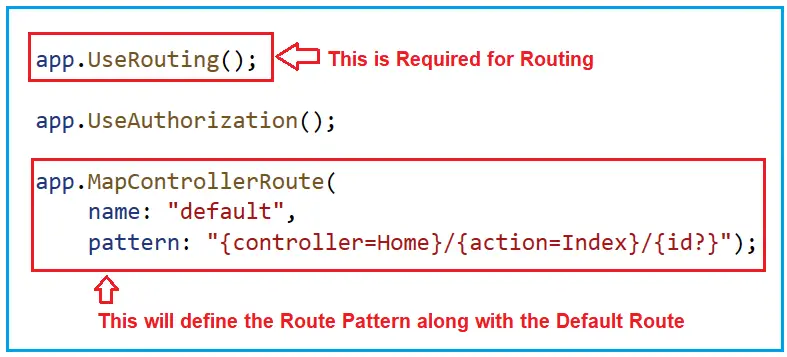

Understanding How Routing Works in ASP.NET Core MVC Application:

### Registration of Route Templates (MapControllerRoute):

The MapControllerRoute method is invoked during the application startup process to define the route templates and their corresponding patterns. It registers all the route templates into the route table once when the application starts. MapControllerRoute does not execute for each incoming request. Instead, it only runs during the application startup to populate the route table with the defined route templates.

应用启动过程中，调用MapControllerRoute方法定义路由模板以及路由模式。所有的路由模板被注册在路由表中。

MapControllerRoute implicitly sets up the endpoint middleware (i.e., UseEndpoints) necessary for handling the routes. The UseEndpoints middleware is responsible for executing the corresponding endpoints when a matching request comes in. So, MapControllerRoute sets up the routes once at startup and registers the UseEndpoints middleware, which executes the corresponding endpoint for each request that matches a route.

### Routing Middleware (UseRouting):


The UseRouting middleware examines incoming HTTP requests and matches them against the route template stored in the route table to determine the appropriate routes. It runs for each incoming HTTP request.

When a request arrives, the UseRouting middleware parses the URL and matches it against the defined route templates stored in the route table. If a match is found, it then extracts values (like controller name, action method name, and parameters) and stores them in the HttpContext under RouteData. If no match is found, it will return a 404 error to the client.

### Determining the Controller and Action (UseEndpoints):

After UseRouting identifies a matching route and prepares the necessary context (like controller, action, and parameters), control is passed to the UseEndpoints middleware. This is where the actual decision to execute a specific controller action is made. UseEndpoints evaluates the route data provided by UseRouting and invokes the appropriate controller and action method.

### Who Decides Which Action Method Executes:

The decision of which action method of which controller to execute is primarily made by the UseEndpoints middleware, which uses the route data populated by UseRouting. Based on the matched route and the parameters provided in the URL, UseEndpoints routes the request to the specific controller action that matches the criteria defined in the route table.

### Understanding the Default Route in ASP.NET Core MVC:
The default route is created with the following URL Pattern. So, if we don’t specify anything in the URL, then by default, the Index action method of the Home Controller class will handle the request.

`{controller=Home}/{action=Index}/{id?}`

In this example, the MapControllerRoute method defines a default route. The pattern parameter specifies the route template, where **{controller}**, **{action}**, and **{id}** are placeholders for route parameters. The name parameter gives the route a name, which can be used for generating URLs. The meaning of the placeholders are as follows:

- **{controller}**: Represents the name of the controller class.
- **{action}**: Represents the action method name within the controller.
- **{id?}**: Represents an optional route parameter called “id”.

With this configuration, an incoming URL like /Home/Index would match the Index action method of the HomeController. Similarly, /Products/Details/5 would match the Details action method of the ProductsController with an id parameter set to 5.

### Understanding Route Template in ASP.NET Core MVC Application:

The default route is created with the URL Pattern: **{controller=Home}/{action=Index}/{id?}**

As you can see in the default route template {controller=Home}/{action=Index}/{id?}, we have a question mark at the end of the id parameter, which makes the id parameter optional. That means the following two requests now map to the same Details action method of the Home Controller class.
**/Home/Details/1**
**/Home/Details**

In the default route template **{controller=Home}/{action=Index}/{id?}**, the value **Home** in {controller=Home} is the default value for the Controller. Similarly, the value Index in {action=Index} is the default value for the action method. That means if we navigate to the application’s root URL, as shown below, then that request will be handled by default by the Index action method of the Home Controller class.
**http://localhost:52190/**

The following two URLs are also mapped to the Index action method of the HomeController class.
**http://localhost:52190/Home**
**http://localhost:52190/Home/Index**

The default route works fine for most of the ASP.NET Core MVC Web Applications. For example, create a Controller named StudentController and copy and paste the following code into it.

```csharp
using Microsoft.AspNetCore.Mvc;
namespace RoutingInASPDotNetCoreMVC.Controllers
{
    public class StudentController : Controller
    {
        public string Index()
        {
            return "Index() Action Method of StudentController";
        }
        public string Details(int? id)
        {
            return $"Details({id}) Action Method of StudentController";
        }
    }
}
```

Now, the URL /student/index is mapped to the Index() action method of the StudentController class, and the URL /student/details or /student/details/5 both are mapped to the Details(int? id) action method of the StudentController. 

### Configure Multiple Conventional Routing in ASP.NET Core MVC Application

In ASP.NET Core MVC, we can define multiple conventional routes to handle various URL patterns in our application. This allows us to create more flexible and maintainable routing configurations. This approach allows you to direct incoming requests to various controllers and actions based on specific URL structures. For example, we want to access the Index Action Method of the Student Controller using the following URL.

`https://localhost:44359/Student/All`

To achieve this, we can configure the MapControllerRoute method, as shown in the image below. Here, you can see we have specified the pattern as Student/All and the default controller and action name as controller = Student, action = Index.

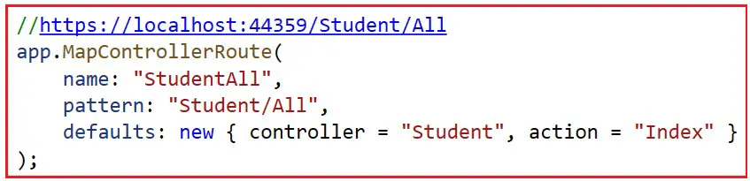

Next, we want to access the Details of the action method for the Student Controller using the following URL.

`https://localhost:44359/StudentDetails/10`

To achieve this, we can configure another MapControllerRoute method, as shown in the below image. Here, you can see we have specified the pattern as StudentDetails/{ID} and specified the default controller and action name as controller = Student”, action = Details.

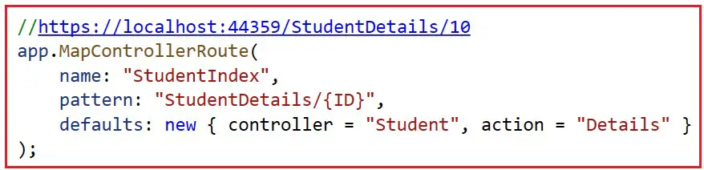

We need to access the rest of the controllers and actions using the following URL Pattern. We also need to configure the default controller and action names as Home and Index.

`https://localhost:44359/{Controller Name}/{Action method Name}`

To achieve this, we can configure another MapControllerRoute method, as shown in the below image. Here, you can see we have specified the pattern as {controller}/{action}/{id:int?} and specified the default controller and action name as controller = Home, action = Index.

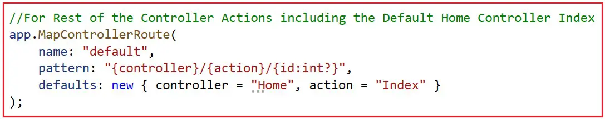

The complete code of the Program class is given below.

```csharp
namespace RoutingInASPDotNetCoreMvc
{
    public class Program
    {
        public static void Main(string[] args)
        {
            var builder = WebApplication.CreateBuilder(args);

            //Add services to the container

            builder.Services.AddControllersWithViews();

            var app = builder.Build();

            //Configure the HTTP request pipeline.
            if(!app.Environment.IsDevelopment())
            {
                app.UseExceptionHandler("/Home/Error");
                //The defaults HSTS value is 30 days.You may want to change this for production scenarios, see https://aka.ms/aspnetcore-hsts.
                app.UseHsts();
            }

            app.UseHttpsRedirection();
            app.UseStaticFiles();
            app.UseRouting();
            app.UseAuthorization();

            //https://localhost:44359/Student/All
            app.MapControllerRoute(
                name:"StudentAll",
                pattern:"Student/All",
                defaults:new {controller="Student",action="Index"}
            );

            //https://localhost:44359/StudentDetails/10
            app.MapControllerRoute(
                name:"StudentIndex",
                pattern:"StudentDetails/{ID}",
                defaults: new {controller="Student",action="Details"}
            );

            //For Rest of the controller actions including the default home controller index

            app.MapControllerRoute(
                name:"default",
                pattern:"{controller}/{action}/{id:int?}",
                defaults:new {controller="Home",action="Index"}
            );

            app.Run();
        }
    }
}
```

With the above changes in place, run the application and navigate to the specific URLs, and you will get the data as expected.

**Note**: Routes are evaluated in the order they are defined. Ensure the most specific routes are defined first, as the request will be handled by the first route it matches. It’s a good practice to give each route a unique name. This helps when generating URLs based on route names. You can specify controller, action, and parameter default values. This is useful for defining fallbacks for missing parts of the route.

### Benefits of Conventional Routing in ASP.NET Core MVC:
- **Simplicity**: It reduces the need to define routes explicitly for every action method or controller; instead, it uses default conventions.
- **Predictable URLs**: This feature encourages consistent URL patterns across the application, making it easier to understand and debug routing behavior.
- **Centralized Configuration**: All routing rules can be managed in one place (Program.cs), promoting maintainability and consistency.
- **Ease of Maintenance**: As the application grows, maintaining a consistent routing structure becomes easier, especially when new controllers and actions are added.

Conventional-based routing is suitable for most ASP.NET Core MVC applications, where the URL structure follows predictable patterns based on controller names, action methods, and parameter names. It provides a straightforward way to handle typical routing scenarios without the need for extensive attribute routing.

In the next article, I will discuss Custom Route and Route Constraints, Optional Parameters, and Default Values in the ASP.NET Core MVC application. In this article, I explain the fundamentals of Routing in ASP.NET Core MVC Applications. I hope you enjoy this article.